# 🌐 API Design Handbook

⚡ **TL;DR:** If your system is a city, the **API layer** is the road network that lets apps, services, and databases talk to each other safely and efficiently. This handbook walks from fundamentals (what an API is) through API styles (REST, GraphQL, gRPC), design principles, protocols, security, performance, and full-system architecture—using diagrams first, text second.

---

## 1️⃣ API as a Contract Between Systems

**High-Level Summary (max 4 sentences)**  
An API (Application Programming Interface) is a **contract** that defines how software components communicate, specifying what requests are allowed and what responses to expect. It hides implementation details while exposing capabilities through clear interfaces. Good APIs define boundaries between services so different systems can evolve independently. For clients, it’s the only “surface” they need to understand to use the system.

**Everyday Analogy**  
Think of an API like a **restaurant menu**: you see what dishes you can order (endpoints), how to order them (methods), and what you’ll get back, but you never see how the kitchen is organized or how the chef cooks.

**How It Fits Into the System**  
The API sits between clients (web/mobile apps) and backend services, defining how clients can create, read, update, or delete data, without knowing how databases, internal services, or external integrations work. It also defines how internal services can talk to each other in a microservice architecture.

**Diagram (Mermaid)**

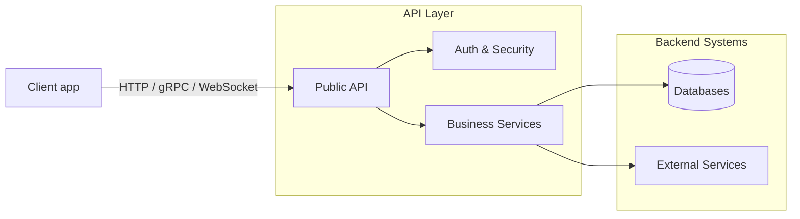

**Implementation Notes**

- **ASP.NET Core APIs**:  
  - Use controllers or minimal APIs to define endpoints (routes + HTTP verbs).  
  - Apply attributes like `[HttpGet("users/{id}")]` to describe the contract and use DTOs to shape request/response payloads.
- **Node/Express APIs**:  
  - Define routes like `app.get('/users/:id', ...)` and use middleware for concerns like auth, logging, and validation.  
  - Keep route handlers thin and push logic into service layers.
- **API Gateway systems**:  
  - The gateway exposes a stable external contract and routes to internal microservices.  
  - Use it to centralize cross-cutting concerns (auth, rate limiting, logging).
- **Microservices**:  
  - Each service exposes its own API contract (often REST or gRPC) for other services.  
  - Contracts should be versioned and backward compatible when possible.

**Common Mistakes / Misconceptions**

- Treating the API as “just endpoints” instead of a **carefully designed contract**.  
- Leaking internal database models directly to clients (tight coupling).  
- Changing the API contract without versioning or considering existing clients.

**Quick Example**

```bash
# Simple REST call to an API contract
curl -X GET https://api.example.com/v1/users/123
# Contract says: returns 200 with user JSON or 404 if not found
```

**Deep Dive (optional)**  
Contracts can be described formally using **OpenAPI/Swagger** (for REST) or **GraphQL schemas** or **proto files** (for gRPC). Senior engineers treat these artifacts as **source of truth** for integration, often designing the contract first (“API-first”) before implementing the internals.

---

## 2️⃣ RESTful APIs

**High-Level Summary (max 4 sentences)**  
REST (Representational State Transfer) is an API style that models data as **resources** accessed via standard HTTP methods like GET, POST, PUT/PATCH, DELETE. REST is stateless: each request contains everything needed to process it. It fits web and mobile scenarios extremely well because it aligns with HTTP status codes, caching, and infrastructure. REST is usually the default choice for public and B2B APIs.

**Everyday Analogy**  
Imagine a **library catalog**: each book has a unique identifier, and you can “look up” a book, “add” a book, “update” book info, or “remove” a book via standard actions.

**How It Fits Into the System**  
REST APIs are typically exposed by the API gateway to external clients. Each microservice may expose its own REST endpoints, and the gateway aggregates or routes calls. REST also integrates naturally with HTTP-based auth, caching, and load balancers.

**Diagram (Mermaid)**

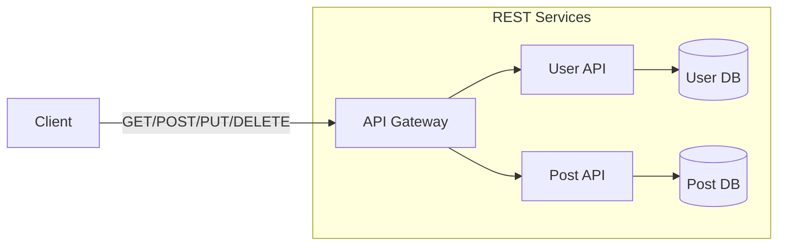

**Implementation Notes**

- **ASP.NET Core**:  
  - Expose REST endpoints using attribute routing: `[HttpGet("users/{id}")]`, `[HttpPost("users")]`.  
  - Use `ActionResult<T>` with proper HTTP status codes (200, 201, 400, 404, 500).  
  - Use middleware for auth, logging, and exception handling.
- **Node/Express**:  
  - Routes like `router.get('/users/:id', ...)`, `router.post('/users', ...)`.  
  - Use `res.status(201).json(user)` and central error-handling middleware.
- **API Gateway**:  
  - Gateway exposes resource-based URLs (e.g. `/v1/users`, `/v1/posts`).  
  - Routes requests to internal services based on path, method, and version.
- **Microservices**:  
  - Each service defines a narrow set of resources (e.g. `UserService` owns `/users`).  
  - Avoid cross-service joins in REST; instead, compose at the gateway or client, or introduce a BFF (Backend For Frontend).

**Common Mistakes / Misconceptions**

- Overloading endpoints with multiple unrelated actions (e.g. `/users/123/doEverything`).  
- Mixing resource names and verbs (e.g. `/createUser` instead of `/users` + POST).  
- Ignoring HTTP semantics (always returning 200, ignoring caching headers).

**Quick Example (Express)**

```javascript
app.get('/v1/users/:id', async (req, res) => {
  const user = await userService.getById(req.params.id);
  if (!user) return res.sendStatus(404);
  res.status(200).json(user);
});
```

**Deep Dive (optional)**  
REST shines when you have **clear resources** (users, orders, posts) and want to leverage HTTP infrastructure (CDNs, caches, proxies). It becomes awkward when clients need highly customized shapes or many related objects at once—those are scenarios where GraphQL might be better.

---

## 3️⃣ GraphQL APIs

**High-Level Summary (max 4 sentences)**  
GraphQL is a **query language** and runtime where clients specify exactly what data they need in a single request. Instead of many resource-based endpoints, you expose one or a small number of GraphQL endpoints. Clients define the shape of the response, reducing over-fetching and under-fetching. It is ideal for complex, data-rich UIs.

**Everyday Analogy**  
Think of GraphQL like **ordering from a custom salad bar**: you choose exactly which ingredients you want instead of picking from a small set of fixed menu items.

**How It Fits Into the System**  
The client calls a single `/graphql` endpoint at the gateway or a GraphQL server. That server resolves fields by calling downstream REST services, databases, or microservices. GraphQL often sits as an **aggregation layer** on top of existing REST/gRPC services.

**Diagram (Mermaid)**

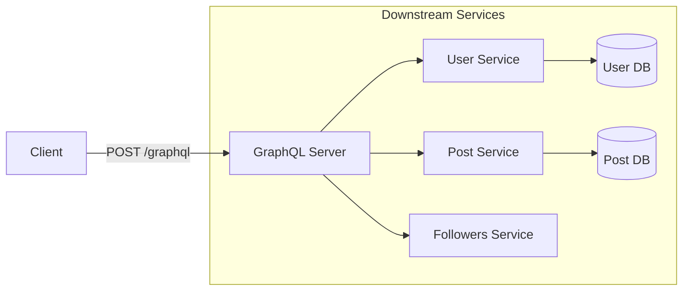

**Implementation Notes**

- **ASP.NET Core**:  
  - Use libraries like HotChocolate to define schemas and resolvers.  
  - Map a single endpoint (e.g. `/graphql`) and secure it with auth middleware.
- **Node/Express**:  
  - Use `apollo-server-express` or similar.  
  - Implement resolvers that call underlying services or databases.
- **API Gateway**:  
  - Gateway may route `/graphql` requests to a dedicated GraphQL server.  
  - Can apply rate limiting per operation or per field if supported.
- **Microservices**:  
  - GraphQL often acts as a **facade** over many microservices rather than replacing them.  
  - Each microservice can be a data source plugged into the GraphQL layer.

**Common Mistakes / Misconceptions**

- Thinking GraphQL “replaces REST entirely”—in practice it often **wraps** existing REST/gRPC services.  
- Allowing unbounded queries (e.g. nested lists with no limits), causing performance and DoS issues.  
- Confusing GraphQL “mutations” with HTTP methods; GraphQL usually still uses HTTP POST.

**Quick Example (GraphQL Query)**

```graphql
query GetUserWithPosts {
  user(id: "123") {
    id
    name
    posts(limit: 5) {
      id
      title
    }
    followers {
      name
    }
  }
}
```

**Deep Dive (optional)**  
GraphQL requires **careful schema evolution**: you typically add fields in a backward-compatible way and deprecate old ones rather than introducing explicit versions. You also need query complexity analysis, rate limiting, and caching strategies (often at the application level, not traditional HTTP caching).

---

## 4️⃣ gRPC and Internal Service Communication

**High-Level Summary (max 4 sentences)**  
gRPC is a high-performance **Remote Procedure Call (RPC)** framework that uses Protocol Buffers (protobuf) for efficient, typed communication. It’s especially well-suited for communication between microservices. gRPC supports streaming and bidirectional communication out of the box. It trades human-readable JSON for speed and strict contracts.

**Everyday Analogy**  
Imagine two teams using a **precise shared playbook**: every move is predefined, with clear input and output formats, leaving little room for ambiguity.

**How It Fits Into the System**  
External clients usually don’t call gRPC directly; they call REST or GraphQL on the gateway. The gateway and internal services often use gRPC to talk among themselves for better performance and type safety.

**Diagram (Mermaid)**

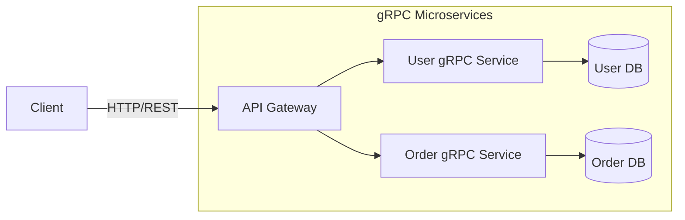

**Implementation Notes**

- **ASP.NET Core**:  
  - Use built-in gRPC support (`Grpc.AspNetCore`).  
  - Define services and messages in `.proto` files and generate server/client stubs.
- **Node**:  
  - Use `@grpc/grpc-js` and protobuf definitions to implement clients/servers.  
  - Node often acts as a client to gRPC services rather than the primary server.
- **API Gateway**:  
  - Gateway may expose REST to the outside and use gRPC to talk to internal services.  
  - Some gateways support gRPC passthrough when you want direct gRPC exposure.
- **Microservices**:  
  - Each service defines its API via proto files; contracts are strongly typed and versioned.  
  - Streaming RPCs are useful for log streaming, long-running operations, etc.

**Common Mistakes / Misconceptions**

- Exposing gRPC directly to browsers (they don’t speak raw gRPC; need gRPC-Web or a proxy).  
- Assuming gRPC is always better than REST; for public APIs, JSON/REST is often more accessible.  
- Treating proto files as an afterthought instead of a primary contract artifact.

**Quick Example (Proto Snippet)**

```proto
service UserService {
  rpc GetUser (GetUserRequest) returns (GetUserResponse);
}

message GetUserRequest {
  string id = 1;
}

message GetUserResponse {
  string id = 1;
  string name = 2;
}
```

---

## 5️⃣ Core API Design Principles (Consistency, Simplicity, Security, Performance)

**High-Level Summary (max 4 sentences)**  
Great APIs are **consistent**, **simple**, **secure**, and **performant**. Consistency means naming, casing, and patterns are predictable. Simplicity focuses on core use cases and avoids unnecessary complexity. Security and performance are non-negotiable pillars: auth, validation, rate limiting, caching, and efficient payloads.

**Everyday Analogy**  
Think of a **well-designed public transit map**: stops are named consistently, routes are easy to follow, it’s safe to use, and trains arrive quickly.

**How It Fits Into the System**  
These principles guide every layer: the gateway, REST/GraphQL endpoints, internal gRPC services, and even database interactions. They ensure that clients and other services can integrate reliably and safely.

**Diagram (Mermaid)**

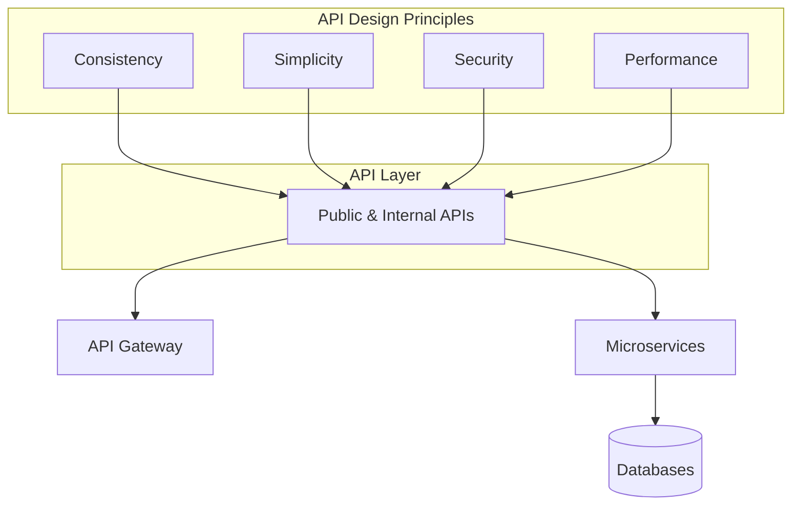

**Implementation Notes**

- **Consistency**  
  - Use a unified naming convention for routes (`/users`, `/user-profiles`), fields (`camelCase` or `snake_case`), and responses.  
  - Enforce via linters, style guides, and schema validation.
- **Simplicity**  
  - Expose minimal necessary endpoints; avoid “God APIs” that do many unrelated actions.  
  - Hide internal complexity behind clear contracts.
- **Security**  
  - Always require authentication for sensitive operations.  
  - Validate inputs at the boundary (route handlers/controllers).
- **Performance**  
  - Use pagination for large collections, cache frequently accessed data, and avoid unnecessary round trips.

**Common Mistakes / Misconceptions**

- Mixing casing and naming styles within the same API.  
- Adding “just one more flag” to an endpoint instead of designing a clear new resource or operation.  
- Treating security and performance optimizations as afterthoughts.

**Quick Example (REST Pagination)**

```bash
GET /v1/posts?limit=20&offset=40
# limit and offset implement simple pagination for performance
```

---

## 6️⃣ Protocol Choice: HTTP, WebSockets, gRPC

**High-Level Summary (max 4 sentences)**  
Your **transport protocol** (HTTP, WebSockets, gRPC) heavily shapes what your API can do. HTTP is ideal for request/response, stateless REST and GraphQL APIs. WebSockets support real-time, bidirectional messaging (e.g. chat, live updates). gRPC (over HTTP/2) provides efficient, strongly-typed RPC for service-to-service calls.

**Everyday Analogy**  
This is like picking a **communication channel**: email (HTTP) for structured messages, live chat (WebSockets) for real-time conversations, and direct radio with codes (gRPC) for fast, precise team coordination.

**How It Fits Into the System**  
Clients mostly use HTTP/HTTPS for REST/GraphQL, optionally upgrading to WebSockets for real-time scenarios. Internally, microservices may use gRPC over HTTP/2 for efficiency. The gateway often terminates incoming HTTP/WS and talks gRPC to services.

**Diagram (Mermaid)**

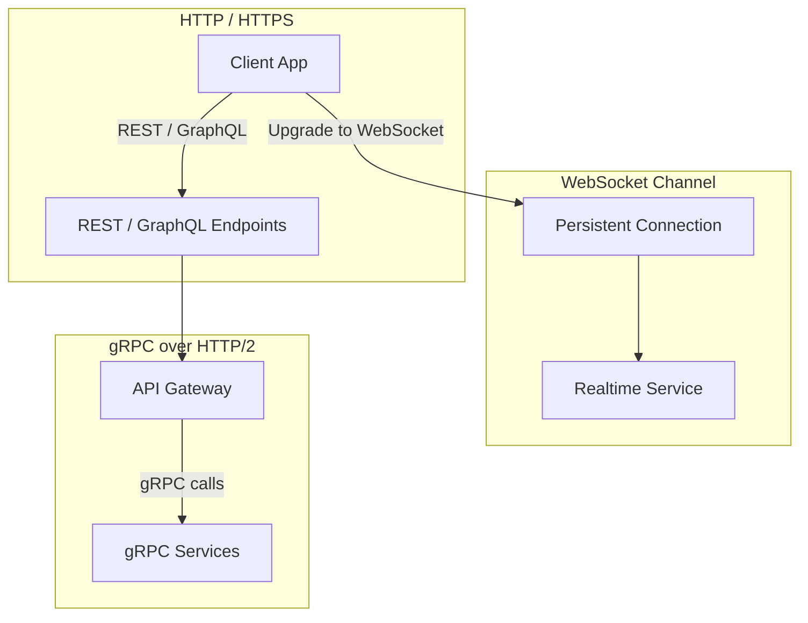

**Implementation Notes**

- **ASP.NET Core**:  
  - Use controllers/minimal APIs for HTTP, SignalR or raw WebSockets for real-time, and gRPC templates for service-to-service.  
- **Node/Express**:  
  - HTTP: standard routes.  
  - WebSockets: libraries like `ws` or `socket.io`.  
  - gRPC: `@grpc/grpc-js` for calling or hosting services.
- **API Gateway**:  
  - Terminates TLS and routes based on path, host, and protocol (HTTP vs WS).  
  - Can translate REST calls to gRPC for internal services.
- **Microservices**:  
  - Choose protocol per use case: gRPC for internal high-throughput RPC, event streaming for async, HTTP for simple interoperability.

**Common Mistakes / Misconceptions**

- Forcing everything over a single protocol “for simplicity.”  
- Using WebSockets where simple polling/HTTP would suffice, adding complexity.  
- Ignoring HTTP/2 benefits for gRPC and multiplexing.

**Quick Example (WebSocket Upgrade in Node)**

```javascript
// Pseudo-code using ws
wss.on('connection', socket => {
  socket.on('message', msg => {
    // handle realtime message
  });
});
```

---

## 7️⃣ API Design Process (From Requirements to Deployment)

**High-Level Summary (max 4 sentences)**  
Designing an API starts with **understanding requirements** and core use cases, then modeling resources and operations. You choose the right API style and protocol (REST, GraphQL, gRPC) and design the contract (endpoints, schemas, status codes). Implementation follows the contract, with testing, documentation, and deployment. Senior engineers iterate on this process with feedback and versioning.

**Everyday Analogy**  
It’s like designing a **public building**: you first understand who will use it and why, then sketch the layout, then build, test safety, and open to the public with signage.

**How It Fits Into the System**  
This process touches every layer—from gateway routes and API schemas to service boundaries and database schemas. Early decisions (like API style and resource modeling) affect scalability, changeability, and developer experience.

**Diagram (Mermaid)**

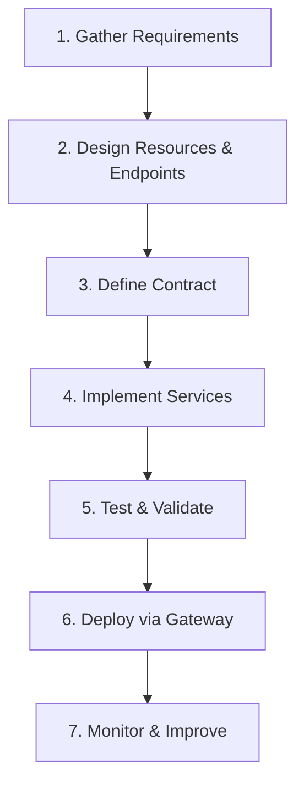

**Implementation Notes**

- **Requirements**:  
  - Identify primary user stories (e.g. “As a user I can view my posts and followers”).  
  - Decide which clients (web, mobile, internal services) will consume the API.
- **Design & Contract**:  
  - REST: design resources and endpoints and describe them in OpenAPI.  
  - GraphQL: design schema (types, queries, mutations, subscriptions).  
  - gRPC: design proto files.
- **Implementation & Deployment**:  
  - Implement in ASP.NET Core or Node/Express behind an API gateway.  
  - Add CI/CD pipelines that deploy services and update schemas.

**Common Mistakes / Misconceptions**

- Jumping straight into coding without a clear contract or resource model.  
- Ignoring versioning and backward compatibility.  
- Not involving consumers (frontend, partners) early in the design.

**Quick Example (Minimal ASP.NET Core Endpoint)**

```csharp
app.MapGet("/v1/users/{id}", async (string id, IUserService svc) =>
{
    var user = await svc.GetByIdAsync(id);
    return user is null ? Results.NotFound() : Results.Ok(user);
});
```

---

## 8️⃣ API Design Approaches and Lifecycle Management

**High-Level Summary (max 4 sentences)**  
There are several ways to approach API design: **top-down** (start from high-level workflows), **bottom-up** (start from existing data models/capabilities), and **contract-first** (design the API specification before implementation.** APIs also have a lifecycle: design, development, deployment, monitoring, maintenance, and deprecation/retirement. Treating design and lifecycle deliberately is what distinguishes senior-level API work from just “coding endpoints.”

**Everyday Analogy**  
It’s like designing a **public service**: you can start from citizen journeys (top-down) or from existing departments and rules (bottom-up), but either way the service has to be launched, run, improved, and eventually replaced.

**How It Fits Into the System**  
Your chosen design approach affects how well the API fits both consumer needs and existing systems. Lifecycle management determines how you roll out new versions, keep old clients working, and eventually retire legacy APIs without breaking consumers.

**Diagram (Mermaid)**

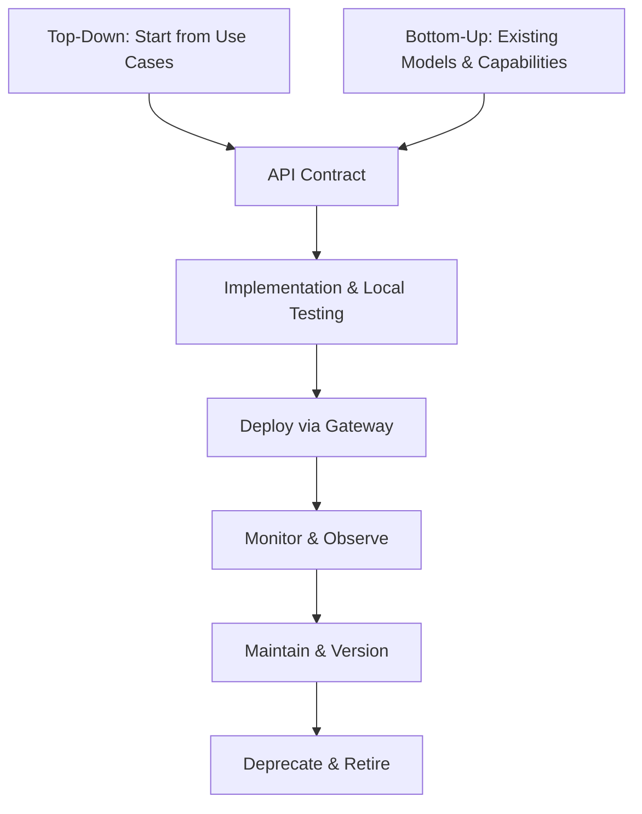

**Implementation Notes**

- **Top-Down**  
  - Common in interviews and greenfield projects: start from user stories and workflows, then derive resources/endpoints.  
  - Ensure you validate designs with frontend/consumer teams before implementation.
- **Bottom-Up**  
  - Common in real companies with existing databases and services: design APIs that reflect real constraints and capabilities.  
  - Be careful not to expose internal quirks directly; still design a clean external contract.
- **Contract-First**  
  - Define OpenAPI/GraphQL schema/proto files first, review them, then generate server stubs and client SDKs.  
  - Helps keep all teams aligned and supports automated testing and documentation.
- **Lifecycle**  
  - Use versioning (e.g. `/v1`, `/v2`) and deprecation notices to migrate consumers safely.  
  - Monitor usage to know when it’s safe to retire older versions.

**Common Mistakes / Misconceptions**

- Jumping straight into coding without a written contract or visual model.  
- Designing only for the first consumer and forgetting future clients and versions.  
- Deprecating or breaking APIs without clear communication and migration paths.

**Quick Example**

```yaml
# Contract-first example: minimal OpenAPI fragment
paths:
  /v1/users/{id}:
    get:
      summary: Get user by ID
      responses:
        '200':
          description: User found
        '404':
          description: User not found
```

---

## 9️⃣ Security: Authentication, Authorization, Validation, Rate Limiting

**High-Level Summary (max 4 sentences)**  
Security for APIs centers on **authentication** (who you are), **authorization** (what you can do), **input validation**, and **rate limiting**. These concerns should be applied consistently across the gateway and services. Proper security protects data, prevents abuse, and builds trust with clients. It is not optional; it is core to API design.

**Everyday Analogy**  
Think of an office building: the **reception desk** checks your ID (authentication), your badge decides which floors you can access (authorization), security checks packages (validation), and turnstiles prevent thousands of people from rushing in at once (rate limiting).

**How It Fits Into the System**  
The API gateway often performs initial auth (e.g. validating JWTs), rate limiting, and some validation. Services then apply fine-grained authorization and deeper validation. Logs and monitoring span the whole system.

**Diagram (Mermaid)**

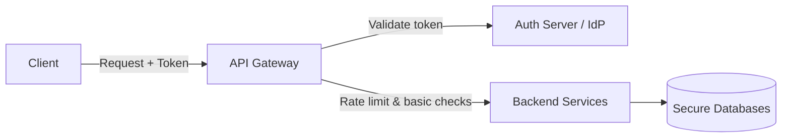

**Implementation Notes**

- **Authentication**  
  - Use JWTs or opaque tokens issued by an identity provider.  
  - In ASP.NET Core, use authentication middleware (`AddAuthentication`, `AddJwtBearer`).  
  - In Node/Express, use middleware like `passport` or custom JWT verification.
- **Authorization**  
  - Use role-based or permission-based checks on endpoints (`[Authorize(Roles="Admin")]`, custom guards).  
  - In Express, write middleware that checks `req.user.roles` for sensitive routes.
- **Validation**  
  - Validate body, query, and path parameters (FluentValidation in .NET, `joi`/`zod` in Node).  
  - Reject invalid input with 400 responses.
- **Rate Limiting**  
  - Implement at the gateway (e.g. NGINX, Azure API Management, AWS API Gateway) using IP/user-based quotas.  
  - For self-hosted APIs, use in-process or distributed rate-limiting libraries.

**Common Mistakes / Misconceptions**

- Confusing authentication with authorization (knowing who you are vs what you can do).  
- Trusting client-side validation instead of validating on the server.  
- Forgetting to rate-limit “read-only” endpoints, which can still be abused.

**Quick Example (Express JWT Middleware)**

```javascript
app.get('/v1/users/me', requireAuth, (req, res) => {
  // req.user is set by auth middleware
  res.json({ id: req.user.id, email: req.user.email });
});
```

---

## 🔟 Performance: Caching, Pagination, Reducing Round Trips

**High-Level Summary (max 4 sentences)**  
Performance is about **doing less work per request** and reducing total requests. Key techniques are caching responses or data, paginating large lists, and minimizing round trips by aggregating data where it makes sense. The right trade-offs depend on API style (REST, GraphQL, gRPC) and usage patterns.

**Everyday Analogy**  
This is like planning **shopping trips**: you make a list, go once (reduce trips), buy in bulk (caching), and avoid carrying unnecessary items (minimize payload).

**How It Fits Into the System**  
The gateway can implement HTTP caching, response compression, and aggregation. Services can use in-memory caches, distributed caches (like Redis), and efficient database queries. GraphQL and gRPC often rely on application-level caching and batching.

**Diagram (Mermaid)**

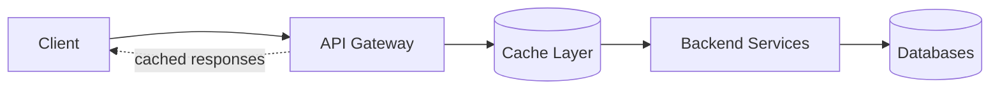

**Implementation Notes**

- **REST + HTTP**  
  - Use `ETag`, `Last-Modified`, `Cache-Control` headers.  
  - Cache read-heavy endpoints behind CDN or reverse proxy.
- **GraphQL**  
  - Use application-level caching in resolvers (e.g. `DataLoader`, Redis).  
  - Design fields with pagination arguments (`first`, `after`, `limit`, `offset`).
- **gRPC**  
  - Cache at service layer for expensive calls.  
  - Use streaming for large data where appropriate.
- **Pagination**  
  - Always paginate large collections (`limit/offset` or cursor-based pagination).  
  - Document defaults and maximum limits.

**Common Mistakes / Misconceptions**

- Returning massive lists in a single response without pagination.  
- Ignoring cache invalidation, leading to stale or inconsistent data.  
- Using caching as a band-aid for poorly designed queries.

**Quick Example (REST Pagination & Caching)**

```http
GET /v1/posts?limit=20&offset=0
Cache-Control: public, max-age=60
ETag: "posts-page-0-v1"
```

---

## 1️⃣1️⃣ Microservices and API Gateway

**High-Level Summary (max 4 sentences)**  
In a microservice architecture, the system is split into **small, independently deployable services**, each owning its data and logic. An API gateway sits in front as a single entry point for clients, routing and aggregating requests. This allows teams to scale and deploy independently while presenting a unified API to consumers. It also centralizes cross-cutting concerns like auth, rate limiting, and observability.

**Everyday Analogy**  
Think of a **shopping mall**: there’s one main entrance (gateway), but many independent shops (microservices) inside, each responsible for its products.

**How It Fits Into the System**  
Clients talk only to the gateway. The gateway knows how to route to user, order, payment, and other services, potentially translating protocols (REST ↔ gRPC). Services talk to their own databases and sometimes to each other via REST, gRPC, or messaging.

**Diagram (Mermaid)**

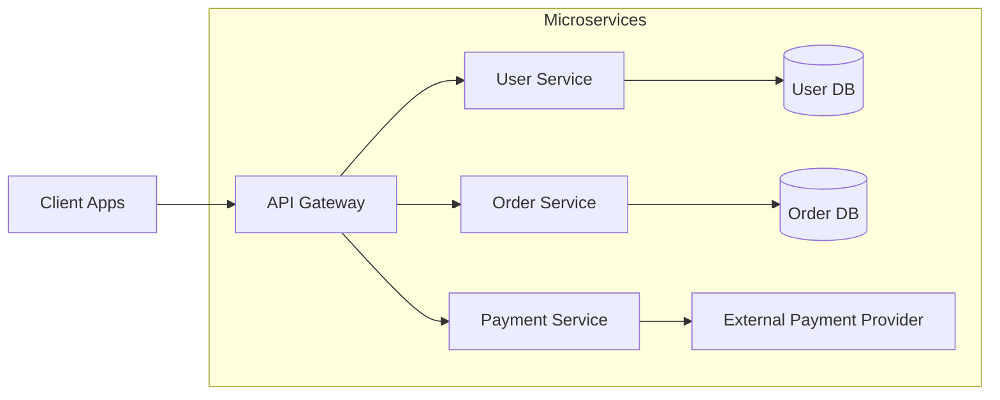

**Implementation Notes**

- **API Gateway**  
  - Can be AWS API Gateway, Azure API Management, Kong, NGINX, etc.  
  - Implements routing, auth, rate limiting, and sometimes request/response transformation.
- **ASP.NET Core & Node Microservices**  
  - Each service exposes its own API (REST or gRPC).  
  - Use independent databases to avoid tight coupling; integrate via APIs or events.
- **Service-to-Service Communication**  
  - Prefer gRPC or message queues for internal communication when performance and reliability matter.  
  - Use centralized logging/tracing (e.g. OpenTelemetry) across services.

**Common Mistakes / Misconceptions**

- Splitting into microservices too early; monolith + modular APIs are often fine initially.  
- Letting services share a single database schema (undoing service boundaries).  
- Duplicating cross-cutting concerns in every service instead of leveraging the gateway.

**Quick Example (Gateway Route Config – Pseudo YAML)**

```yaml
routes:
  - path: /v1/users/*
    upstream: http://user-service:8080
  - path: /v1/orders/*
    upstream: http://order-service:8080
```

---

## 1️⃣2️⃣ Complete System Architecture Overview

**High-Level Summary (max 4 sentences)**  
The full API system has clients talking to an API gateway, which exposes REST and/or GraphQL endpoints and possibly WebSockets. The gateway applies security (auth, authorization checks), rate limiting, and routing to microservices. Microservices may communicate via REST or gRPC and persist data to their own databases or external services. Performance, security, and good design principles apply at every layer.

**Diagram (Mermaid)**

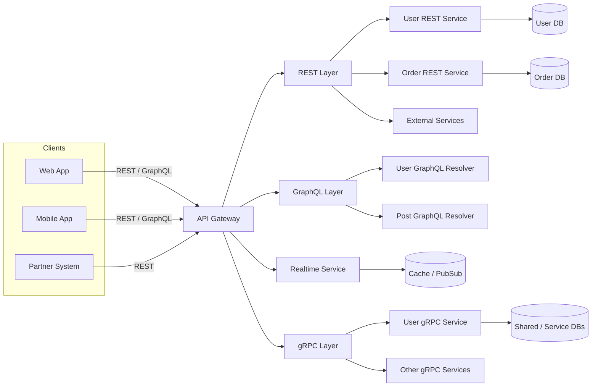

---

### Concept Quick Explainer (Glossary)

**Term: SQL**

- **What It Is**: A language for querying and manipulating data in relational databases (e.g. PostgreSQL, MySQL, SQL Server).  
- **How It’s Used**: APIs call services that run SQL queries to fetch or update structured data in tables.  
- **Where It Happens In The System**: Inside backend services and data access layers behind the API, never directly from client browsers.  
- **Why Engineers Care**: It underpins most transactional systems and must be written safely and efficiently.

---

**Term: NoSQL**

- **What It Is**: A family of databases (e.g. MongoDB, DynamoDB) that store data in non-relational formats like documents, key-value pairs, or wide columns.  
- **How It’s Used**: APIs use NoSQL when flexible schema or high write throughput is more important than strict relations.  
- **Where It Happens In The System**: Behind specific services that benefit from flexible/faster storage models.  
- **Why Engineers Care**: Choosing SQL vs NoSQL impacts performance, consistency, and how APIs model data.

---

**Term: SQL Injection**

- **What It Is**: A vulnerability where untrusted input is concatenated into SQL queries, allowing attackers to run arbitrary database commands.  
- **How It Happens (Simple Example)**: Building a query like `SELECT * FROM users WHERE name = '${userInput}'` allows input like `' OR 1=1 --` to bypass filters.  
- **Where It Happens In The System**: In the data access layer of backend services when they don’t validate or parameterize inputs.  
- **Why Engineers Care**: It can lead to data theft or destruction; parameterized queries and ORMs are used to prevent it.

---

**Term: CORS (Cross-Origin Resource Sharing)**

- **What It Is**: A browser security mechanism that controls which origins (domains) can call your API with browser credentials.  
- **How It Happens**: The browser sends preflight requests and checks response headers like `Access-Control-Allow-Origin`.  
- **Where It Happens In The System**: At the API layer or gateway, which sets the appropriate headers.  
- **Why Engineers Care**: Misconfigured CORS can block legitimate frontend apps or expose APIs to unintended origins.

---

**Term: Firewall**

- **What It Is**: A security device or software that controls incoming and outgoing network traffic based on rules.  
- **Where It Happens In The System**: At network edges around the gateway, load balancers, or services.  
- **Why Engineers Care**: It’s the first line of defense against unauthorized access and certain types of attacks.

---

**Term: VPN (Virtual Private Network)**

- **What It Is**: A secure, encrypted tunnel that lets clients or services connect to a private network over the internet.  
- **Where It Happens In The System**: Between remote clients/partners and internal networks hosting APIs and services.  
- **Why Engineers Care**: Often used to restrict sensitive APIs to internal or trusted networks only.

---

**Term: API Gateway**

- **What It Is**: A single entry point that routes, secures, and monitors requests to multiple backend services.  
- **Where It Happens In The System**: Between external clients and internal microservices.  
- **Why Engineers Care**: It centralizes cross-cutting concerns like auth, rate limiting, logging, and protocol translation.

---

**Term: Authentication vs Authorization**

- **Authentication (AuthN)**: Verifying who you are (e.g. login using password, token, or OAuth).  
- **Authorization (AuthZ)**: Determining what you’re allowed to do (e.g. read-only vs admin).  
- **Where It Happens**: AuthN at gateway or auth service; AuthZ in services and endpoints.  
- **Why Engineers Care**: Mixing them up leads to designs where identity is checked but permissions aren’t enforced correctly.

---

**Term: JWT (JSON Web Token)**

- **What It Is**: A compact, signed token (often in a header) that encodes user identity and claims.  
- **How It’s Used**: Clients send JWTs with each request; APIs validate the signature and read claims.  
- **Where It Happens In The System**: Issued by an auth server, validated by gateway and services.  
- **Why Engineers Care**: Enables stateless auth across many services without shared session storage.

---

**Term: Rate Limiting**

- **What It Is**: Controlling how many requests a client can make in a given time window.  
- **How It’s Used**: E.g. “100 requests per minute per IP or per API key.”  
- **Where It Happens In The System**: Typically at the API gateway or edge proxies.  
- **Why Engineers Care**: Prevents abuse, DoS attacks, and runaway clients from overloading the system.

---

### Knowledge Check

1. **API Basics**  
   - What does it mean to say an API is a “contract” between a client and a server?  
   - Why is it useful that APIs hide implementation details behind an interface?

2. **REST vs GraphQL vs gRPC**  
   - When would you prefer REST over GraphQL for a public API?  
   - Give an example of a UI scenario where GraphQL can reduce the number of requests compared to REST.  
   - Why is gRPC often used for service-to-service communication instead of for browser clients?

3. **Design Principles**  
   - What are two examples of consistency in API design (naming, response shape, etc.)?  
   - How does pagination improve performance and user experience for list endpoints?

4. **Protocols and Real-Time**  
   - When is WebSockets a better choice than plain HTTP, and when is it unnecessary complexity?  
   - How does your choice of protocol (HTTP vs gRPC) influence how you design your API?

5. **Security**  
   - What is the difference between authentication and authorization in the context of an API?  
   - Why should you never rely solely on client-side validation?  
   - How does rate limiting help protect your API?

6. **System Architecture**  
   - What role does an API gateway play in a microservices architecture?  
   - Why might microservices avoid sharing a single central database schema?

7. **Practical Implementation**  
   - In a Node/Express API, where would you implement input validation and why?  
   - In ASP.NET Core, how would you express that an endpoint requires an authenticated user?

