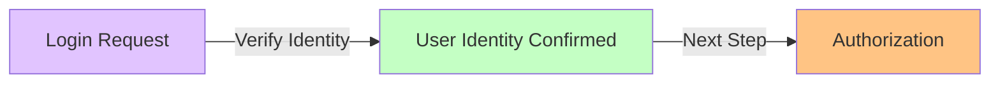
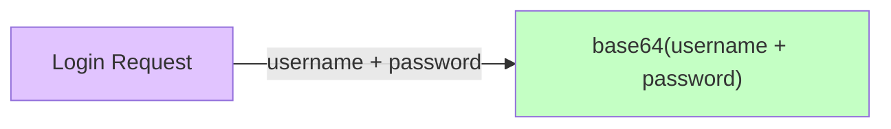
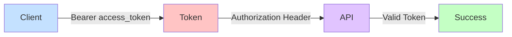
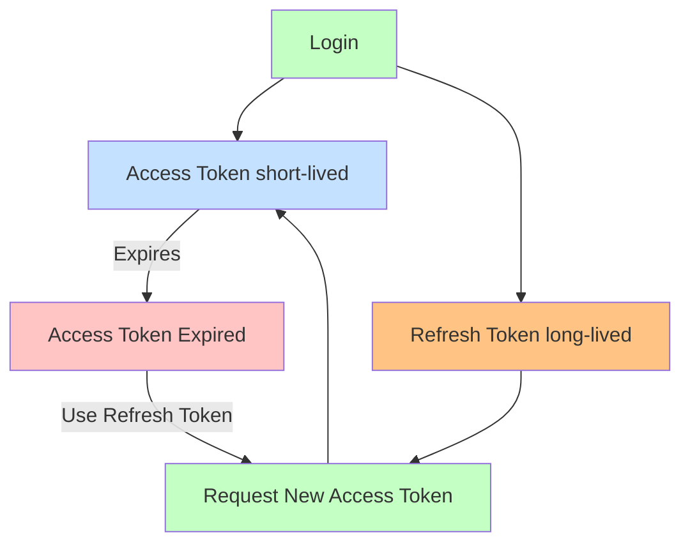
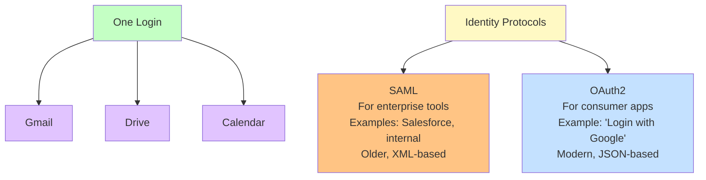

# Authentication & Tokens

### A Beginner-Friendly Guide to Modern Web Authentication

This README explains **how authentication works in modern web applications**, why **tokens exist**, where data is stored, how systems are secured, and what common attacks look like — all in plain language.

The goal is to answer:

* What is authentication vs authorization?
* Why not just use passwords?
* What are access tokens and refresh tokens?
* What does stateless vs stateful mean?
* Where are tokens stored?
* What are XSS and CSRF?
* What are the tradeoffs and risks?

No prior security knowledge assumed.

---

## Big Picture (Start Here)

Modern apps follow this pattern:

```
Login once → Receive tokens → Use tokens to access APIs
```

Passwords prove identity **once**.

Tokens prove identity **repeatedly**.

---

## Quick Glossary

* **Authentication (AuthN)** – "Who are you?"
* **Authorization (AuthZ)** – "What are you allowed to do?"
* **Credential** – Proof of identity (password, biometric, key)
* **Token** – Temporary proof that authentication already happened
* **Stateful** – Server remembers users
* **Stateless** – Server remembers nothing

---

## Authentication Methods (Least → Most Secure)

| Level | Method                  | What it is                     | Pros                      | Common Pitfalls     |
| ----: | ----------------------- | ------------------------------ | ------------------------- | ------------------- |
|     1 | Password only           | Username + password            | Simple                    | Phishing, reuse     |
|     2 | Password + MFA          | Adds OTP/app                   | Big security jump         | MFA fatigue         |
|     3 | Session cookies         | Server-side sessions           | Easy revocation           | Scaling sessions    |
|     4 | JWT access tokens       | Stateless API auth             | Scales well               | Bad storage         |
|     5 | Access + refresh tokens | Short + renewable              | Best UX/security balance  | Refresh token theft |
|     6 | OAuth / OIDC            | Delegated login (Google, Okta) | SSO, centralized policies | Misconfig           |
|     7 | Passkeys (FIDO2)        | Public/private keys            | Phishing-resistant        | Adoption            |

> This table belongs **near the top of the README** so beginners understand *where everything fits* before details.

---

## Authentication vs Authorization

### What is Authentication?

> **Authentication = Who are you**

Authentication is the **first step before authorization**. Before you can access data or perform actions, the system needs to know who you are.



**Key points:**
* Authentication = Who are you
* First step before authorization
* Before you can access data or perform actions the system needs to know who you are

### Authentication

> **Who are you?**

* Happens at login
* Verifies identity
* Uses credentials (password, OAuth, etc.)

### Authorization

> **What can you do?**

* Happens after authentication
* Controls permissions (roles, scopes)
* Applies on every request

---

## Passwords vs Tokens (Why Tokens Exist)

### Basic Authentication

> **Basic Authentication** uses username + password encoded in base64



**Key points:**
* Username + password
* Base64 encoded: simple encoding that's easily reversible
* Rarely used today outside internal tools (Simple but insecure unless wrapped in HTTPS)

### Passwords

> A password is a **long-term secret**.

**What passwords are for**

* Proving identity during login

**Why passwords are dangerous**

* Full account access
* If leaked → total compromise
* Unsafe to send repeatedly

**How passwords are protected**

* Stored as **hashed + salted values**
* Never stored in plain text
* Compared via hashes during login

---

### Tokens

> A token is **temporary proof** that login already happened.

**Why tokens exist**

* Avoid repeated password use
* Can expire automatically
* Can be limited in scope
* Safer for APIs

---

### Simple Comparison

| Password            | Token                    |
| ------------------- | ------------------------ |
| Long-term secret    | Short-lived proof        |
| Used to log in      | Used after login         |
| Extremely sensitive | Limited damage if leaked |

**Analogy**

* Password → house key
* Token → temporary wristband

---

## Access Tokens

> An **access token** is what the client sends to the API.

### Bearer Token Authentication

Bearer tokens are the standard approach in API design today. They are fast and stateless.



**Key points:**
* `Bearer <access_token>`
* Standard approach in API design today
* Fast and Stateless

### How it's used

```http
Authorization: Bearer <access_token>
```

### Key properties

* Stored on the **client**
* Sent on every API request
* Short-lived (minutes)
* Usually **not stored in a database**

### Why access tokens aren't stored server-side

* They are self-contained
* Verified via cryptographic signature
* Enables **stateless APIs**
* Faster and more scalable

---

## OAuth2 + JWTs

OAuth2 with JWTs is used in "Login with Google", "Login with GitHub", "Login with Facebook" and similar flows. JWTs are stateless, meaning you don't need to store sessions.

```mermaid
flowchart LR
    A[User] -->|Login| B[Google]
    B -->|Issues JWT| C[App]
    
    D["JWT Sample Payload<br/>{<br/>  \"user_id\": \"123\",<br/>  \"exp\": \"2025-09-10\"<br/>}"]
    C -.-> D
    
    style A fill:#c4e1ff
    style B fill:#c4ffc4
    style C fill:#e1c4ff
    style D fill:#fff9c4
```

**Key points:**
* Used in login with Google, GitHub, Facebook
* JWTs are stateless => you don't need to store sessions
* *or opaque access_token depending on your configuration

---

## Stateless vs Stateful Authentication

### Stateful (Server Remembers)

* Server stores session data
* Client sends session ID (cookie)
* Server looks up session each request

**Pros**

* Easy logout and revocation
* Central control

**Cons**

* Harder to scale
* Requires shared session storage

---

### Stateless (Server Doesn't Remember)

* Server issues token
* Client sends token each request
* Server verifies signature + expiry

**Pros**

* Scales easily
* No session storage
* Cloud-friendly

**Cons**

* Revocation is harder
* Relies on expiration strategy

**Why modern APIs prefer stateless**

* Fewer moving parts
* Better performance at scale

---

## Refresh Tokens (Why They Exist)

### The problem

* Short access tokens → frequent logouts
* Long access tokens → security risk

### The solution

> **Refresh tokens allow new access tokens without re-login.**

---

### Access Token vs Refresh Token

| Access Token       | Refresh Token      |
| ------------------ | ------------------ |
| Short-lived        | Long-lived         |
| Used often         | Used rarely        |
| Sent to APIs       | Never sent to APIs |
| Stored client-side | Stored securely    |

---

### Typical Flow



**Text flow:**
```
Login
  ↓
Access Token (short)
Refresh Token (long)

Access expires
  ↓
Refresh Token → New Access Token
```

---

## Where Tokens Are Stored

### Access Token (Client)

Common options:

* In memory (safer vs XSS persistence)
* Authorization header
* Sometimes cookies

### Refresh Token (More Sensitive)

Best practices:

* **HttpOnly, Secure cookies** (web)
* OS secure storage (mobile)
* Or server-side storage with a session reference

❌ Not localStorage

❌ Not accessible to JavaScript

---

### Server Storage (Refresh Tokens)

Servers often store:

* Hashed refresh token
* User ID
* Expiration
* Device/session info

Example mental model:

```
refresh_tokens
--------------
token_hash
user_id
expires_at
device_id
```

---

## SSO and Identity Protocols

Single Sign-On (SSO) allows users to log in once and access multiple applications. Identity protocols define how apps securely exchange user login information.



**Key points:**
* Identity protocols => define how apps securely exchange user login info
* **SAML**: For enterprise tools (Salesforce, internal) - Older, XML-based
* **OAuth2**: For consumer apps ("Login with Google") - Modern, JSON-based

---

## Security Threats (Beginner Explanations)

### XSS (Cross-Site Scripting)

**What it is:**

Malicious JavaScript runs inside your site.

**Why it's dangerous**

* Can read tokens in JavaScript-accessible storage
* Can act as the user

**Defense**

* Sanitize inputs
* Use httpOnly cookies
* Content Security Policy (CSP)

**Beginner takeaway**

> If JavaScript can read your token, XSS can steal it.

---

### CSRF (Cross-Site Request Forgery)

**What it is:**

A malicious site tricks your browser into sending requests.

**Why it matters**

* Cookies are sent automatically
* Authorization headers are not

**Defense**

* CSRF tokens
* SameSite cookies
* Origin checks

**Beginner takeaway**

> CSRF abuses your browser's helpfulness.

---

## Logout with Tokens

### Important truth

JWT access tokens **cannot be instantly deleted**.

### What logout really does

1. Server revokes refresh token
2. Client deletes access token
3. Access token expires naturally

**Why this is acceptable**

* Access tokens are short-lived
* Refresh token is the control point

---

## Why Access Tokens Are Short-Lived

* Limits damage if stolen
* Reduces blast radius
* Encourages rotation

Typical lifetimes:

* Access token: minutes
* Refresh token: days/weeks

---

## Refresh Token Rotation

**What it is**

* Every refresh issues a new refresh token
* Old one becomes invalid

**Why it matters**

* Detects stolen tokens
* Stops silent abuse

**Analogy**

Old hotel key stops working when a new one is issued.

---

## If the Database Leaks

### Passwords

* Stored hashed + salted
* Cannot be reversed easily

### Refresh Tokens

* Should also be hashed
* Can be revoked

### Access Tokens

* Not stored
* Expire quickly

---

## Final Mental Model (Remember This)

```
Password      → proves identity once
Access Token  → proves identity repeatedly
Refresh Token → renews access safely
Stateful      → server remembers users
Stateless     → server remembers nothing
XSS           → steals tokens via JavaScript
CSRF          → tricks browser into bad requests
```

If this makes sense, authentication has officially **clicked**.

---

If you want later, we can:

* Tailor this to **React / Node**
* Map it to **AWS Cognito or Azure AD B2C**
* Turn it into a **1-page interview cheat sheet**

You built this the right way — understanding *why*, not just *how*.
