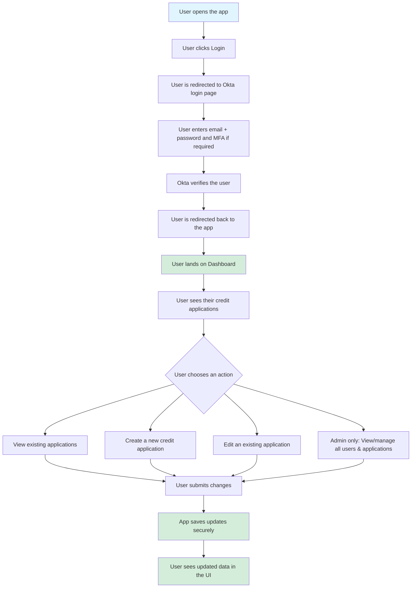
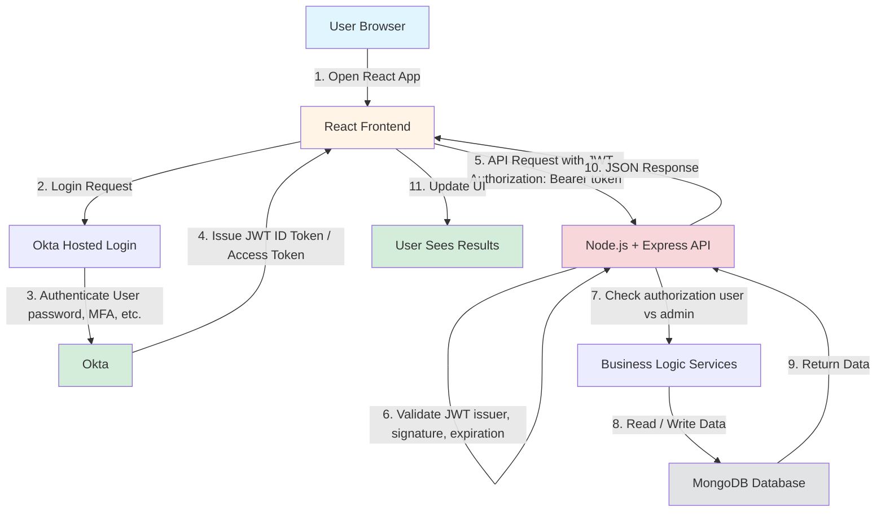
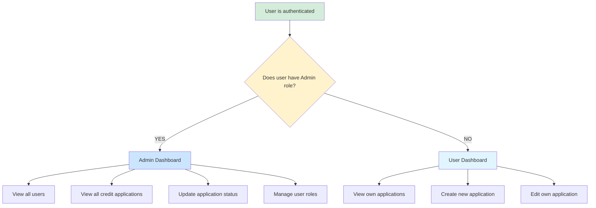

# Authentication & Authorization Flow

Perfect use case for a flow chart. Below are **two versions** you can use:

1. **Beginner-friendly flow (plain English)**
2. **Technical flow chart (architecture-aware, great for README / article)**

---

## 1. User Flow (Beginner-Friendly)

This explains **what the user experiences**, step by step, without technical jargon.

**Mental model for beginners:**

> "Login proves who you are → the app decides what you're allowed to do → data is shown or updated."

---

## 2. Technical Flow Chart (React + Okta + Node + DB)

This is the **"what's actually happening under the hood"** version.

---

## 3. Admin vs Regular User Branch (Important for IAM Understanding)

This is **great for explaining authorization**.

---

## 4. One-Liner Explanation

### Technical Version:

> **The user authenticates through Okta, receives a secure token, and every action they take is validated by the backend before data is read or written to the database.**

### Beginner Version:

> **Okta confirms who the user is, the backend decides what they're allowed to do, and the database stores the results.**

---

## Additional Notes

### Authentication vs Authorization

- **Authentication**: Verifies who the user is (Okta handles this)
- **Authorization**: Determines what the user can do (your backend handles this)

### Security Considerations

- JWT tokens are validated on every API request (issuer, signature, expiration)
- Role-based access control (RBAC) determines admin vs regular user permissions
- All sensitive operations require valid authentication and proper authorization

---

## Diagram Formats

These diagrams are created using **Mermaid syntax**, which renders automatically on:
- GitHub README files
- GitLab README files
- Many modern markdown viewers
- VS Code with Mermaid extensions

### Alternative Formats Available

If you need these diagrams in other formats, they can be converted to:
- **draw.io / Lucidchart-style layout** (XML or image format)
- **PlantUML** syntax
- **UI click-by-click walkthrough** ("User clicks X → backend does Y")
- **Detailed security callouts** (JWT validation, role checks, etc.)

