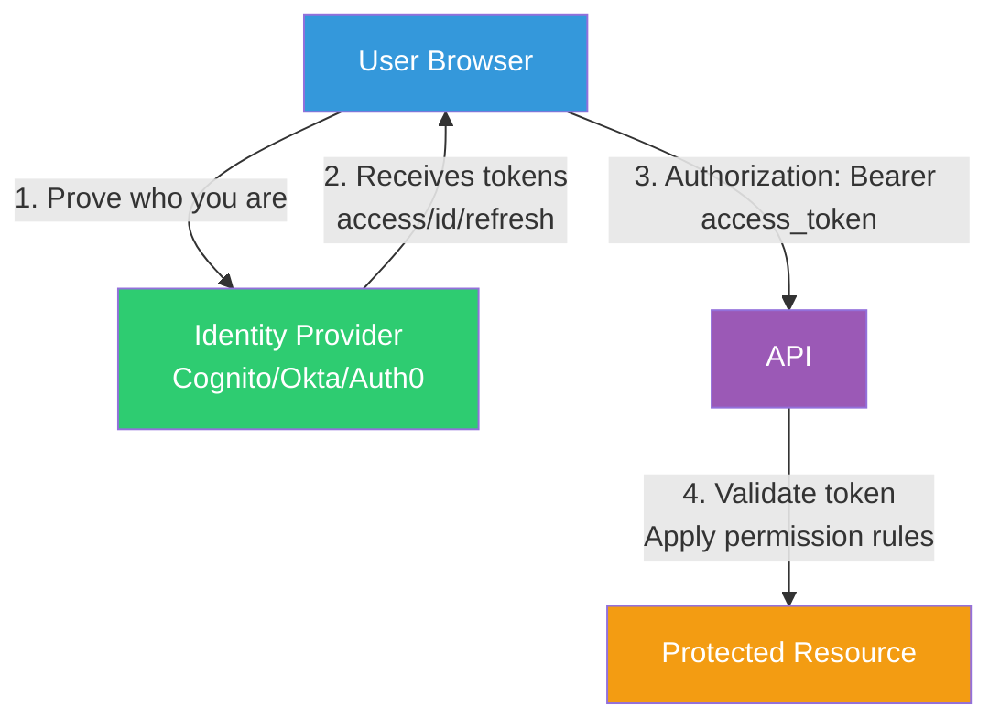
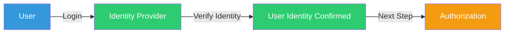
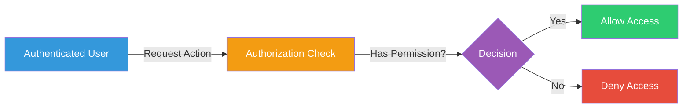
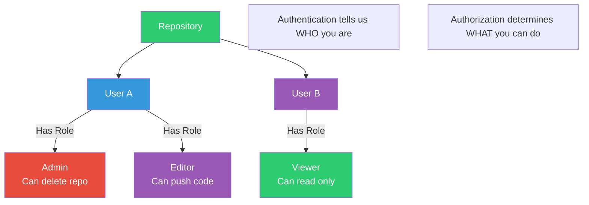
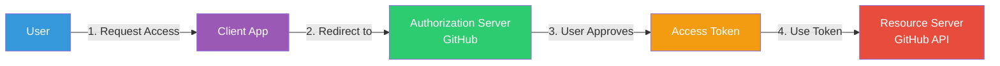
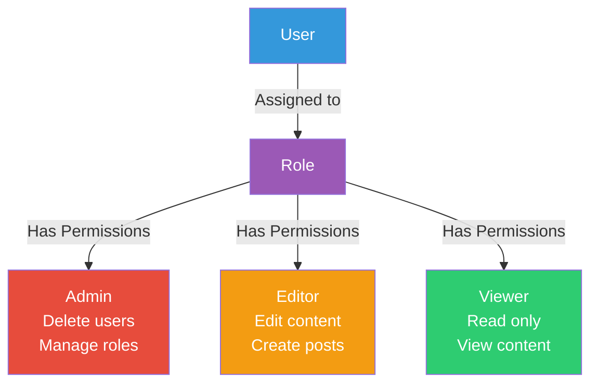
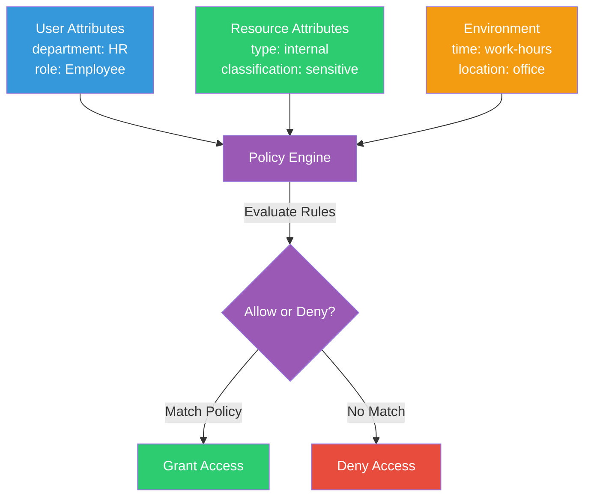
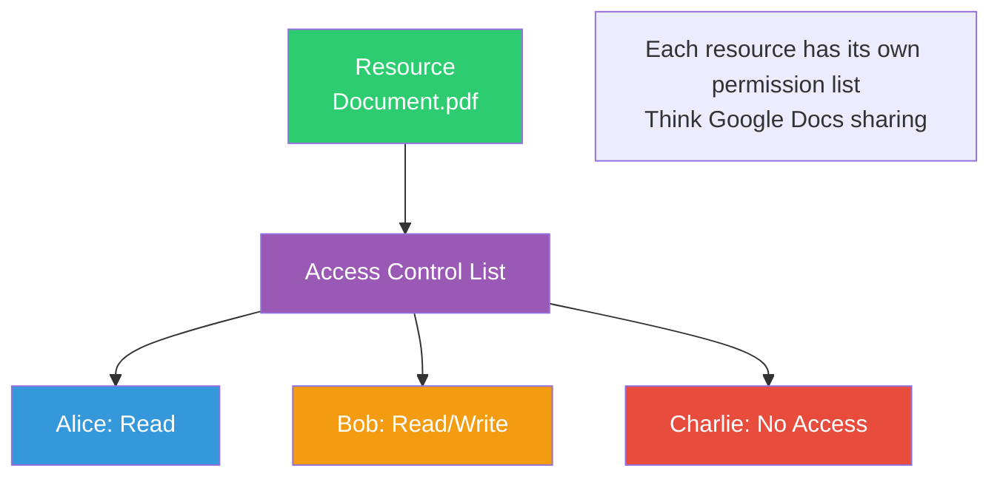
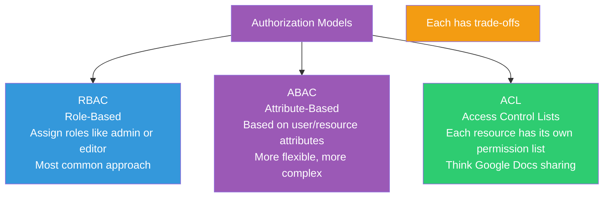
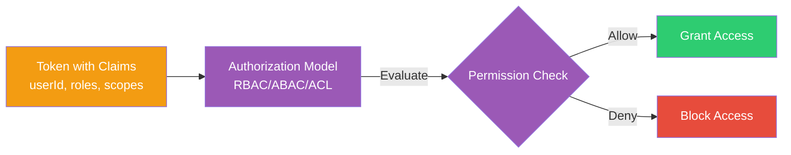

# Auth 101: Authentication + Authorization (Beginner-Friendly)

A practical, beginner-friendly guide to understanding **who you are** (authentication) and **what you're allowed to do** (authorization) in modern web apps — including **tokens (JWT/bearer)**, **OAuth2**, **refresh tokens**, and common **authorization models** like **RBAC / ABAC / ACL**.

---

## TL;DR

- **Authentication (AuthN)** answers: *"Who are you?"* (login)

- **Authorization (AuthZ)** answers: *"What can you do?"* (permissions)

- **Tokens** are like **temporary "entry passes"** that represent identity and/or permissions.

- **Access tokens** are short-lived (minutes). **Refresh tokens** are longer-lived and used to get new access tokens.

- **RBAC** = roles (Admin/Editor/Viewer).  

  **ABAC** = rules using attributes (department=HR AND resource=internal AND time=work-hours).  

  **ACL** = per-resource permission list (Google Doc sharing).

---

## Where to start reading

If you're new, read in this order:

1. AuthN vs AuthZ

2. Passwords vs Tokens (and why tokens exist)

3. Access Token vs Refresh Token

4. Stateless vs Stateful sessions

5. RBAC vs ABAC vs ACL

6. Common security gotchas (XSS/CSRF)

---

## Quick mental model (diagram)



**Key points:**
- **(AuthN)** Prove who you are -> Identity Provider
- **(AuthZ)** Use token to access stuff -> API validates and applies permissions

---

# 1) Authentication vs Authorization (the difference)

## Authentication (AuthN)

Authentication is the **login** part.

- Examples: username+password, Google login, MFA, passkeys



## Authorization (AuthZ)

Authorization is the **permission** part.

- Examples: "Only admins can delete users", "Only owners can edit this doc"



**Important:** You can be authenticated and still be blocked (authorized denied).

### Example: GitHub Repository



---

# 2) Passwords vs Tokens (why tokens exist)

## Passwords

- A password is a **secret** you know.

- Passwords should **never** be sent to random third-party apps.

- Passwords are long-lived secrets: if stolen, attacker can often log in until you change it.

## Tokens (access tokens / bearer tokens)

- A token is a **temporary credential** issued after you authenticate.

- Tokens represent **what the user (or app) is allowed to do**.

- Tokens are typically scoped and expirable: "Read repo, but can't delete repo."

**Analogy:**  

Password = your house key (you do NOT hand this to strangers)  

Token = a temporary guest pass with limited access and an expiration time

---

# 3) Stateless vs Stateful (why it matters)

## Stateful sessions (classic web sessions)

- Server stores session data (like `sessionId -> userId`) in **memory/DB/cache**

- Client stores only a **session ID** (often in a cookie)

- Pros: server can revoke instantly, easy "log out everywhere"

- Cons: server must store/lookup sessions (scaling + storage)

## Stateless tokens (common in APIs)

- Server does not store session state for each user request

- Client sends a token each time

- Pros: scales well, fewer DB lookups per request

- Cons: revocation is harder (you rely on short expirations, rotate keys, or maintain deny-lists)

---

# 4) Access tokens vs Refresh tokens (and what happens without refresh)

## Access Token

- Short-lived (often 5–60 minutes)

- Used on every API request

- Sent like:

```http
Authorization: Bearer <access_token>
```

### If an access token is stolen…

Attacker can act as that user **until it expires** (so keeping it short-lived is the point).

## Refresh Token

* Longer-lived (days/weeks)

* Used to obtain a **new access token** without forcing the user to log in again

* Typically sent only to a token endpoint (not on every request)

### Without refresh tokens

* Your access token expires -> user must log in again frequently

  (annoying UX, especially on mobile / long sessions)

---

# 5) Where are tokens stored (client vs server)?

This depends on the app type and security posture.

## Client-side storage options

### Option A: In-memory (best for XSS safety)

* Stored in memory only (JS variable)

* Lost on refresh/tab close

* Great for SPAs if you can re-auth or silently refresh

### Option B: Secure cookies (often best "balanced" default)

* Store tokens in **HttpOnly + Secure + SameSite** cookies

* HttpOnly blocks JavaScript from reading it (helps against XSS token theft)

* Still requires CSRF defenses depending on how you use cookies

### Option C: localStorage/sessionStorage (convenient, but risky)

* Easy to implement

* **If XSS happens, attacker can read localStorage tokens**

* Use only if you understand the risk and have strong XSS prevention

## Server-side storage options

### Stateful sessions

* Server stores session data, client stores session ID cookie

* Easy to revoke, easy to rotate, commonly used for traditional web apps

### Refresh token storage

* Many systems store refresh tokens on the server (DB) hashed + rotated

* Helps with:

  * revocation

  * "logout everywhere"

  * detecting token reuse

---

# 6) What is XSS (and why everyone warns about it)?

**XSS (Cross-Site Scripting)** happens when an attacker injects JavaScript into your site/app.

If your app stores tokens in localStorage and you have XSS:

* attacker's injected JS can do: `localStorage.getItem("token")`

* now they have your token

**Basic XSS defenses:**

* escape/encode untrusted input

* avoid dangerously rendering HTML

* set Content Security Policy (CSP)

* sanitize user content

---

## What is CSRF (Cross-Site Request Forgery)?

**CSRF (Cross-Site Request Forgery)** happens when a malicious website tricks your browser into making requests to a site where you're authenticated.

**How it works:**

* You're logged into `bank.com` (cookie stored in browser)

* You visit `evil.com` which has a form that submits to `bank.com`

* Your browser automatically sends your `bank.com` cookie with the request

* `bank.com` sees you're authenticated and processes the request

**CSRF defenses:**

* **SameSite cookies**: Cookies are only sent with requests from the same site

* **CSRF tokens**: Server generates a unique token per session, client must include it

* **Origin checks**: Verify the request came from your own domain

* **Double-submit cookie pattern**: Cookie value must match a value in the request body/header

---

# 7) OAuth2 (delegated authorization) in plain English

OAuth2 is used when:

* an app wants to access another service **on your behalf**

* without you giving the app your password

Example: "Vercel wants to read your GitHub repo"

* You log in to GitHub

* You approve permissions (scopes)

* GitHub returns a token to Vercel

* Vercel uses token -> can only do what you approved

**Key idea:** Password never leaves GitHub. Token is limited + revocable.



---

# 8) Authorization Models: RBAC vs ABAC vs ACL

These define **how you decide** whether a request is allowed.

## RBAC — Role-Based Access Control

You assign users to roles, roles have permissions.

* User -> Role -> Permissions

* Example roles: Admin, Editor, Viewer



**Pros**

* Simple and common

* Easy to explain

**Cons**

* Can get messy when you need many "special cases"

  * "Editor can edit *only* HR docs, but only during work hours…"

## ABAC — Attribute-Based Access Control

Permissions are decisions based on attributes about:

* the user (department=HR)

* the resource (classification=internal)

* the environment (time, device, location)

Example rule:

* Allow if: `user.department == "HR" AND resource.type == "internal" AND env.time in workHours`



**Pros**

* Very flexible

* Handles complex rules without exploding roles

**Cons**

* More complex to design + test

* Can create policy conflicts if not managed well

## ACL — Access Control Lists

Each resource stores a list of who can do what.

Example (Google Docs):

* This doc:

  * Alice: read

  * Bob: read/write

  * Charlie: no access



**Pros**

* Very granular per resource

* Very intuitive for "sharing" scenarios

**Cons**

* Can be harder to scale/maintain for huge systems

* Requires careful management to avoid messy permission sprawl

---

## Authorization model cheat sheet (quick table)

| Model | Main idea                    | Best for                                  | Weak spot                      |
| ----- | ---------------------------- | ----------------------------------------- | ------------------------------ |
| RBAC  | roles grant permissions      | dashboards, admin panels, internal tools  | role explosion for edge cases  |
| ABAC  | rules based on attributes    | enterprise apps, compliance-heavy systems | complexity + policy management |
| ACL   | per-resource permission list | file sharing, docs, resources with owners | scaling + permission sprawl    |

---

## Common Authorization Models Overview



---

# 9) Tokens vs Authorization Models (common confusion)

Tokens are usually **a mechanism** for carrying identity/claims.

Authorization models are **the strategy** for deciding access.

* Token may contain: userId, roles, scopes, issuer, expiration

* Authorization model decides: "Given these roles/scopes/attributes, allow or deny?"

**Example**

* JWT (JSON Web Token) contains role=Editor and scopes=repo:read

* Your RBAC/ABAC logic uses that info to allow "edit article" but deny "delete user"

**What is a JWT?**

A JWT is a self-contained token format with three parts:
* **Header**: Algorithm and token type
* **Payload**: Claims (userId, roles, scopes, expiration, etc.)
* **Signature**: Cryptographic signature to verify authenticity

JWTs are stateless - the server can verify them without database lookups, making them popular for APIs.



---

# 10) Common "holes" and follow-up questions (the stuff interviewers ask)

## "How do you revoke tokens?"

* Short-lived access tokens + refresh token rotation

* Server-side deny-list / token blacklist (for high security systems)

* Store refresh tokens in DB and revoke them

## "What if a token is stolen?"

* Keep access tokens short-lived

* Use HTTPS everywhere

* Store tokens safely (prefer HttpOnly cookies or in-memory)

* Rotate refresh tokens, detect reuse

## "How do you validate a JWT?"

* Check:

  * signature (trusted issuer keys)

  * expiration (exp)

  * audience (aud)

  * issuer (iss)

  * scopes/roles/claims

## "How do you prevent CSRF?"

* If using cookies for auth:

  * SameSite cookies

  * CSRF tokens for state-changing requests

  * double-submit cookie patterns (depends on framework)

---

# 11) Practical design guidance (what most real systems do)

A very common, reasonable setup:

* **AuthN:** OAuth/OIDC with an Identity Provider (Cognito/Okta/Auth0)

* **Access control strategy:** RBAC for broad roles + ABAC rules for special cases

* **Token strategy:**

  * short-lived access token

  * refresh token rotation

* **Storage:**

  * HttpOnly secure cookies (or in-memory for SPAs + refresh strategy)

Real systems often combine models:

* RBAC for "Admin/Editor/Viewer"

* ACL for "sharing documents"

* ABAC for "compliance conditions"

---

## Glossary (fast)

* **JWT (JSON Web Token)**: A common token format (often used as access tokens). Contains three parts: header, payload (claims), and signature. Self-contained and can be verified without database lookups.

* **Bearer token**: Whoever "bears" (has) it can use it (treat like cash). Sent in the `Authorization: Bearer <token>` header.

* **Token**: A temporary credential issued after authentication. Represents identity and/or permissions. Short-lived and scoped.

* **Access token**: Short-lived token (minutes) used to access protected resources. Sent on every API request.

* **Refresh token**: Long-lived token (days/weeks) used to obtain new access tokens without re-authentication.

* **Scope**: A permission label (e.g., `repo:read`, `user:write`). Defines what actions the token allows.

* **Claims**: Fields inside a token (userId, roles, exp, iss, aud). Contains information about the user and permissions.

* **Issuer (iss)**: Who created the token (Identity Provider like Cognito/Okta/Auth0).

* **IdP (Identity Provider)**: Service that authenticates users and issues tokens (e.g., Cognito, Okta, Auth0, Google).

* **OIDC (OpenID Connect)**: Authentication layer built on top of OAuth2. Provides identity information (who the user is) in addition to OAuth2's authorization (what they can do).

* **OAuth2**: Authorization framework that allows apps to access resources on behalf of users without sharing passwords.

* **XSS (Cross-Site Scripting)**: Attack where malicious JavaScript is injected into your site/app, potentially stealing tokens or session data.

* **CSRF (Cross-Site Request Forgery)**: Attack where a malicious site tricks your browser into making authenticated requests to another site.

* **MFA (Multi-Factor Authentication)**: Security method requiring multiple forms of verification (password + SMS code, password + authenticator app, etc.).

* **CSP (Content Security Policy)**: Security header that helps prevent XSS by controlling which resources can be loaded/executed.

* **HttpOnly cookie**: Cookie attribute that prevents JavaScript from accessing the cookie, protecting against XSS token theft.

* **SameSite cookie**: Cookie attribute that controls when cookies are sent with cross-site requests, helping prevent CSRF.

* **SPA (Single Page Application)**: Web app that loads once and updates dynamically without full page reloads (e.g., React, Vue, Angular apps).

* **RBAC (Role-Based Access Control)**: Authorization model where users are assigned roles, and roles have permissions.

* **ABAC (Attribute-Based Access Control)**: Authorization model where permissions are based on attributes (user, resource, environment).

* **ACL (Access Control List)**: Authorization model where each resource has its own list of who can do what.

---

## Want to adapt this README to your project?

Replace these placeholders:

* **Identity Provider:** `<Cognito/Okta/Auth0/...>`

* **Roles:** `<Admin/Editor/Viewer/...>`

* **Resources:** `<documents/repos/rides/...>`

* **Rules:** `<your ABAC conditions>`

If you paste your project's "users + resources + rules", I can tailor this into a project-specific README section without turning it into a novel.

