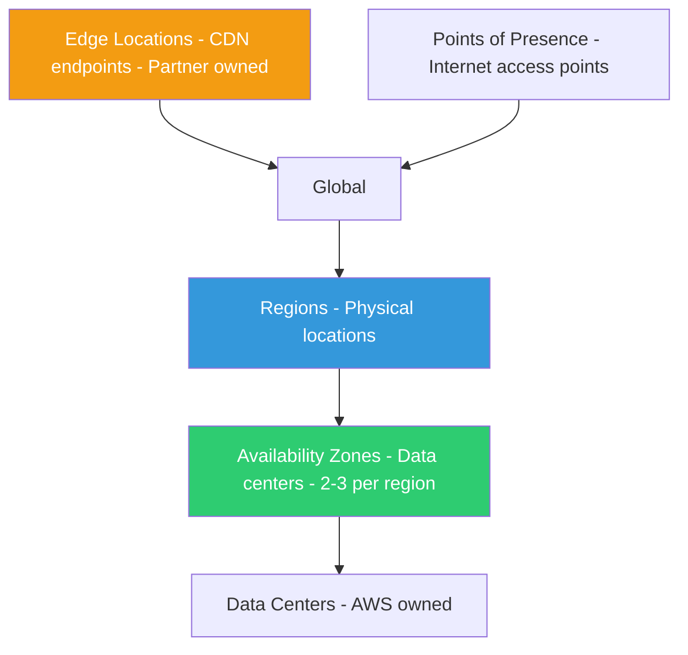
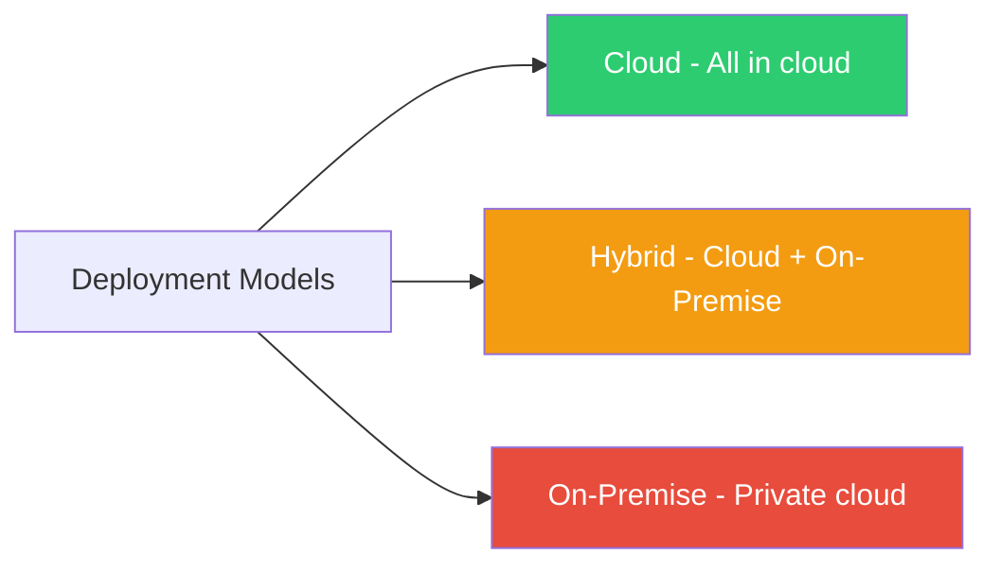
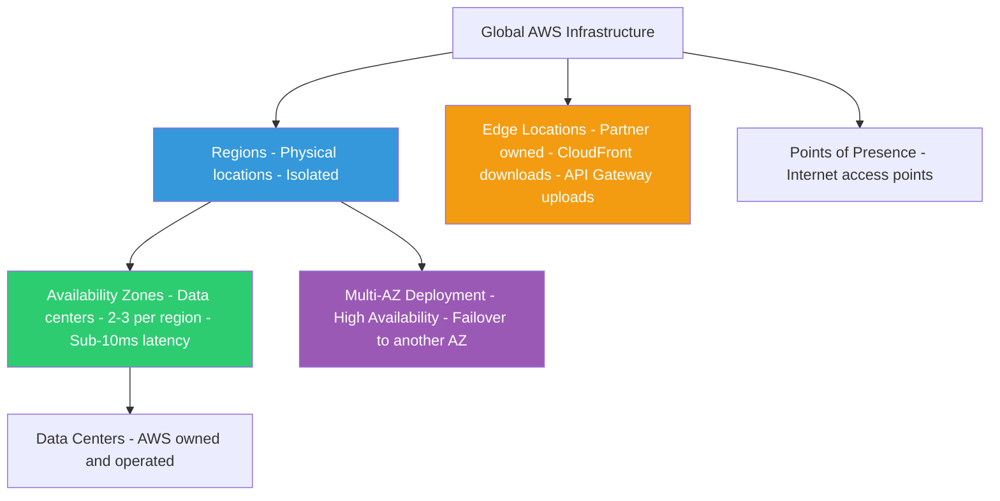
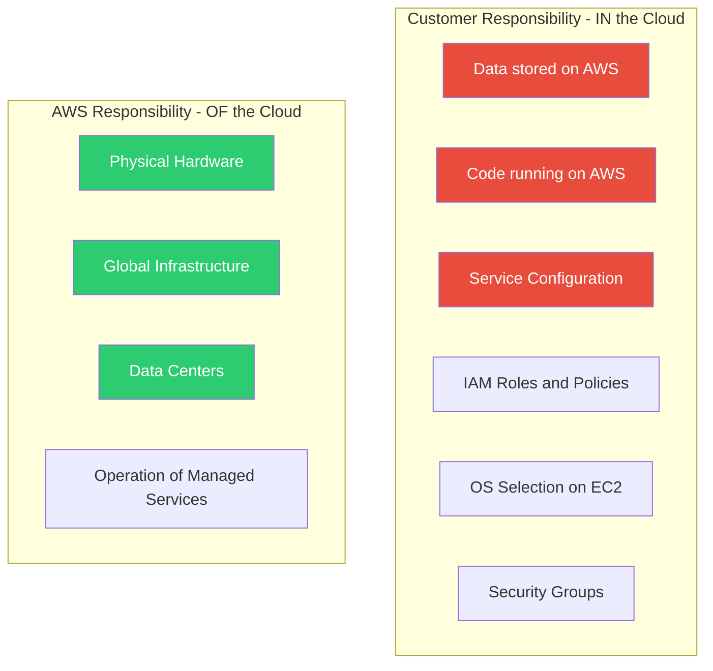
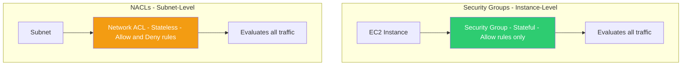
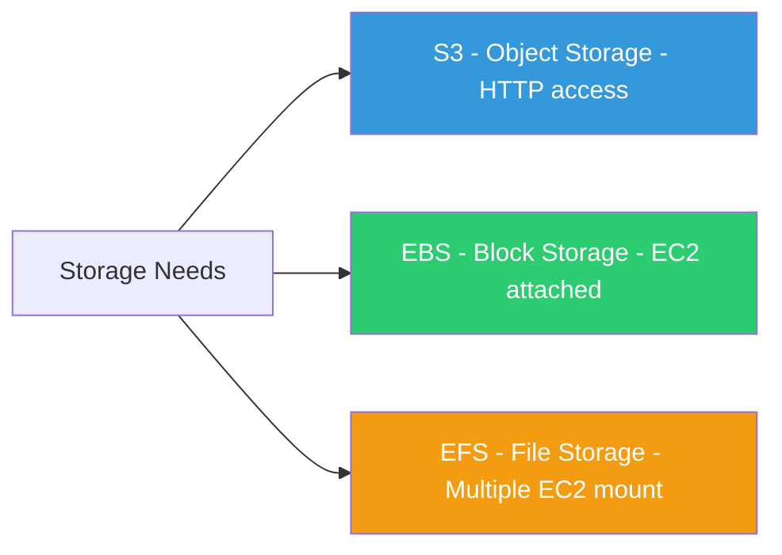
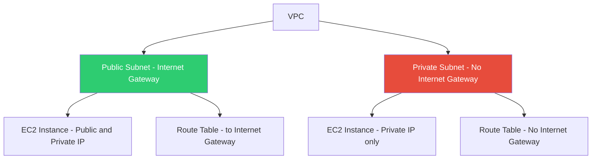
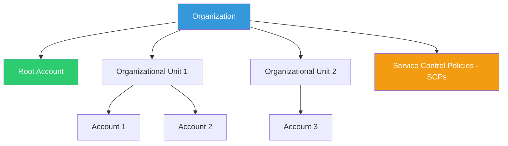
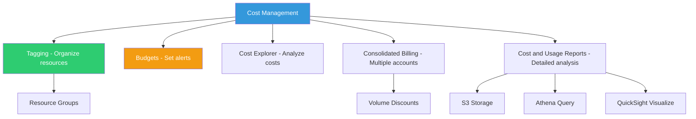

# AWS Certified Cloud Practitioner (CLF-C02) - Study Guide

> Personalized cheat sheet based on ExamPro Certified Cloud Practitioner Cheat Sheet  
> Updated: Based on CLF-C02 exam blueprint

---

## How to Use This Sheet

**30-second instructions:**
- **First pass** = Diagrams only (get the big picture)
- **Second pass** = Read frame bullets + exam cues
- **Third pass** = Self-quiz with quick recall section
- **Before exam** = Scan memory hooks and common traps

**Study pattern:** Visual → Concept → Details → Recall

---

## 1. TL;DR Map

```mermaid
flowchart TD
    A[AWS CLF-C02] --> B[Cloud Concepts]
    A --> C[Security & Compliance]
    A --> D[Technology Services]
    A --> E[Billing & Pricing]
    
    B --> B1[Types: SaaS/PaaS/IaaS]
    B --> B2[Deployment Models]
    B --> B3[Six Benefits]
    B --> B4[Global Infrastructure]
    B --> B5[Shared Responsibility]
    
    C --> C1[IAM]
    C --> C2[Security Services]
    C --> C3[Compliance Programs]
    
    D --> D1[Compute]
    D --> D2[Storage]
    D --> D3[Database]
    D --> D4[Networking]
    D --> D5[Integration]
    
    E --> E1[Support Tiers]
    E --> E2[EC2 Pricing Models]
    E --> E3[Cost Management]
    
    style A fill:#3498DB,color:#fff
    style B fill:#2ECC71,color:#fff
    style C fill:#E74C3C,color:#fff
    style D fill:#F39C12,color:#fff
    style E fill:#9B59B6,color:#fff
```

**Top Exam Signals (10 bullets):**
- ⚠️ **Shared Responsibility Model** - "In" vs "Of" the cloud
- 🗺️ **Global Infrastructure** - Regions → AZs → Edge/PoP hierarchy
- 🔒 **Security Groups vs NACLs** - Instance-level vs Subnet-level firewalls
- 💰 **EC2 Pricing Models** - On-Demand, Reserved, Spot, Dedicated Hosts
- 📊 **Cost Management** - Tagging, Budgets, Cost Explorer, Consolidated Billing
- 🌍 **Multi-AZ vs Multi-Region** - High Availability vs Disaster Recovery
- 🔐 **IAM** - Users, Groups, Roles, Policies
- 📦 **Storage Services** - S3 vs EBS vs EFS (object vs block vs file)
- 🗄️ **Database Services** - RDS vs DynamoDB vs Redshift (SQL vs NoSQL vs Warehouse)
- 📈 **Support Tiers** - Basic/Developer/Business/Enterprise (response times)

---

## 2. Cloud Concepts

### A) Bird's-Eye Frame
- **Cloud Computing Types**: SaaS (customers), PaaS (developers), IaaS (admins)
- **Deployment Models**: Cloud (full cloud), Hybrid (cloud + on-premise), On-Premise (private cloud)
- **Six Benefits**: Trade CAPEX for OPEX, Economies of scale, Stop guessing capacity, Speed/agility, Stop running data centers, Go global
- **Global Infrastructure**: Regions (multiple AZs) → AZs (data centers) → Edge/PoP (CDN endpoints)
- **Shared Responsibility**: Customer = "In" cloud (data, code, config), AWS = "Of" cloud (hardware, infrastructure, managed services)

### B) Visual Comparison

| Aspect | SaaS | PaaS | IaaS |
|--------|------|------|------|
| **Target** | Customers | Developers | Admins |
| **You Manage** | Nothing | Applications | OS, Apps, Data |
| **Provider Manages** | Everything | Infrastructure | Hardware |
| **Example** | Gmail, Office365 | Elastic Beanstalk | EC2, VPC |

**Global Infrastructure Hierarchy:**

### C) Exam Cues
- Questions about **who manages what** in each cloud type
- **Deployment model selection** scenarios (compliance, legacy systems)
- **Benefits matching** - which benefit addresses which business problem
- **Region vs AZ** - when to use multi-AZ vs multi-region
- **Edge Locations** - CloudFront (downloads) vs API Gateway (uploads)

### D) Tiny Example
**Scenario**: A startup wants to deploy a web app quickly without managing servers.
- **Answer**: PaaS (Elastic Beanstalk) - they manage code, AWS manages infrastructure
- **Not IaaS**: Too much management overhead
- **Not SaaS**: They're building, not consuming

### E) Memory Hook
- **SaaS/PaaS/IaaS**: "Software/Platform/Infrastructure" - **S**oftware is done, **P**latform is partial, **I**nfrastructure is in your hands
- **Deployment Models**: **C**loud = Complete, **H**ybrid = Half, **O**n-Premise = Own
- **Six Benefits**: **T**rade expense, **B**enefit scale, **S**top guessing, **I**ncrease speed, **S**top spending, **G**o global (T-B-S-I-S-G)
- **Shared Responsibility**: Customer = **"IN"** (inside the cloud: data, code, config), AWS = **"OF"** (of the cloud: hardware, infrastructure)

---

## 3. Six Advantages and Benefits of Cloud Computing

### A) Bird's-Eye Frame
1. **Trade capital expense for variable expense** - No upfront costs, pay as you use
2. **Benefit from massive economies of scale** - Shared costs across customers
3. **Stop guessing capacity** - Scale up/down based on actual need
4. **Increase speed and agility** - Launch resources in minutes (not weeks)
5. **Stop spending money on running/maintaining data centers** - Focus on customers
6. **Go global in minutes** - Deploy across multiple regions with few clicks

### B) Comparison Table

| Benefit | Traditional IT | Cloud Computing |
|---------|---------------|-----------------|
| **Cost Model** | Large upfront investment | Pay only when you consume |
| **Scale** | Fixed capacity, often over-provisioned | Elastic, match actual usage |
| **Speed** | Weeks/months to deploy | Minutes to launch |
| **Maintenance** | You manage hardware, power, cooling | AWS manages infrastructure |
| **Global Reach** | Build data centers in each region | Deploy globally with clicks |

### C) Exam Cues
- **Matching scenarios** - "Company wants to reduce upfront costs" → Benefit #1
- **Capacity planning** - "Eliminate guesswork" → Benefit #3
- **Time-to-market** - "Launch faster" → Benefit #4
- **Cost optimization** - "Reduce maintenance overhead" → Benefit #5
- **Global expansion** - "Lower latency worldwide" → Benefit #6

### D) Tiny Example
**Scenario**: A company paid $100K upfront for servers, uses 30% capacity most of the year, but needs 100% during holidays.
- **Cloud Solution**: Pay for 30% most of the time, scale to 100% during holidays
- **Benefits**: #1 (variable expense), #3 (no capacity guessing)

### E) Memory Hook
- **T-B-S-I-S-G**: Trade expense, Benefit scale, Stop guessing, Increase speed, Stop spending, Go global
- **Think**: "Traditional IT = CAPEX, Cloud = OPEX" (capital expense → operational expense)

---

## 4. Cloud Computing Deployment Models

### A) Bird's-Eye Frame
- **Cloud**: Fully utilizing cloud computing (all resources in cloud)
- **Hybrid**: Using both cloud and on-premise (common for legacy systems, compliance)
- **On-Premise**: Deploying resources on-premises (sometimes called "private cloud")
- **Use Cases**: Cloud = startups/SaaS, Hybrid = banks/enterprises with legacy, On-Premise = healthcare/government with strict compliance

### B) Visual Comparison

| Model | Infrastructure Location | Best For | Common Users |
|-------|------------------------|----------|--------------|
| **Cloud** | Fully in cloud | Startups, SaaS providers | Modern companies |
| **Hybrid** | Cloud + On-Premise | Legacy systems, compliance | Banks, enterprises |
| **On-Premise** | Own data centers | Strict compliance, sensitive data | Healthcare, government |

### C) Exam Cues
- **Scenario-based selection** - "Company has legacy systems but wants cloud benefits" → Hybrid
- **Compliance requirements** - "Healthcare data must stay on-premise" → On-Premise or Hybrid
- **Cost/control trade-off** - Cloud = less control but lower cost, On-Premise = more control but higher cost

### D) Tiny Example
**Scenario**: A bank wants to migrate customer-facing apps to cloud but keep core banking systems on-premise due to regulations.
- **Answer**: Hybrid deployment model
- **Why**: Combines cloud benefits (scalability, cost) with on-premise requirements (compliance, control)

### E) Memory Hook
- **Cloud = Complete** (all in cloud)
- **Hybrid = Half** (half cloud, half on-premise)
- **On-Premise = Own** (you own and control everything)
- **Rule**: If you see "legacy systems" or "compliance restrictions" → likely Hybrid

---

## 5. AWS Global Infrastructure

### A) Bird's-Eye Frame
- **Regions**: Physical locations worldwide with multiple Availability Zones (at least 2, most have 3)
- **Availability Zones (AZs)**: One or more discrete data centers (AWS-owned), isolated from each other
- **Edge Locations**: Data centers owned by partners (CDN endpoints for CloudFront, low latency)
- **Points of Presence (PoPs)**: Internet access points to AWS network
- **Key Facts**: US-EAST-1 = largest region, billing info region, new services launch here first

### B) Visual Hierarchy

### C) Comparison Table

| Component | What It Is | Key Characteristics |
|-----------|------------|---------------------|
| **Region** | Physical location with multiple AZs | Isolated, independent (power, water, location) |
| **Availability Zone** | One or more data centers | AWS-owned, sub-10ms latency between AZs in same region |
| **Edge Location** | Partner-owned data center | CDN endpoints, low latency globally |
| **Point of Presence** | Internet access point | Entry point to AWS network |

### D) Exam Cues
- **Multi-AZ vs Multi-Region** - High Availability (HA) vs Disaster Recovery (DR)
- **Latency questions** - AZs in same region = sub-10ms, Edge Locations = low latency globally
- **Billing region** - US-EAST-1 is where billing information is stored
- **Service availability** - Not all services available in all regions
- **Edge Location uses** - CloudFront (downloads) vs API Gateway (uploads)

### E) Tiny Example
**Scenario**: An application needs high availability within a region.
- **Answer**: Deploy across multiple AZs (Multi-AZ)
- **Why**: If one AZ fails, traffic routes to another AZ in the same region (sub-10ms latency)
- **Not Multi-Region**: That's for disaster recovery, not high availability

### F) Memory Hook
- **Regions = Real estate** (physical locations)
- **AZs = Actual zones** (data centers, 2-3 per region)
- **Edge = Endpoints** (CDN, partner-owned)
- **Multi-AZ = High Availability**, **Multi-Region = Disaster Recovery**
- **US-EAST-1**: "First and largest" (billing, new services)

---

## 6. Shared Responsibility Model

### A) Bird's-Eye Frame
- **Customer Responsibility ("IN" the Cloud)**: Data, code, configuration, IAM roles, OS choices, security groups
- **AWS Responsibility ("OF" the Cloud)**: Physical hardware, global infrastructure, data centers, operation of managed services
- **Simple Rule**: Customer = application layer, AWS = infrastructure layer
- **Key Exception**: Managed services shift more responsibility to AWS

### B) Visual Model

### C) Comparison Table

| Responsibility Area | Customer ("IN") | AWS ("OF") |
|---------------------|-----------------|------------|
| **Data** | Encryption, access control | Physical security |
| **Applications** | Code, configuration | Compute infrastructure |
| **Platform** | OS, patches (EC2) | Hypervisor, hardware |
| **Infrastructure** | VPC, subnets | Data centers, networking |
| **Managed Services** | Data, configuration | Everything else |

### D) Exam Cues
- **"Who is responsible for..."** questions - Use "IN" vs "OF" rule
- **Security scenarios** - Customer = data encryption, AWS = physical security
- **Managed services** - RDS, DynamoDB shift more responsibility to AWS
- **EC2 specific** - Customer manages OS, AWS manages hypervisor

### E) Tiny Example
**Scenario**: Who is responsible for encrypting data stored in S3?
- **Answer**: Customer responsibility ("IN" the cloud)
- **Why**: Data encryption is a configuration choice made by the customer
- **AWS Responsibility**: Physical security of the data center where S3 data is stored

### F) Memory Hook
- **Customer = "IN"** (inside: data, code, config) 🏠
- **AWS = "OF"** (of the cloud: hardware, infrastructure) 🏗️
- **Think**: "Customer controls what goes IN, AWS controls what it's OF"

---

## 7. AWS Compliance Programs

### A) Bird's-Eye Frame
- **Compliance**: Internal policies/procedures to comply with laws, regulations, or uphold business reputation
- **HIPAA**: Health Insurance Portability and Accountability Act (medical information privacy/security)
- **PCI DSS**: Payment Card Industry Data Security Standard (credit card information)
- **FIPS**: Federal Information Processing Standard (cryptographic modules)
- **NIST 800-53**: Security controls for federal information systems

### B) Quick Reference Table

| Program | Full Name | Purpose | Use Case |
|---------|-----------|---------|----------|
| **HIPAA** | Health Insurance Portability and Accountability Act | Medical information privacy/security | Healthcare applications |
| **PCI DSS** | Payment Card Industry Data Security Standard | Credit card data security | E-commerce, online payments |
| **FIPS** | Federal Information Processing Standard | Cryptographic module security | Government, sensitive data |
| **NIST 800-53** | National Institute of Standards and Technology | Federal system security controls | Federal information systems |

### C) Exam Cues
- **Scenario matching** - "Healthcare app" → HIPAA, "E-commerce with credit cards" → PCI DSS
- **Government/federal** - FIPS or NIST 800-53
- **Data type focus** - Medical data = HIPAA, Payment data = PCI DSS

### D) Tiny Example
**Scenario**: A company wants to build an e-commerce website that processes credit card payments.
- **Answer**: Must comply with PCI DSS
- **Why**: PCI DSS is required when handling credit card information

### E) Memory Hook
- **HIPAA = Health** (medical information)
- **PCI DSS = Payment** (credit cards)
- **FIPS = Federal** (cryptographic standards)
- **NIST = National** (federal systems)

---

## 8. Security Services

### A) Bird's-Eye Frame
- **IAM**: Identity and Access Management (users, groups, roles, policies)
- **Security Services**: Artifact (compliance reports), Inspector (EC2 security benchmarks), Shield (DDoS protection), WAF (web app firewall), GuardDuty (threat detection), KMS (encryption keys), Macie (S3 data monitoring)
- **Network Security**: VPN (Site-to-Site, Client), Security Groups (instance-level firewall), NACLs (subnet-level firewall)
- **Security Hub**: Comprehensive view of security alerts across accounts

### B) Service Comparison

| Service | Purpose | Scope |
|---------|---------|-------|
| **IAM** | Access management | Users, groups, roles, policies |
| **Security Groups** | Firewall at instance level | Allow rules only, stateful |
| **NACLs** | Firewall at subnet level | Allow + Deny rules, stateless |
| **Shield** | DDoS protection | Managed DDoS protection |
| **WAF** | Web application firewall | HTTP/HTTPS traffic filtering |
| **GuardDuty** | Threat detection | Monitors for malicious activity |
| **Inspector** | Security assessment | EC2 instance security benchmarks |
| **Macie** | Data security | S3 data access monitoring |
| **KMS** | Key management | Encryption key creation/control |

### C) Visual: Security Groups vs NACLs

### D) Exam Cues
- **Security Groups vs NACLs** - Instance-level (stateful, allow only) vs Subnet-level (stateless, allow/deny)
- **DDoS protection** - Shield
- **Web application protection** - WAF
- **Threat detection** - GuardDuty (continuous monitoring)
- **Security assessment** - Inspector (on-demand EC2 benchmarks)
- **Data monitoring** - Macie (S3-focused)
- **Access management** - IAM (foundation of AWS security)

### E) Tiny Example
**Scenario**: Need to block specific IP addresses at the subnet level.
- **Answer**: Use NACLs (not Security Groups)
- **Why**: NACLs support Deny rules and operate at subnet level
- **Security Groups**: Only Allow rules, instance-level only

### F) Memory Hook
- **Security Groups = Stateful, Allow only, Instance-level** (S-A-I)
- **NACLs = Stateless, Allow/Deny, Subnet-level** (S-A-S)
- **Shield = Stop DDoS**, **WAF = Web App Firewall**, **GuardDuty = Guard against threats**
- **Inspector = Inspect EC2**, **Macie = Monitor S3**, **KMS = Key Management Service**

---

## 9. Technology Services

### 9.1 Database Services

#### A) Bird's-Eye Frame
- **Relational (SQL)**: RDS (MySQL, Postgres, MariaDB, Oracle, SQL Server, Aurora), Aurora Serverless
- **NoSQL**: DynamoDB (key/value), DocumentDB (MongoDB-compatible), Neptune (graph)
- **Data Warehouse**: Redshift (columnar, petabyte-scale)
- **In-Memory**: ElastiCache (Redis, Memcached)

#### B) Service Comparison

| Service | Type | Use Case | Key Feature |
|---------|------|----------|-------------|
| **RDS** | Relational (SQL) | Traditional database needs | Multiple engines, managed |
| **Aurora** | Relational (SQL) | High performance, MySQL/Postgres | 5x faster (MySQL), 3x faster (Postgres) |
| **Aurora Serverless** | Relational (SQL) | Variable workloads | Runs only when needed (like Lambda) |
| **DynamoDB** | NoSQL (key/value) | Fast, scalable, flexible schema | Serverless, pay-per-use |
| **DocumentDB** | NoSQL (document) | MongoDB workloads | MongoDB-compatible |
| **Neptune** | Graph database | Relationships, social networks | Managed graph database |
| **Redshift** | Data warehouse | Analytics, reporting | Columnar, petabyte-scale |
| **ElastiCache** | In-memory | Caching, session storage | Redis or Memcached |

#### C) Exam Cues
- **SQL vs NoSQL** - Structured data → RDS/Aurora, Flexible schema → DynamoDB
- **Performance** - Aurora for high-performance SQL, DynamoDB for fast NoSQL
- **Serverless** - Aurora Serverless (SQL), DynamoDB (NoSQL)
- **Analytics** - Redshift for data warehousing
- **Caching** - ElastiCache

#### D) Memory Hook
- **RDS = Relational Database Service** (SQL)
- **DynamoDB = Dynamo + DB** (NoSQL, fast)
- **Aurora = Aurora** (high-performance RDS)
- **Redshift = Red shift** (data warehouse, analytics)
- **ElastiCache = Elastic Cache** (in-memory caching)

---

### 9.2 Storage Services

#### A) Bird's-Eye Frame
- **Object Storage**: S3 (Simple Storage Service), S3 Glacier (archiving)
- **Block Storage**: EBS (Elastic Block Storage - attached to EC2)
- **File Storage**: EFS (Elastic File Storage - mountable to multiple EC2 instances)
- **Hybrid Storage**: Storage Gateway (on-premise to cloud)
- **Data Migration**: Snowball (50-80 TB), Snowball Edge (100 TB), Snowmobile (100 PB)

#### B) Storage Comparison

| Service | Type | Access | Use Case |
|---------|------|--------|----------|
| **S3** | Object | HTTP/HTTPS | Static websites, backups, data lakes |
| **S3 Glacier** | Object (archive) | Retrieval takes time | Long-term archiving |
| **EBS** | Block | Attached to EC2 | EC2 instance storage, databases |
| **EFS** | File | NFS, mountable | Shared file storage across EC2 instances |
| **Storage Gateway** | Hybrid | On-premise to cloud | Backup, DR, migration |

#### C) Visual: S3 vs EBS vs EFS

#### D) Exam Cues
- **Object vs Block vs File** - Web storage → S3, EC2 disk → EBS, Shared files → EFS
- **Multiple EC2 access** - EFS (file storage)
- **Archive storage** - S3 Glacier
- **Large data migration** - Snowball/Snowmobile (physical transfer)

#### E) Memory Hook
- **S3 = Simple Storage Service** (object, HTTP)
- **EBS = Elastic Block Storage** (block, EC2 attached)
- **EFS = Elastic File Storage** (file, multiple EC2)
- **Snowball = Snow ball** (physical data migration)

---

### 9.3 Computing Services

#### A) Bird's-Eye Frame
- **Virtual Servers**: EC2 (Elastic Compute Cloud - configurable VMs)
- **Containers**: ECS (Docker), Fargate (serverless containers), EKS (Kubernetes)
- **Serverless**: Lambda (functions, pay per execution)
- **Orchestration**: Elastic Beanstalk (deploy web apps), Batch (batch computing)

#### B) Service Comparison

| Service | Type | Management Level | Use Case |
|---------|------|------------------|----------|
| **EC2** | Virtual servers | You manage OS | Full control, configurable |
| **ECS** | Container service | You manage EC2 | Docker containers on EC2 |
| **Fargate** | Serverless containers | AWS manages infrastructure | Containers without EC2 management |
| **EKS** | Kubernetes | You manage Kubernetes | Kubernetes orchestration |
| **Lambda** | Serverless functions | AWS manages everything | Event-driven, pay per use |
| **Elastic Beanstalk** | Platform service | AWS manages infrastructure | Deploy web apps quickly |

#### C) Exam Cues
- **Serverless** - Lambda (functions), Fargate (containers)
- **Full control** - EC2 (manage OS, applications)
- **Container orchestration** - ECS (Docker), EKS (Kubernetes)
- **Quick deployment** - Elastic Beanstalk (PaaS)

#### D) Memory Hook
- **EC2 = Elastic Compute Cloud** (virtual servers)
- **ECS = Elastic Container Service** (Docker)
- **EKS = Elastic Kubernetes Service** (Kubernetes)
- **Lambda = Lambda** (serverless functions)
- **Fargate = Fargate** (serverless containers)

---

### 9.4 Networking Services

#### A) Bird's-Eye Frame
- **VPC**: Virtual Private Cloud (isolated network section)
- **Internet Gateway (IGW)**: Enables internet access
- **Route Tables**: Control traffic direction
- **Subnets**: Public (internet access) vs Private (no direct internet)
- **Security**: Security Groups (instance-level), NACLs (subnet-level)

#### B) Visual: VPC Architecture

#### C) Exam Cues
- **Public vs Private Subnets** - Public = IGW access, Private = no direct internet
- **IP addresses** - Public subnet = public + private IPs, Private subnet = private IPs only
- **Route Tables** - Control traffic routing
- **Security Groups vs NACLs** - Instance vs Subnet level

#### D) Memory Hook
- **VPC = Virtual Private Cloud** (isolated network)
- **IGW = Internet Gateway** (internet access)
- **Public Subnet = Public** (internet access), **Private Subnet = Private** (no internet)

---

### 9.5 Application Integration Services

#### A) Bird's-Eye Frame
- **SNS**: Simple Notification Service (Pub/Sub, push notifications)
- **SQS**: Simple Queue Service (message queuing, pull model)
- **EventBridge**: Serverless event bus (formerly CloudWatch Events)
- **Step Functions**: Serverless workflow orchestration
- **Kinesis**: Real-time data streaming

#### B) Service Comparison

| Service | Model | Use Case |
|---------|-------|----------|
| **SNS** | Pub/Sub (push) | Notifications, alerts |
| **SQS** | Queue (pull) | Message queuing, background jobs |
| **EventBridge** | Event bus | Event-driven architecture |
| **Step Functions** | Workflow | Orchestrate Lambda functions |
| **Kinesis** | Streaming | Real-time data processing |

#### C) Exam Cues
- **Push vs Pull** - SNS = push (notifications), SQS = pull (queues)
- **Event-driven** - EventBridge (event bus)
- **Workflow** - Step Functions (orchestrate Lambdas)
- **Streaming** - Kinesis (real-time data)

#### D) Memory Hook
- **SNS = Simple Notification Service** (push, Pub/Sub)
- **SQS = Simple Queue Service** (pull, queuing)
- **EventBridge = Event Bridge** (event bus)
- **Step Functions = Step Functions** (workflow)

---

## 10. Organizations and Accounts

### A) Bird's-Eye Frame
- **Organizations**: Centrally manage billing, access, compliance, security across multiple accounts
- **Root Account User**: Single sign-in with complete access to all AWS services/resources
- **Organizational Units (OUs)**: Groups of AWS accounts (hierarchical structure)
- **Service Control Policies (SCPs)**: Central control over permissions for all accounts in organization

### B) Visual Hierarchy

### C) Exam Cues
- **Consolidated Billing** - Organizations enable consolidated billing
- **Centralized Management** - Organizations for managing multiple accounts
- **SCPs** - Control permissions across organization accounts
- **Root Account** - Complete access, one per account

### D) Memory Hook
- **Organizations = Organization** (manage multiple accounts)
- **SCPs = Service Control Policies** (central permission control)
- **OU = Organizational Unit** (hierarchical grouping)

---

## 11. Provisioning Services

### A) Bird's-Eye Frame
- **Elastic Beanstalk**: Deploy and scale web applications (PaaS)
- **CloudFormation**: Infrastructure as Code (JSON/YAML)
- **OpsWorks**: Configuration management (Chef/Puppet)
- **QuickStart**: Pre-made packages for common workloads
- **Marketplace**: Digital catalog of software listings

### B) Service Comparison

| Service | Purpose | Format |
|---------|---------|--------|
| **Elastic Beanstalk** | Deploy web apps | Application code |
| **CloudFormation** | Infrastructure as Code | JSON/YAML templates |
| **OpsWorks** | Configuration management | Chef/Puppet |
| **QuickStart** | Pre-made packages | Templates |
| **Marketplace** | Software catalog | Software listings |

### C) Exam Cues
- **Infrastructure as Code** - CloudFormation
- **Quick deployment** - Elastic Beanstalk (PaaS)
- **Configuration management** - OpsWorks (Chef/Puppet)
- **Pre-built solutions** - QuickStart, Marketplace

### D) Memory Hook
- **CloudFormation = Cloud Formation** (Infrastructure as Code)
- **Elastic Beanstalk = Elastic Beanstalk** (PaaS, web apps)

---

## 12. Logging Services

### A) Bird's-Eye Frame
- **CloudTrail**: Logs all API calls (SDK, CLI) - audit trail ("who can we blame")
- **CloudWatch**: Collection of monitoring services
  - **CloudWatch Metrics**: Performance data (CPU, memory, network)
  - **CloudWatch Alarms**: Trigger events based on conditions
  - **CloudWatch Logs**: Log collection and analysis
  - **CloudWatch Dashboards**: Visualizations

### B) Service Comparison

| Service | Purpose | Use Case |
|---------|---------|----------|
| **CloudTrail** | API call logging | Audit trail, compliance |
| **CloudWatch Metrics** | Performance monitoring | CPU, memory, network utilization |
| **CloudWatch Alarms** | Event triggers | Alert on threshold breaches |
| **CloudWatch Logs** | Log management | Application/system logs |
| **CloudWatch Dashboards** | Visualizations | Custom metric dashboards |

### C) Exam Cues
- **Audit trail** - CloudTrail (API calls)
- **Performance monitoring** - CloudWatch Metrics
- **Alerting** - CloudWatch Alarms
- **Log management** - CloudWatch Logs

### D) Memory Hook
- **CloudTrail = Cloud Trail** (audit trail, API calls)
- **CloudWatch = Cloud Watch** (monitoring, metrics, alarms, logs)

---

## 13. Must-Know Terminology

Quick Reference Glossary

| Term | Meaning | Don't Confuse With |
|------|---------|-------------------|
| **Availability Zone (AZ)** | One or more data centers in a region | Region (contains multiple AZs) |
| **Region** | Physical location with multiple AZs | AZ (data center within a region) |
| **Edge Location** | Partner-owned data center for CDN | AZ (AWS-owned data center) |
| **VPC** | Virtual Private Cloud (isolated network) | Subnet (subdivision of VPC) |
| **Security Group** | Instance-level firewall (stateful, allow only) | NACL (subnet-level, stateless, allow/deny) |
| **NACL** | Subnet-level firewall (stateless, allow/deny) | Security Group (instance-level, stateful) |
| **Public Subnet** | Subnet with internet gateway access | Private Subnet (no direct internet) |
| **Private Subnet** | Subnet without direct internet access | Public Subnet (has internet gateway) |
| **IAM** | Identity and Access Management | Security Groups (network-level security) |
| **S3** | Object storage (HTTP access) | EBS (block storage, EC2 attached) |
| **EBS** | Block storage (EC2 attached) | EFS (file storage, multiple EC2) |
| **EFS** | File storage (multiple EC2 mountable) | EBS (block storage, single EC2) |
| **RDS** | Relational Database Service (SQL) | DynamoDB (NoSQL) |
| **DynamoDB** | NoSQL key/value database | RDS (SQL database) |
| **Lambda** | Serverless functions | EC2 (virtual servers) |
| **EC2** | Virtual servers (full control) | Lambda (serverless functions) |
| **Multi-AZ** | High Availability (within region) | Multi-Region (Disaster Recovery) |
| **Multi-Region** | Disaster Recovery (across regions) | Multi-AZ (High Availability) |

---

## 14. Services You Must Recognize

### Storage Services

| Service | What It Is | When to Use | Exam Cue |
|---------|------------|-------------|----------|
| **S3** | Object storage | Static websites, backups, data lakes | HTTP access, unlimited storage |
| **EBS** | Block storage | EC2 instance storage, databases | Attached to EC2, persistent |
| **EFS** | File storage | Shared files across EC2 instances | Multiple EC2 mountable |
| **S3 Glacier** | Archive storage | Long-term backups, archiving | Retrieval takes time, cheap |

**Decision Table: S3 vs EBS vs EFS**

| Need | Use |
|------|-----|
| Web-accessible storage | S3 |
| EC2 instance disk | EBS |
| Shared files across EC2 | EFS |
| Long-term archive | S3 Glacier |

### Database Services

| Service | What It Is | When to Use | Exam Cue |
|---------|------------|-------------|----------|
| **RDS** | Managed SQL database | Traditional database needs | Multiple engines (MySQL, Postgres, etc.) |
| **Aurora** | High-performance RDS | High-performance SQL needs | 5x faster (MySQL), 3x faster (Postgres) |
| **DynamoDB** | NoSQL key/value | Fast, scalable, flexible schema | Serverless, pay-per-use |
| **Redshift** | Data warehouse | Analytics, reporting | Columnar, petabyte-scale |

**Decision Table: SQL vs NoSQL**

| Requirement | Use |
|-------------|-----|
| Structured data, SQL queries | RDS/Aurora |
| Flexible schema, high scale | DynamoDB |
| Analytics, data warehousing | Redshift |

### Compute Services

| Service | What It Is | When to Use | Exam Cue |
|---------|------------|-------------|----------|
| **EC2** | Virtual servers | Full control, configurable | Manage OS, applications |
| **Lambda** | Serverless functions | Event-driven, pay-per-use | No server management |
| **ECS** | Container service | Docker containers | Manage EC2, containers |
| **Fargate** | Serverless containers | Containers without EC2 management | AWS manages infrastructure |
| **Elastic Beanstalk** | Platform service | Quick web app deployment | PaaS, AWS manages infrastructure |

---

## 15. Pricing + Billing

### A) Bird's-Eye Frame
- **Support Tiers**: Basic (free), Developer ($29), Business ($100), Enterprise ($15,000)
- **EC2 Pricing**: On-Demand, Reserved Instances, Spot Instances, Dedicated Hosts
- **Cost Management**: Tagging, Budgets, Cost Explorer, Consolidated Billing, Cost and Usage Reports
- **Savings Plans**: Flexible pricing model (up to 72% savings on compute)

### B) Support Tiers Comparison

| Tier | Cost/Month | Support Type | Response Time | Trusted Advisor |
|------|------------|--------------|---------------|-----------------|
| **Basic** | $0 | Billing/account only | N/A | 7 checks |
| **Developer** | $29 | Email support | ~24 hours | All checks |
| **Business** | $100 | Chat, phone (24/7) | < 1-12 hours* | All checks |
| **Enterprise** | $15,000 | Personal concierge, TAM | < 15 minutes** | All checks |

*Business tier: General < 24hrs, System Impaired < 12hrs, Production Impaired < 4hrs, Production DOWN < 1hr  
**Enterprise tier: Business-Critical DOWN < 15min

### C) EC2 Pricing Models

| Model | Savings | Commitment | Use Case | Key Feature |
|-------|---------|------------|----------|-------------|
| **On-Demand** | 0% (baseline) | None | Short-term, unpredictable | Pay per hour, flexible |
| **Reserved Instances** | Up to 75% | 1-3 years | Steady-state, predictable | Best long-term value |
| **Spot Instances** | Up to 90% | None | Interruptible workloads | Can be terminated by AWS |
| **Dedicated Hosts** | 0-70%* | Optional | Isolated hardware | Most expensive, dedicated servers |

*Dedicated Hosts can be on-demand or reserved (up to 70% off)

**Reserved Instance Types:**
- **Standard**: Up to 75% off, cannot change attributes
- **Convertible**: Up to 54% off, can change attributes if equal/greater value
- **Scheduled**: Reserved for specific time periods (e.g., once a week)

### D) Cost Management Services

### E) Exam Cues
- **Support tier selection** - Based on response time requirements, cost
- **EC2 pricing model selection** - Based on workload characteristics (interruptible, predictable, etc.)
- **Cost management** - Tagging for organization, Budgets for alerts, Cost Explorer for analysis
- **Consolidated Billing** - Organizations enable consolidated billing, volume discounts

### F) Memory Hook
- **Support Tiers**: **B**asic ($0), **D**eveloper ($29), **B**usiness ($100), **E**nterprise ($15K)
- **EC2 Pricing**: **O**n-Demand (0% off), **R**eserved (75% off), **S**pot (90% off), **D**edicated (most expensive)
- **Reserved Instance**: **S**tandard (75% off, no change), **C**onvertible (54% off, can change), **S**cheduled (time-based)
- **Cost Management**: **T**agging → **B**udgets → **C**ost Explorer → **C**onsolidated Billing

---

## 16. Quick Recall / Self-Quiz

### Flashcard Prompts (40 questions)

Click to expand self-quiz questions

1. **What are the three types of cloud computing?**
   - SaaS (Software as a Service), PaaS (Platform as a Service), IaaS (Infrastructure as a Service)

2. **What are the six benefits of cloud computing?**
   - Trade CAPEX for OPEX, Economies of scale, Stop guessing capacity, Increase speed/agility, Stop spending on data centers, Go global

3. **What are the three deployment models?**
   - Cloud, Hybrid, On-Premise

4. **What is a Region?**
   - Physical location with multiple Availability Zones

5. **What is an Availability Zone?**
   - One or more discrete data centers owned by AWS

6. **How many AZs are typically in a region?**
   - At least 2, most have 3

7. **What is the difference between Edge Locations and AZs?**
   - Edge Locations are partner-owned (CDN), AZs are AWS-owned (data centers)

8. **What is the Shared Responsibility Model?**
   - Customer = "IN" cloud (data, code, config), AWS = "OF" cloud (hardware, infrastructure)

9. **What compliance program is for healthcare data?**
   - HIPAA

10. **What compliance program is for credit card data?**
    - PCI DSS

11. **What is the difference between Security Groups and NACLs?**
    - Security Groups: instance-level, stateful, allow only | NACLs: subnet-level, stateless, allow/deny

12. **What service protects against DDoS attacks?**
    - AWS Shield

13. **What service is a web application firewall?**
    - WAF (Web Application Firewall)

14. **What is the difference between S3, EBS, and EFS?**
    - S3: object storage (HTTP) | EBS: block storage (EC2 attached) | EFS: file storage (multiple EC2)

15. **What is the difference between RDS and DynamoDB?**
    - RDS: SQL database | DynamoDB: NoSQL key/value database

16. **What is Aurora?**
    - High-performance managed database (5x faster MySQL, 3x faster Postgres)

17. **What is Redshift?**
    - Data warehouse service (columnar, petabyte-scale)

18. **What is the difference between EC2 and Lambda?**
    - EC2: virtual servers (full control) | Lambda: serverless functions (pay per use)

19. **What is the difference between ECS and Fargate?**
    - ECS: Docker on EC2 (you manage EC2) | Fargate: serverless containers (AWS manages infrastructure)

20. **What is the difference between public and private subnets?**
    - Public: internet gateway access, public + private IPs | Private: no direct internet, private IPs only

21. **What is VPC?**
    - Virtual Private Cloud (isolated network section)

22. **What is the difference between SNS and SQS?**
    - SNS: Pub/Sub, push notifications | SQS: queue, pull model

23. **What service logs all API calls?**
    - CloudTrail

24. **What is CloudWatch used for?**
    - Monitoring (metrics, alarms, logs, dashboards)

25. **What are the four EC2 pricing models?**
    - On-Demand, Reserved Instances, Spot Instances, Dedicated Hosts

26. **Which EC2 pricing model offers the most savings?**
    - Spot Instances (up to 90% off)

27. **Which EC2 pricing model is best for long-term predictable workloads?**
    - Reserved Instances (up to 75% off)

28. **What are the four support tiers?**
    - Basic ($0), Developer ($29), Business ($100), Enterprise ($15,000)

29. **What service provides consolidated billing?**
    - AWS Organizations

30. **What is the purpose of tagging?**
    - Organize and consolidate AWS resources (metadata)

31. **What is the difference between Multi-AZ and Multi-Region?**
    - Multi-AZ: High Availability (within region) | Multi-Region: Disaster Recovery (across regions)

32. **What service is used for Infrastructure as Code?**
    - CloudFormation

33. **What is Elastic Beanstalk?**
    - Platform service for deploying web applications (PaaS)

34. **What is the difference between IAM users, groups, and roles?**
    - Users: individual identities | Groups: collections of users | Roles: temporary credentials

35. **What is Organizations used for?**
    - Centralized management of multiple AWS accounts (billing, access, compliance)

36. **What are Service Control Policies (SCPs)?**
    - Central control over permissions for all accounts in an organization

37. **What is the largest AWS region?**
    - US-EAST-1 (also where billing info is stored, new services launch here first)

38. **What is the latency between AZs in the same region?**
    - Sub-10ms

39. **What services are free?**
    - AutoScaling, IAM, VPC, Cost Explorer, Organizations and Consolidated Billing

40. **What is the difference between CloudTrail and CloudWatch?**
    - CloudTrail: API call logging (audit trail) | CloudWatch: monitoring (metrics, alarms, logs)

### Common Traps / Confusions (10 items)

Click to expand common exam traps

1. **Security Groups vs NACLs**
   - ❌ Trap: Thinking both work the same way
   - ✅ Reality: Security Groups = instance-level, stateful, allow only | NACLs = subnet-level, stateless, allow/deny

2. **Multi-AZ vs Multi-Region**
   - ❌ Trap: Using them interchangeably
   - ✅ Reality: Multi-AZ = High Availability (within region) | Multi-Region = Disaster Recovery (across regions)

3. **Public vs Private Subnets**
   - ❌ Trap: Thinking private subnets can't access internet at all
   - ✅ Reality: Private subnets have no direct internet gateway, but can use NAT Gateway

4. **S3 vs EBS vs EFS**
   - ❌ Trap: Using wrong storage type for use case
   - ✅ Reality: S3 = object/HTTP | EBS = block/EC2 attached | EFS = file/multiple EC2

5. **RDS vs DynamoDB**
   - ❌ Trap: Using SQL database for NoSQL use case (or vice versa)
   - ✅ Reality: RDS = SQL/structured data | DynamoDB = NoSQL/flexible schema

6. **EC2 vs Lambda**
   - ❌ Trap: Using EC2 for simple event-driven tasks
   - ✅ Reality: EC2 = full control, always running | Lambda = serverless, pay per use, event-driven

7. **On-Demand vs Reserved vs Spot**
   - ❌ Trap: Using wrong pricing model for workload
   - ✅ Reality: On-Demand = flexible, Reserved = predictable, Spot = interruptible

8. **CloudTrail vs CloudWatch**
   - ❌ Trap: Confusing audit logging with monitoring
   - ✅ Reality: CloudTrail = API call logs (audit) | CloudWatch = metrics/alarms (monitoring)

9. **Edge Locations vs Availability Zones**
   - ❌ Trap: Thinking Edge Locations are data centers for running workloads
   - ✅ Reality: Edge Locations = CDN endpoints (partner-owned) | AZs = data centers (AWS-owned)

10. **Shared Responsibility Model**
    - ❌ Trap: Thinking AWS manages everything in managed services
    - ✅ Reality: Customer still manages data, configuration | AWS manages infrastructure, operation

---

## Summary: Exam Day Checklist

✅ **Cloud Concepts**: Know SaaS/PaaS/IaaS, deployment models, six benefits, global infrastructure  
✅ **Security**: IAM, Security Groups vs NACLs, security services (Shield, WAF, GuardDuty, etc.)  
✅ **Storage**: S3 vs EBS vs EFS, use cases for each  
✅ **Database**: RDS vs DynamoDB, when to use SQL vs NoSQL  
✅ **Compute**: EC2 vs Lambda, containers (ECS/Fargate/EKS)  
✅ **Networking**: VPC, subnets (public/private), Security Groups vs NACLs  
✅ **Billing**: Support tiers, EC2 pricing models, cost management  
✅ **Shared Responsibility**: Customer "IN" vs AWS "OF"  

---

**Good luck on your CLF-C02 exam! 🚀**
