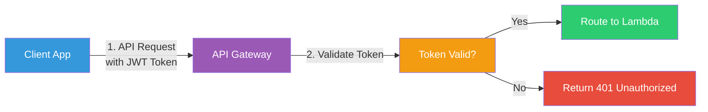
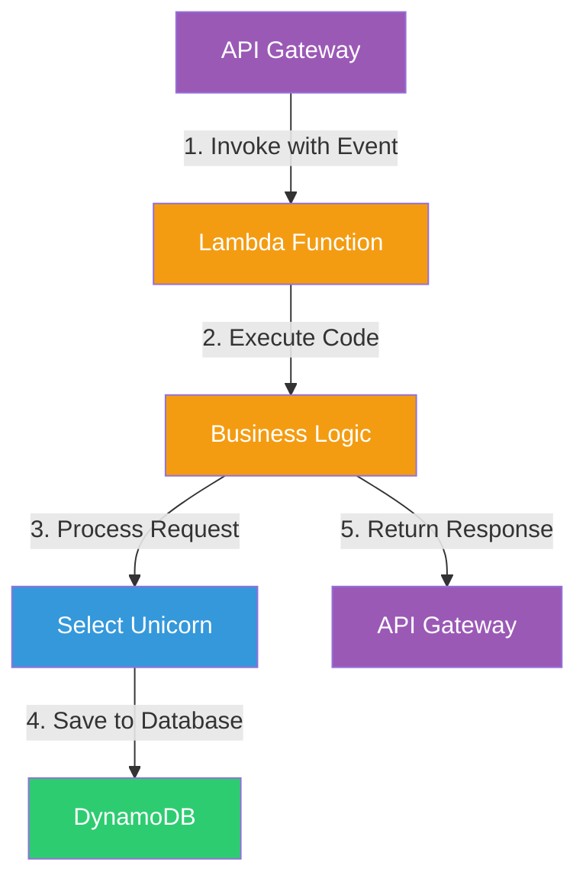
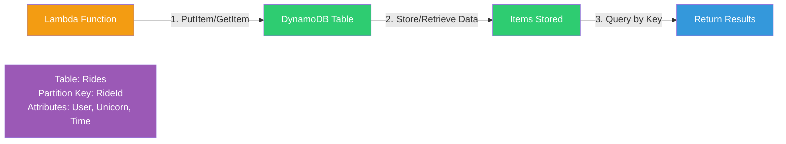
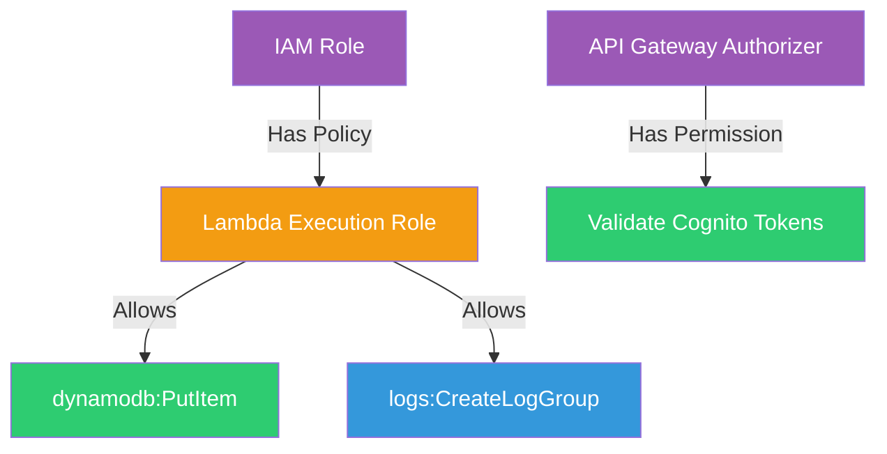
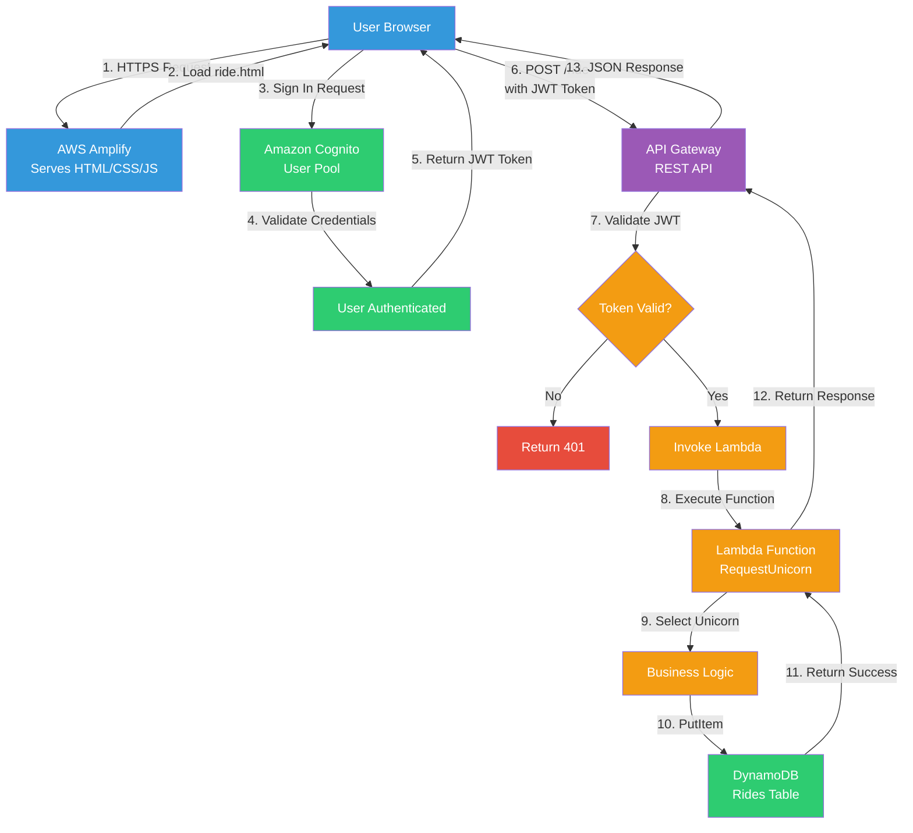
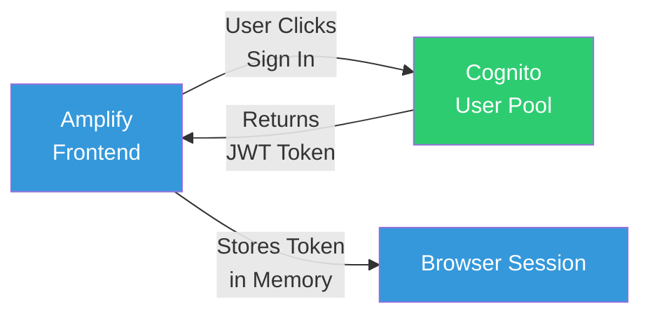
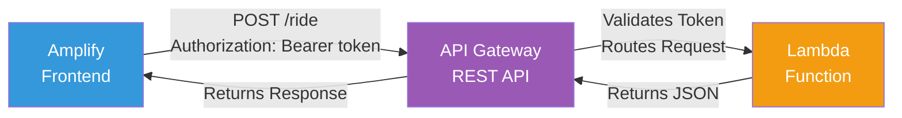
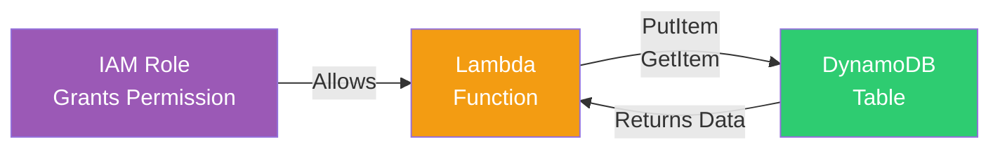
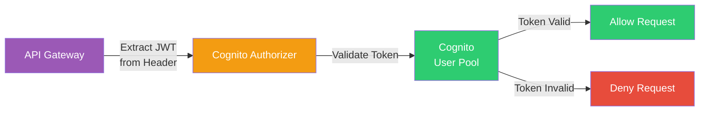
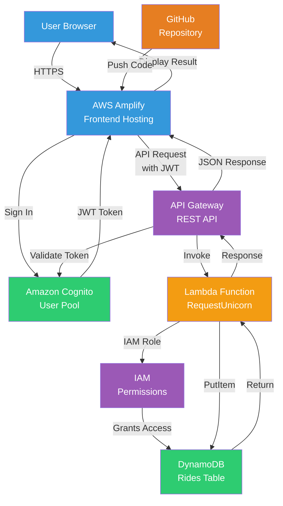

# AWS Core Services: A Beginner-Friendly Guide

A practical, beginner-friendly guide to understanding **core AWS services** and how they connect and work together in real-life applications — illustrated through the **Wild Rydes** serverless web application.

The goal is to answer:

* What are the core AWS services for web applications?
* How do AWS services connect and work together?
* What does each service do in a real application?
* How does a complete serverless architecture work end-to-end?

No prior AWS knowledge assumed.

---

## TL;DR

- **AWS Amplify** = Hosts your frontend and handles CI/CD
- **Amazon Cognito** = User authentication and authorization (sign-up, sign-in)
- **Amazon API Gateway** = Front door for your backend API
- **AWS Lambda** = Serverless backend code (runs without servers)
- **Amazon DynamoDB** = Fast, scalable NoSQL database
- **AWS IAM** = Permissions and access control
- **GitHub** = Code repository and version control

**Real-world example:** Wild Rydes (a ride-sharing app) uses all these services together.

---

## Where to start reading

If you're new, read in this order:

1. Big Picture: How services connect
2. Core AWS Services overview
3. End-to-end request flow
4. Service interactions in detail
5. Real-world application architecture

---

## Big Picture (Start Here)

Modern serverless web applications follow this pattern:

```
User Browser -> Frontend Hosting -> Authentication -> API Gateway -> Backend Logic -> Database
```

Each service has a specific job. Together, they create a complete, scalable application.

---

## Quick Glossary

* **Serverless** – Run code without managing servers (AWS handles infrastructure)
* **Frontend** – The part users see and interact with (HTML, CSS, JavaScript)
* **Backend** – The logic that processes requests and manages data
* **API** – Application Programming Interface (how frontend talks to backend)
* **Authentication** – Proving who you are (login)
* **Authorization** – What you're allowed to do (permissions)
* **NoSQL** – Database that doesn't require fixed schema (flexible data structure)

---

## Core AWS Services Overview

### AWS Amplify (Frontend Hosting)

> **Hosts your website and handles automatic deployments**

**What it does:**
* Serves static files (HTML, CSS, JavaScript) to users' browsers
* Automatically deploys new versions when code is pushed to GitHub
* Provides HTTPS and global CDN for fast content delivery
* Handles custom domains and environment variables

**In Wild Rydes:**
* Hosts `index.html`, `signin.html`, `ride.html`, and all CSS/JS files
* Automatically deploys when code is pushed to GitHub

**Analogy:** Like a web hosting service that automatically updates your site when you push code.

---

### Amazon Cognito (Authentication)

> **Manages user accounts and authentication**

**What it does:**
* Stores user accounts (email, password hashes)
* Handles user registration and email verification
* Authenticates users (login) and generates JWT tokens
* Supports social logins (Google, Facebook, etc.)
* Manages password reset and MFA

**In Wild Rydes:**
* Users register with email/password
* Users verify via email code
* Users sign in to receive JWT tokens
* Tokens prove identity to the API

**Analogy:** Like a bouncer at a club who checks IDs and gives you a wristband.


---

### Amazon API Gateway (API Front Door)

> **Exposes backend endpoints and routes requests**

**What it does:**
* Creates HTTP endpoints (like `/ride`, `/users`) that clients can call
* Validates incoming requests using authorizers (Cognito JWT tokens)
* Routes requests to backend services (Lambda functions)
* Handles CORS (Cross-Origin Resource Sharing) for browser security
* Can throttle, cache, and transform requests
* Manages API versions and stages (dev, staging, prod)

**In Wild Rydes:**
* Exposes the `/ride` POST endpoint
* Validates JWT token from Cognito
* Routes request to Lambda function
* Handles CORS for browser requests

**Analogy:** Like a receptionist who checks your appointment (token), then directs you to the right office (Lambda).



---

### AWS Lambda (Serverless Backend)

> **Runs backend code without managing servers**

**What it does:**
* Executes your code (Node.js, Python, Java, etc.) in response to events
* Automatically scales from zero to thousands of concurrent executions
* You only pay for compute time used (billed per millisecond)
* No server management, patching, or capacity planning
* Runs code in isolated execution environments

**In Wild Rydes:**
* Receives ride requests from API Gateway
* Selects a unicorn from the fleet
* Records the ride in DynamoDB
* Returns ride details to the client

**Analogy:** Like hiring temporary workers who show up exactly when needed, do the job, then leave.



---

### Amazon DynamoDB (Database)

> **Fast, scalable NoSQL database**

**What it does:**
* Stores data in tables with items (rows) and attributes (columns)
* Automatically scales to handle any amount of traffic
* Provides single-digit millisecond latency
* NoSQL means flexible schema - add new attributes without migrations
* Supports on-demand or provisioned capacity
* Built-in backup and point-in-time recovery

**In Wild Rydes:**
* Stores ride records with RideId, User, Unicorn details, RequestTime
* Partition key: RideId (unique identifier for each ride)
* Each ride is a separate item in the table

**Analogy:** Like a filing cabinet that automatically expands, organizes itself, and finds files instantly.



---

### AWS IAM (Permissions)

> **Controls who (or what service) can do what**

**What it does:**
* Creates roles that services can "assume" to get permissions
* Attaches policies (JSON documents) that grant specific permissions
* Acts as the "permissions glue" between services
* Follows principle of least privilege (only necessary permissions)
* Manages access keys and temporary credentials

**In Wild Rydes:**
* Lambda execution role has permission to write to DynamoDB
* API Gateway authorizer has permission to validate Cognito tokens
* Services can't access resources without proper IAM permissions

**Analogy:** Like security badges that grant access to specific buildings and rooms.



---

## End-to-End Request Flow (Wild Rydes Example)

Here's what happens when a user requests a ride:



**Step-by-step breakdown:**

1. **User opens app** → Browser loads files from AWS Amplify
2. **User signs in** → Cognito validates credentials, returns JWT token
3. **User requests ride** → Browser sends POST request to API Gateway with JWT token
4. **API Gateway validates** → Checks JWT token using Cognito authorizer
5. **Lambda executes** → Function processes request, selects unicorn
6. **DynamoDB stores** → Ride record saved to database
7. **Response returned** → JSON response flows back to browser
8. **User sees result** → Unicorn assignment displayed on map

---

## Service Interactions: How They Connect

### Frontend ↔ Authentication



**Key connection:** Cognito provides JWT tokens that the frontend stores and includes in API requests.

---

### Frontend ↔ Backend API



**Key connection:** API Gateway acts as the front door, validating requests before routing to Lambda.

---

### Backend ↔ Database



**Key connection:** Lambda uses IAM role permissions to read/write to DynamoDB.

---

### API Gateway ↔ Cognito



**Key connection:** API Gateway uses Cognito authorizer to validate JWT tokens on every request.

---

## Complete Architecture Diagram



---

## Real-World Application Patterns

### Pattern 1: Serverless Web Application (Wild Rydes)

**Use case:** Web app with user authentication, API, and database

**Services:**
* Amplify → Frontend hosting
* Cognito → User authentication
* API Gateway + Lambda → Backend API
* DynamoDB → Data storage
* IAM → Service permissions

**Why serverless:**
* No server management
* Automatic scaling
* Pay only for what you use
* Fast to deploy and iterate

---

### Pattern 2: API-First Application

**Use case:** Mobile app or multiple frontends need backend API

**Services:**
* API Gateway → Single API endpoint
* Lambda → Business logic
* DynamoDB → Data storage
* Cognito → Mobile/user authentication

**Key benefit:** One backend serves multiple clients (web, mobile, etc.)

---

### Pattern 3: Event-Driven Architecture

**Use case:** Process events asynchronously (e.g., file uploads, data changes)

**Services:**
* Lambda → Event handlers
* DynamoDB Streams → Event source
* API Gateway → Trigger events
* S3 → Store files

**Key benefit:** Decoupled, scalable event processing

---

## Service Comparison Table

| Service | What it replaces | Key Benefit |
| ------- | ---------------- | ----------- |
| **AWS Amplify** | Traditional web hosting | Automatic deployments from GitHub |
| **Amazon Cognito** | Custom auth system | Managed authentication, no code needed |
| **API Gateway** | Load balancer + API server | Serverless API with built-in auth |
| **AWS Lambda** | Application servers | No server management, auto-scaling |
| **Amazon DynamoDB** | Traditional database | Auto-scaling, single-digit ms latency |
| **AWS IAM** | Manual permission management | Centralized, secure access control |

---

## Common Use Cases

### When to use each service:

**AWS Amplify:**
* Hosting static websites (React, Vue, Angular, HTML/CSS/JS)
* Need automatic deployments from Git
* Want CDN and HTTPS out of the box

**Amazon Cognito:**
* Need user registration and login
* Want social logins (Google, Facebook)
* Need MFA (Multi-Factor Authentication)
* Don't want to build auth from scratch

**API Gateway:**
* Creating REST APIs
* Need request validation and routing
* Want built-in CORS and throttling
* Need to integrate with Lambda

**AWS Lambda:**
* Running backend code without servers
* Event-driven processing
* Need automatic scaling
* Want pay-per-use pricing

**Amazon DynamoDB:**
* Need fast, scalable database
* Flexible schema requirements
* Single-digit millisecond latency needs
* NoSQL data model fits your use case

**AWS IAM:**
* Managing permissions between services
* Controlling access to AWS resources
* Following security best practices
* Need temporary credentials

---

## Security Best Practices

### Token Management
* Store JWT tokens securely (HttpOnly cookies or in-memory)
* Never commit secrets to code repositories
* Use environment variables for configuration

### IAM Permissions
* Follow principle of least privilege
* Use IAM roles for service-to-service communication
* Never hardcode access keys in code

### API Security
* Always validate tokens in API Gateway
* Use HTTPS for all communication
* Enable CORS appropriately (not `*` in production)

### Database Security
* Use IAM roles for database access
* Enable encryption at rest
* Use VPC endpoints for private access (advanced)

---

## Cost Considerations

**Free tier eligible services:**
* AWS Amplify: Free tier includes 1000 build minutes/month
* Amazon Cognito: Free tier includes 50,000 MAUs (Monthly Active Users)
* API Gateway: Free tier includes 1 million requests/month
* AWS Lambda: Free tier includes 1 million requests/month + 400,000 GB-seconds
* Amazon DynamoDB: Free tier includes 25 GB storage + 25 RCU + 25 WCU

**Cost optimization tips:**
* Use on-demand DynamoDB for unpredictable workloads
* Set up Lambda provisioned concurrency only if needed
* Monitor CloudWatch metrics to track usage
* Use API Gateway caching to reduce Lambda invocations

---

## Glossary (Fast Reference)

* **Serverless** – Run code without managing servers; AWS handles infrastructure
* **JWT (JSON Web Token)** – Self-contained token format used for authentication
* **CORS (Cross-Origin Resource Sharing)** – Browser security feature for cross-domain requests
* **IAM Role** – AWS identity with permissions that services can assume
* **Partition Key** – Primary key used to distribute data in DynamoDB
* **Authorizer** – API Gateway component that validates requests before routing
* **Invoke URL** – The endpoint URL where your API Gateway is accessible
* **User Pool** – Cognito service that stores user accounts and handles authentication
* **Execution Role** – IAM role that Lambda assumes when running code
* **PutItem** – DynamoDB operation to create or update an item
* **GetItem** – DynamoDB operation to retrieve an item by key

---

## Next Steps

1. **Explore the Wild Rydes project** in `wildrydes-site/` to see these services in action
2. **Read the detailed README** in `wildrydes-site/README.md` for setup instructions
3. **Review the architecture** in `wildrydes-site/docs/ARCHITECTURE.md` for deeper details
4. **Try building your own** serverless application using these patterns

---

## Additional Resources

* [AWS Serverless Workshops](https://aws.amazon.com/serverless-workshops/)
* [AWS Amplify Documentation](https://docs.aws.amazon.com/amplify/)
* [Amazon Cognito Documentation](https://docs.aws.amazon.com/cognito/)
* [API Gateway Documentation](https://docs.aws.amazon.com/apigateway/)
* [AWS Lambda Documentation](https://docs.aws.amazon.com/lambda/)
* [Amazon DynamoDB Documentation](https://docs.aws.amazon.com/dynamodb/)
* [AWS IAM Documentation](https://docs.aws.amazon.com/iam/)

---

Understanding these core services and how they connect is the foundation for building modern, scalable applications on AWS. Start with the Wild Rydes project to see them all working together!

