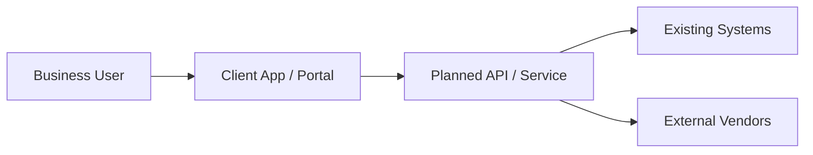
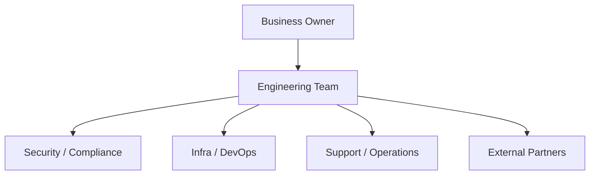
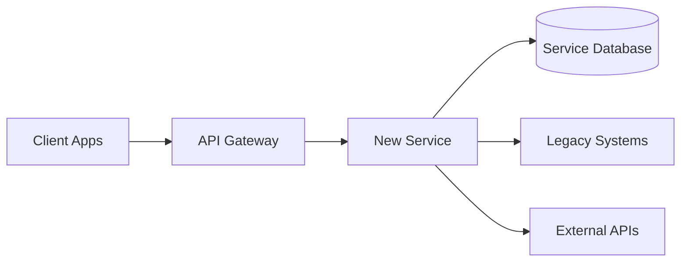
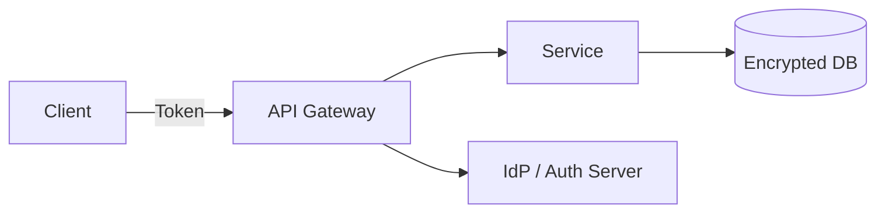
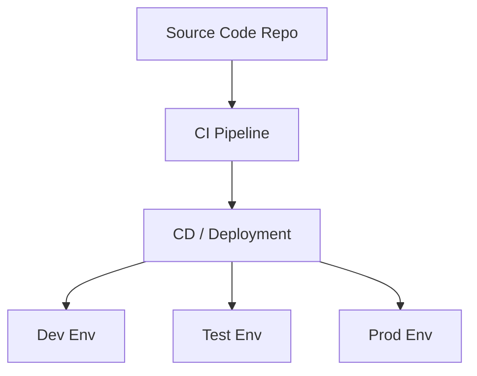
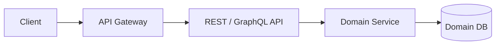
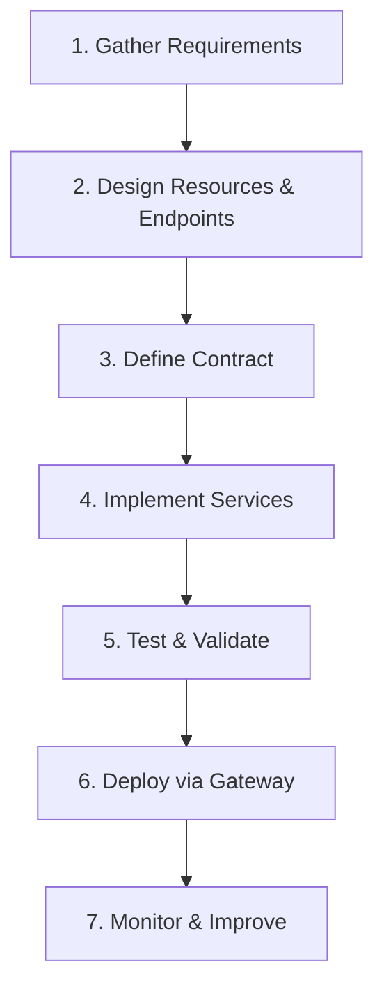
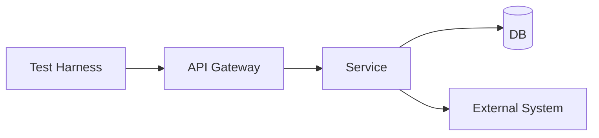

# 🚀 Software Engineering Delivery Playbook

⚡ **TL;DR:** This playbook explains how to take an idea from “we should build this” to running in production, by combining requirements, architecture, communication, and disciplined delivery.

---

## 1️⃣ Requirements Discovery

**What This Is (max 4 sentences)**  
Requirements discovery is the process of understanding what the business actually needs the system to do. It focuses on user journeys, system interactions, constraints, and success criteria. The outcome is a shared understanding of **problems and outcomes**, not just features.

**Why It Matters**  
If you start from the wrong or incomplete requirements, every downstream decision (architecture, API design, estimates) will be off. Good discovery reduces rework, scope creep, and late surprises.

**Key Questions Engineers Should Ask**

- Who are the primary users and what are their top 3–5 workflows?  
- What systems will call this system/API, and what systems will it call?  
- Are there upstream/downstream dependencies (batch jobs, events, external vendors)?  
- What does “done” look like in measurable terms (latency, data accuracy, volume, SLAs)?  
- What are the hard constraints (regulatory, legal, release dates, budgets)?

**Architecture Thinking**  
At this stage, think in terms of **high-level flows**, not detailed components. Map the main actors (users, client apps, partner systems) and the core systems they touch.



**Risks and Failure Points**

- Unclear or conflicting business goals.  
- Hidden stakeholders who appear late and veto decisions.  
- Ignoring non-functional requirements (performance, SLAs, data quality).  
- Assuming current behavior is the desired behavior.

**Real World Example**  
A retailer wants an “order tracking API.” During discovery, engineers learn that call center agents, mobile users, and a partner logistics portal all need different slices of tracking data. Without that early discovery, the team would have built a single generic endpoint that satisfied none of them well.

**Artifacts Produced**

- Problem statement and goals (1–2 pages).  
- List of primary user journeys.  
- High-level system interaction diagram.  
- Initial list of functional and non-functional requirements.

---

## 2️⃣ Stakeholder Mapping

**What This Is (max 4 sentences)**  
Stakeholder mapping identifies all people and roles who influence, approve, or are impacted by the project. This includes business owners, security, compliance, infrastructure, support, and external partners. The goal is to know **who to talk to, when, and about what**.

**Why It Matters**  
Projects often fail not due to code, but because key stakeholders weren’t engaged early enough. Early mapping avoids late blockers like “security hasn’t reviewed this” or “operations can’t support this design.”

**Key Questions Engineers Should Ask**

- Who owns the business outcome and budget for this project?  
- Who approves security, compliance, and data handling decisions?  
- Who runs the production environment and on-call support?  
- Are there external vendors or partner teams that must integrate or approve changes?

**Architecture Thinking**  
Think of each stakeholder group as a **node in the delivery system** that the solution must pass through (requirements, design review, security review, deployment, support).



**Risks and Failure Points**

- Missing security/compliance early and being blocked close to go-live.  
- Not involving support/operations and ending with an unmaintainable system.  
- Conflicting priorities between business units.

**Real World Example**  
An API is ready from an engineering perspective, but production deployment is delayed by 6 weeks because the security review board only meets monthly and was never engaged until the end.

**Artifacts Produced**

- Stakeholder map with names/roles.  
- RACI (Responsible, Accountable, Consulted, Informed) for the project.  
- Communication plan (who gets updates, how often).

---

## 3️⃣ System Architecture Planning

**What This Is (max 4 sentences)**  
System architecture planning is where you design **how the system fits into the existing ecosystem**. You choose boundaries, components, integration patterns, and data flows. The outcome is an architecture that can realistically be built, operated, and evolved.

**Why It Matters**  
Good architecture reduces coupling, enables independent change, and clarifies responsibilities across services and teams. Poor architecture leads to brittle integrations, scaling issues, and expensive rewrites.

**Key Questions Engineers Should Ask**

- Where does this system sit relative to existing apps, APIs, and data stores?  
- Which parts must be highly available, and where can we tolerate failure or delay?  
- Should we build a new service, extend an existing one, or integrate via an API gateway?  
- How will data flow end-to-end (create, read, update, delete, replicate)?

**Architecture Thinking**  
Think in terms of **bounded contexts** and clear contracts between components. Start with a simple macro diagram before diving into microservices or specific technologies.



**Risks and Failure Points**

- Over-engineering (too many services, too much complexity) for the project’s size.  
- Tight coupling to legacy systems that are about to change.  
- Ignoring observability (logging, metrics, tracing) in the architecture.

**Real World Example**  
For a customer profile system, architecture planning reveals that three different systems hold overlapping user data. The team decides to build a “profile aggregation service” and define it as the single API contract for all clients, instead of letting each client talk to all three systems independently.

**Artifacts Produced**

- High-level architecture diagram(s).  
- Architecture decision records (key choices and trade-offs).  
- List of services/components with responsibilities.

---

## 4️⃣ Security and Compliance Planning

**What This Is (max 4 sentences)**  
Security and compliance planning defines **how the system will protect data and meet regulatory requirements**. It covers authentication, authorization, data handling, logging, and audit needs. This is done before implementation to avoid late-stage rework.

**Why It Matters**  
Enterprise projects often fail or stall due to unmet security/compliance requirements, not technical bugs. Early planning ensures designs can pass reviews and be approved for production.

**Key Questions Engineers Should Ask**

- What types of data are involved (PII, payment, health, internal-only)?  
- What authentication model is required (OAuth2, SSO, API keys, mTLS)?  
- What authorization rules exist (roles, permissions, data-level access)?  
- What logs/audits are required for legal or compliance reasons?  
- Are there data residency or retention requirements?

**Architecture Thinking**  
Think of security as a set of **layers around and inside your system**: edge (gateway), service, data, and observability. Decide where each control lives.



**Risks and Failure Points**

- Designing an API that doesn’t align with the organization’s standard auth model.  
- Logging sensitive data in plain text.  
- Not planning for security review timelines and required artifacts.

**Real World Example**  
An internal HR API is built with simple API keys, but security requires SSO with fine-grained RBAC. The team must retrofit the system to use the corporate IdP, delaying go-live.

**Artifacts Produced**

- Security model description (authn/authz, data protection).  
- Data classification and handling guidelines.  
- Inputs for security/compliance review (diagrams, threat model summary).

---

## 5️⃣ Infrastructure and Access Setup

**What This Is (max 4 sentences)**  
Infrastructure and access setup covers **where and how the system will run**: environments, networking, CI/CD, monitoring, and permissions. This often runs in parallel with design and early implementation.

**Why It Matters**  
Lack of environments or access is one of the biggest blockers in enterprise delivery. Getting infra and permissions ready early keeps implementation moving and avoids last-minute “we can’t deploy” surprises.

**Key Questions Engineers Should Ask**

- Which environments are available (dev, test, staging, prod), and who controls them?  
- How will we deploy (CI/CD pipeline, manual scripts, platform tools)?  
- What networking/firewall/VPN constraints exist?  
- Who has permissions to create resources, secrets, and DNS entries?

**Architecture Thinking**  
Think of infrastructure as a **platform layer** supporting your services: compute, networking, storage, observability, and deployment pipelines.



**Risks and Failure Points**

- Waiting until late to request firewalls, DNS, or certificates.  
- Manual, undocumented deployment steps that only one person knows.  
- No monitoring/alerting plan for production.

**Real World Example**  
The team finishes development but discovers that creating production databases requires a two-week change-management process they never initiated. Go-live is delayed while paperwork and approvals catch up.

**Artifacts Produced**

- Environment diagram and access matrix.  
- CI/CD pipeline definition.  
- Infra-as-code scripts (where applicable).  
- Runbooks for environment setup.

---

## 6️⃣ API Design Planning

**What This Is (max 4 sentences)**  
API design planning defines the **external contract**: endpoints or operations, request/response shapes, errors, and versioning strategy. It usually produces a design document and a formal spec (OpenAPI, GraphQL schema, proto files).

**Why It Matters**  
APIs are long-lived contracts. A well-planned design reduces breaking changes, simplifies client code, and makes integration predictable for other teams.

**Key Questions Engineers Should Ask**

- Who are the API consumers (internal services, frontends, partners)?  
- What are the key resources and operations for each user journey?  
- What does a “good” error response look like for clients?  
- How will we handle versioning and backward compatibility?

**Architecture Thinking**  
Think in terms of **resource boundaries** and **operation semantics**. Decide where to use REST vs GraphQL vs gRPC and how the API fits behind or in front of an API gateway.



**Risks and Failure Points**

- Designing APIs that mirror database tables instead of business concepts.  
- Mixing unrelated operations into single endpoints.  
- Not involving consumer teams in reviewing the API spec.

**Real World Example**  
Before implementing a payments API, the team writes an OpenAPI spec and reviews it with the mobile and billing teams. The review uncovers missing fields and unclear error cases that would have caused churn during integration.

**Artifacts Produced**

- API design document (endpoints/operations, use cases).  
- OpenAPI / GraphQL schema / proto files.  
- Example requests/responses and error scenarios.

---

## 7️⃣ API Design Process (From Requirements to Deployment)

**High-Level Summary (max 4 sentences)**  
Designing an API starts with **understanding requirements** and core use cases, then modeling resources and operations. You choose the right API style and protocol (REST, GraphQL, gRPC) and design the contract (endpoints, schemas, status codes). Implementation follows the contract, with testing, documentation, and deployment. Senior engineers iterate on this process with feedback and versioning.

**Everyday Analogy**  
It’s like designing a **public building**: you first understand who will use it and why, then sketch the layout, then build, test safety, and open to the public with signage.

**How It Fits Into the System**  
This process touches every layer—from gateway routes and API schemas to service boundaries and database schemas. Early decisions (like API style and resource modeling) affect scalability, changeability, and developer experience.

**Diagram (Mermaid)**



**Implementation Notes**

- **Requirements**:  
  - Identify primary user stories (e.g. “As a user I can view my posts and followers”).  
  - Decide which clients (web, mobile, internal services) will consume the API.
- **Design & Contract**:  
  - REST: design resources and endpoints and describe them in OpenAPI.  
  - GraphQL: design schema (types, queries, mutations, subscriptions).  
  - gRPC: design proto files.
- **Implementation & Deployment**:  
  - Implement in ASP.NET Core or Node/Express behind an API gateway.  
  - Add CI/CD pipelines that deploy services and update schemas.

**Common Mistakes / Misconceptions**

- Jumping straight into coding without a clear contract or resource model.  
- Ignoring versioning and backward compatibility.  
- Not involving consumers (frontend, partners) early in the design.

**Quick Example (Minimal ASP.NET Core Endpoint)**

```csharp
app.MapGet("/v1/users/{id}", async (string id, IUserService svc) =>
{
    var user = await svc.GetByIdAsync(id);
    return user is null ? Results.NotFound() : Results.Ok(user);
});
```

---

## 8️⃣ Implementation Phase

**What This Is (max 4 sentences)**  
Implementation is where engineers translate designs and specs into working code, tests, and infrastructure. It includes coding, code review, integration, and continuous integration.

**Why It Matters**  
This is where most effort and time are spent, and where technical decisions solidify. Good implementation practices keep quality high and reduce surprises in later testing and deployment.

**Key Questions Engineers Should Ask**

- Does this code align with the agreed architecture and API contracts?  
- Are we covering critical paths with automated tests (unit, integration, contract tests)?  
- How will we observe this feature in production (logs, metrics, traces)?  
- Are we building in small, reviewable increments?

**Architecture Thinking**  
Think in terms of **layers and boundaries** inside your service (API layer, domain layer, data layer) and how they map to the overall architecture.

**Risks and Failure Points**

- “Scope creep” during implementation (adding features without revisiting requirements).  
- Skipping tests and observability to hit short-term deadlines.  
- Diverging from contracts used by other teams.

**Real World Example**  
During implementation of an order API, the team adds several “nice-to-have” fields without updating the spec. The mobile team integrates based on the original spec and finds breaking differences, causing rework.

**Artifacts Produced**

- Source code and tests.  
- Updated design docs (to reflect final implementation).  
- Service-level dashboards and alerts.

---

## 9️⃣ Testing and Validation

**What This Is (max 4 sentences)**  
Testing and validation confirm that the system works as intended and integrates correctly with other systems. It includes unit, integration, end-to-end, performance, and security testing as appropriate.

**Why It Matters**  
Enterprise systems often fail at integration boundaries, not within isolated components. Good testing finds these issues before production and builds trust with stakeholders.

**Key Questions Engineers Should Ask**

- What are the most critical paths (happy paths and edge cases) that must be tested?  
- How will we validate integrations with external systems (test environments, mocks, contract tests)?  
- Are there performance or load targets we must validate?  
- Who must sign off before we can go live?

**Architecture Thinking**  
Map tests to **system flows**, not just units: client → gateway → service → database → external systems.



**Risks and Failure Points**

- Relying only on unit tests and skipping real integration tests.  
- No stable test environments or test data.  
- Ignoring performance and failure-mode testing (timeouts, partial outages).

**Real World Example**  
An API passes unit tests but fails in staging because the external payment provider enforces stricter timeouts than the mocks used in development.

**Artifacts Produced**

- Test plans and test cases (formal or lightweight).  
- Automated test suites and test reports.  
- Performance and load test results.

---

## 🔟 Deployment and Release

**What This Is (max 4 sentences)**  
Deployment and release cover getting the system into production and making it available to users. It includes rollout strategies, change management, and initial monitoring.

**Why It Matters**  
Poorly planned releases cause outages, rollbacks, and loss of trust. A controlled release plan reduces risk and sets up long-term stability.

**Key Questions Engineers Should Ask**

- What is our rollout strategy (big bang, canary, blue-green)?  
- What is the rollback plan if something goes wrong?  
- Do we need feature flags or dark launches?  
- Who must be on-call or available during release?

**Architecture Thinking**  
Think about **how changes propagate** across components and environments, and how to minimize blast radius.

**Risks and Failure Points**

- Manual, error-prone deployment steps.  
- No clear rollback procedure.  
- Changes in dependencies (databases, external systems) not accounted for.

**Real World Example**  
During a blue-green deployment, traffic is gradually shifted to the new version while metrics are watched. When an error rate spike is detected, traffic is shifted back, preventing a full outage.

**Artifacts Produced**

- Release plan and checklist.  
- Deployment scripts / pipeline configurations.  
- Change tickets / approvals (where required).

---

## 1️⃣1️⃣ Documentation and Handoff

**What This Is (max 4 sentences)**  
Documentation and handoff ensure that **others can operate, support, and extend** the system after initial delivery. It includes technical docs, runbooks, and knowledge transfer to support and other teams.

**Why It Matters**  
Without good handoff, systems become “black boxes” that only the original team can touch. This leads to operational risk and slows future changes.

**Key Questions Engineers Should Ask**

- What do new engineers need to know to work on this system?  
- What does support need to know to handle incidents?  
- Where is the documentation stored and how is it kept up to date?  
- Are there onboarding or training sessions needed?

**Architecture Thinking**  
Think of documentation as part of the **system interface** for humans: how people discover, understand, and safely modify the system.

**Risks and Failure Points**

- Documentation that is out of date the moment it’s written.  
- No runbooks, making incident response slow and risky.  
- Relying on tribal knowledge instead of written artifacts.

**Real World Example**  
An API goes down at 2 a.m., but the on-call engineer restores service quickly using a clear runbook that describes known failure modes and recovery steps.

**Artifacts Produced**

- System overview and architecture docs.  
- API documentation (e.g. Swagger UI, GraphQL schema docs).  
- Runbooks and operational guides.  
- Handoff session recordings or notes.

