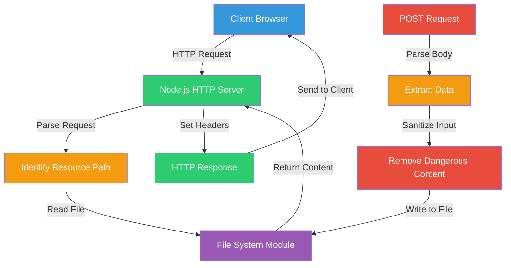
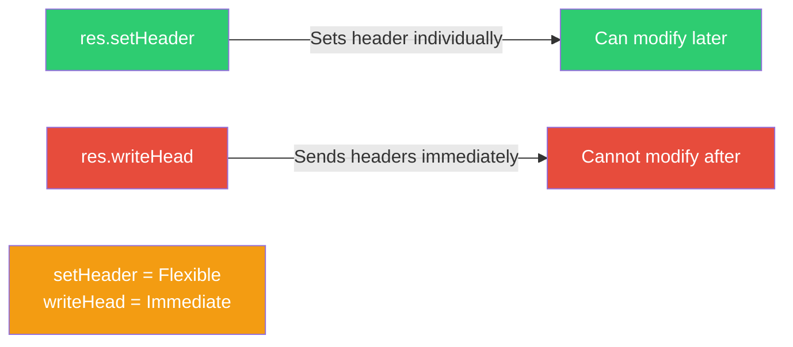
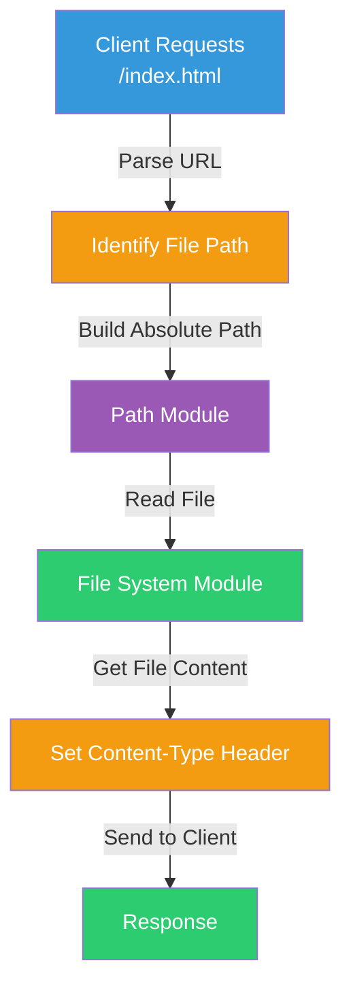
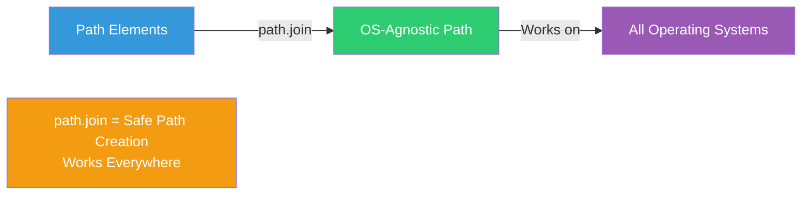
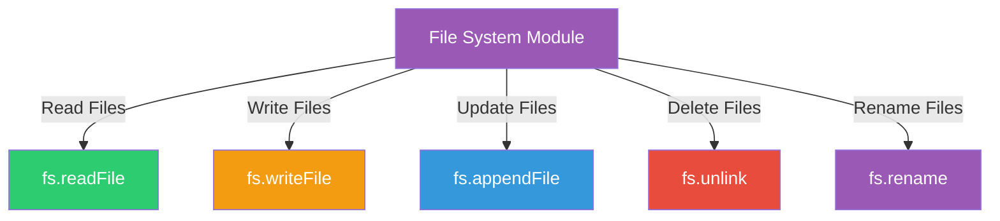
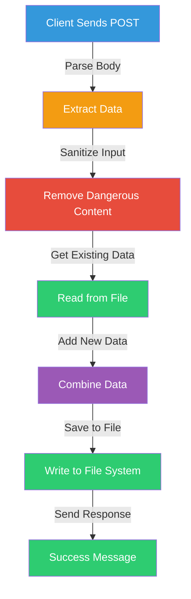
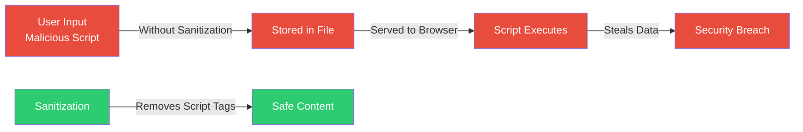

# Node.js Project: Building a Server from Scratch

### A Beginner-Friendly Guide to HTTP Servers, File Systems, and Web Development

This project demonstrates **how to build a web server using Node.js**, how to **serve static files**, handle **POST requests**, manage **file operations**, and implement **security practices** like input sanitization — all using only Node.js core modules.

The goal is to answer:

* How do you create an HTTP server in Node.js?
* How do you serve static files?
* How do you handle POST requests?
* How do you read and write files?
* How do you handle paths across different operating systems?
* What is input sanitization and why does it matter?

No prior Node.js knowledge assumed.

---

## TL;DR

- **HTTP Server** = Server that responds to web requests using Node.js `http` module
- **Static Files** = HTML, CSS, JavaScript files served to browsers
- **POST Requests** = Method for sending data to the server (forms, API calls)
- **File System** = Reading and writing files on the server using `fs` module
- **Path Module** = OS-agnostic way to work with file paths
- **Input Sanitization** = Removing dangerous content from user input (XSS prevention)

---

## Where to start reading

If you're new, read in this order:

1. HTTP Server Basics
2. Serving Static Files
3. Handling POST Requests
4. File System Operations
5. Path Handling
6. Security: Input Sanitization

---

## Quick mental model (diagram)



**Key points:**
- Client sends request -> Server identifies resource -> Reads file -> Sends response
- POST requests -> Parse data -> Sanitize -> Save to file

---

# 1) HTTP Server Basics

An HTTP server listens for requests and sends responses. In Node.js, you use the `http` module.

### Creating a Basic Server

```javascript
import http from 'node:http';

const PORT = 8000;

const server = http.createServer((req, res) => {
  res.writeHead(200, { 'Content-Type': 'text/html' });
  res.end('<html><h1>The server is working!!!</h1></html>');
});

server.listen(PORT, () => console.log(`Connected on port: ${PORT}`));
```

### Understanding Response Methods



**Key differences:**

| Method | Behavior | Use Case |
| ------ | -------- | -------- |
| `res.setHeader()` | Sets header but doesn't send immediately | Allows modification before sending |
| `res.writeHead()` | Sends headers immediately | Final headers, cannot be changed after |

**Important:** Don't mix them! Headers set with `setHeader()` after `writeHead()` will be ignored.

---

# 2) Serving Static Files

Static files are files that don't change (HTML, CSS, JavaScript, images). The server reads them from the file system and sends them to the client.

### The Process



**Steps:**
1. Identify what resource the client wants
2. Identify the path to that resource
3. Read the resource using the File System module
4. Send the resource to the client with appropriate headers

### Example: Serving an HTML File

```javascript
import path from 'node:path';
import http from 'node:http';
import fs from 'node:fs/promises';

const PORT = 8000;
const __dirname = path.dirname(import.meta.url.replace('file://', ''));

const server = http.createServer(async (req, res) => {
  const pathToResource = path.join(__dirname, 'public', 'index.html');
  const content = await fs.readFile(pathToResource, 'utf8');
  
  res.statusCode = 200;
  res.setHeader('Content-Type', 'text/html');
  res.end(content);
});

server.listen(PORT, () => console.log('Server running on port 8000'));
```

---

# 3) Path Handling: Absolute vs Relative

Working with file paths can be tricky because different operating systems use different path separators.

### The Problem

| OS | Path Example |
| -- | ------------ |
| Linux/Mac | `/home/user/project/public/index.html` |
| Windows | `\Users\user\project\public\index.html` |

### The Solution: Path Module

The `path` module creates OS-agnostic paths that work everywhere.



### Understanding Path Types

**Absolute Paths:**
- Show the full location of a file
- Always the same, regardless of where you run the script
- Independent of current working directory

**Relative Paths:**
- Relative to the file where they appear
- Often use `.` (current folder) or `..` (up one folder)
- Common in import statements

**Using `import.meta`:**
```javascript
// ES Modules (Node.js v20+)
const __dirname = import.meta.dirname;
const __filename = import.meta.filename;

// Older ES Modules
import path from 'node:path';
import url from 'node:url';
const __filename = url.fileURLToPath(import.meta.url);
const __dirname = path.dirname(__filename);
```

---

# 4) File System Operations

The `fs` module lets you interact with files on the server.

### Common File System Methods



| Method | Purpose | Example |
| ------ | ------- | ------- |
| `fs.readFile()` | Read file contents | Reading HTML/CSS files |
| `fs.writeFile()` | Write/create file | Saving user data |
| `fs.appendFile()` | Add to end of file | Logging |
| `fs.unlink()` | Delete file | Cleanup |
| `fs.rename()` | Rename/move file | File management |

### Important: Set Content-Type Headers

When serving files, always set the `Content-Type` header so browsers know how to interpret the content:

```javascript
res.setHeader('Content-Type', 'text/html');  // For HTML files
res.setHeader('Content-Type', 'text/css');   // For CSS files
res.setHeader('Content-Type', 'application/json'); // For JSON
```

---

# 5) Handling POST Requests

POST requests allow clients to send data to the server (forms, API calls).

### POST Request Flow



**Steps to handle POST:**
1. Collect incoming data (parse request body)
2. Parse the data (convert to JavaScript object)
3. Sanitize it (remove dangerous content)
4. Get existing data (read from file)
5. Add new data to existing data
6. Write completed data to file

### Parsing Request Body

```javascript
let body = '';
req.on('data', chunk => {
  body += chunk.toString();
});

req.on('end', async () => {
  const data = JSON.parse(body);
  // Process the data
});
```

---

# 6) Security: Input Sanitization

**XSS (Cross-Site Scripting)** attacks occur when malicious scripts are injected into web pages through user input.

### The Problem



### The Solution: Sanitization

**Sanitization** is removing anything suspicious from incoming input. For text, this means removing HTML tags that could contain malicious scripts.

**Using `sanitize-html` package:**
```javascript
import sanitizeHtml from 'sanitize-html';

const userInput = '<script>alert("XSS")</script>Hello';
const safe = sanitizeHtml(userInput); // Returns: "Hello"
```

**Install:**
```bash
npm install sanitize-html
```

---

# 7) Module Systems: CommonJS vs ES Modules

Node.js supports two module systems:

### CommonJS (CJS)

```javascript
// Export
module.exports = { add, subtract };

// Import
const { add } = require('./math');
```

### ES Modules (ESM)

```javascript
// Export
export function add(a, b) { return a + b; }

// Import
import { add } from './math.js';
```

### Comparison

| Feature | CommonJS | ES Modules |
| ------- | -------- | ---------- |
| Import/Export | `require()` / `module.exports` | `import` / `export` |
| Loading | Synchronous | Asynchronous |
| Top-level await | Not supported | Supported |
| Tree-shaking | Not natively supported | Supported |
| Environment | Node.js (primary) | Browser & Node.js |

**To use ES Modules in Node.js:**
Add to `package.json`:
```json
{
  "type": "module"
}
```

---

## Common Patterns and Best Practices

### Pattern 1: Initialize Project

```bash
npm init
```

Update `package.json` to enable ES Modules:
```json
{
  "type": "module"
}
```

### Pattern 2: Static File Serving

Always:
1. Use `path.join()` for OS-agnostic paths
2. Use absolute paths based on `__dirname`
3. Set appropriate `Content-Type` headers
4. Handle errors (file not found, etc.)

### Pattern 3: POST Request Handling

Always:
1. Parse the request body
2. Sanitize user input
3. Validate data
4. Handle errors gracefully

---

## Final Mental Model (Remember This)

```
HTTP Server      -> Listens for requests, sends responses
Static Files     -> HTML/CSS/JS served as-is
POST Request     -> Client sends data to server
File System      -> Read/write files on server
Path Module      -> OS-agnostic file paths
Sanitization     -> Remove dangerous content from input
setHeader        -> Flexible header setting
writeHead        -> Immediate header sending
Absolute Path    -> Full file location (same everywhere)
Relative Path    -> Location relative to current file
import.meta      -> Metadata about current ES module
```

If this makes sense, building Node.js servers has officially **clicked**.

---

## Glossary (Fast Reference)

* **HTTP Server** – Server that responds to HTTP requests using Node.js `http` module
* **Static Files** – Files served as-is (HTML, CSS, JavaScript, images)
* **POST Request** – HTTP method for sending data to the server
* **File System (fs)** – Node.js module for reading/writing files
* **Path Module** – Node.js module for OS-agnostic path handling
* **Absolute Path** – Full file location (independent of current directory)
* **Relative Path** – File location relative to current file
* **Content-Type** – HTTP header that tells browser how to interpret response
* **Sanitization** – Removing dangerous content from user input
* **XSS** – Cross-Site Scripting attack (injecting malicious scripts)
* **ES Modules** – Modern JavaScript module system (`import`/`export`)
* **CommonJS** – Traditional Node.js module system (`require`/`module.exports`)
* **import.meta** – Object providing metadata about current ES module
* **__dirname** – Directory name of current module
* **res.setHeader()** – Method to set HTTP response header individually
* **res.writeHead()** – Method to send HTTP response headers immediately

---

This project teaches the fundamentals of building web servers with Node.js, laying the groundwork for understanding frameworks like Express.js.
