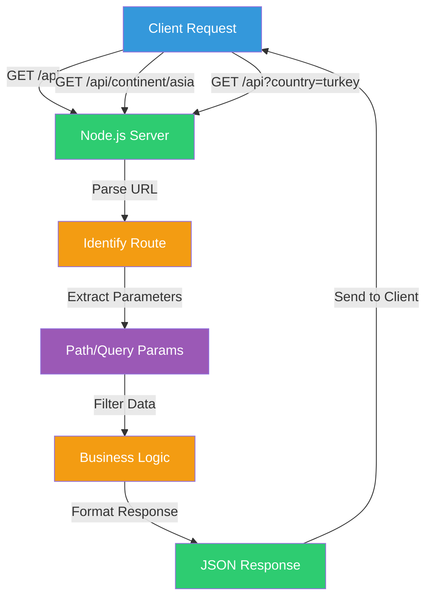
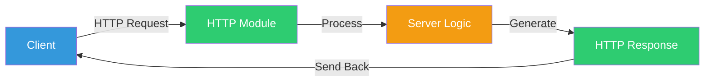
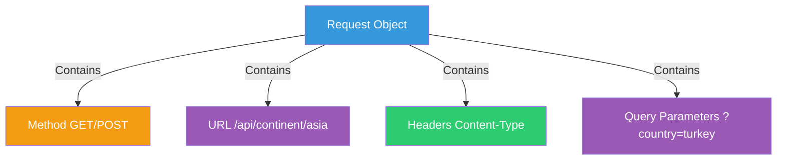
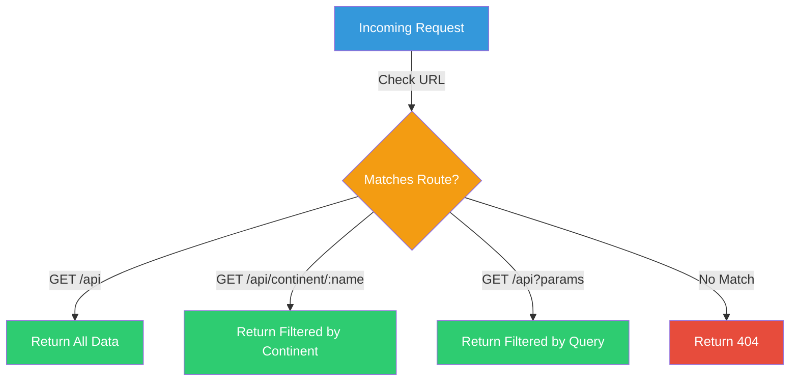
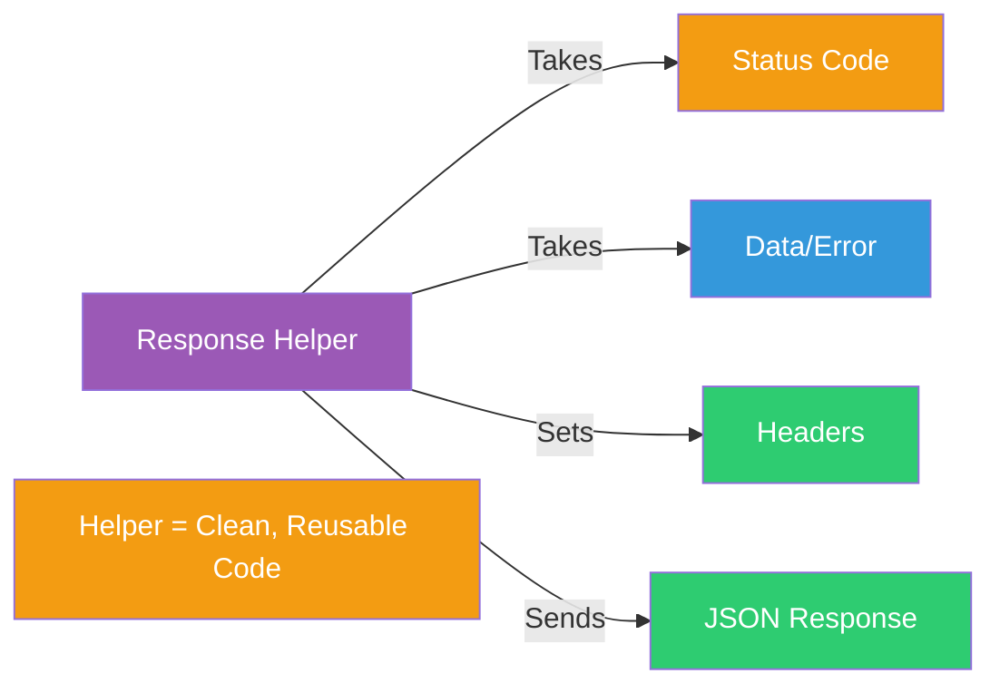
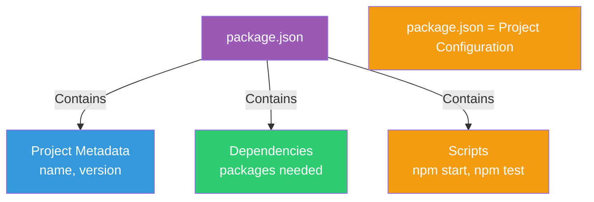

# Wild Horizons API: Building a REST API from Scratch

### A Beginner-Friendly Guide to Node.js APIs, Routing, and Data Filtering

This project demonstrates **how to build a REST API using only Node.js core modules**, how to **handle different request types**, **extract path and query parameters**, **filter data**, and **structure clean server code** — perfect for understanding what frameworks like Express do under the hood.

The goal is to answer:

* How do you build a REST API in Node.js?
* How do you handle different routes and methods?
* How do you extract path parameters?
* How do you extract query parameters?
* How do you filter and return data?
* How do you structure API responses?

No prior API knowledge assumed.

---

## TL;DR

- **REST API** = Style of designing APIs using HTTP methods (GET, POST, etc.)
- **Path Parameters** = Data in the URL path (e.g., `/api/continent/asia`)
- **Query Parameters** = Data after `?` in URL (e.g., `?country=turkey`)
- **Routing** = Determining which code handles which request
- **Filtering** = Selecting specific data based on criteria
- **JSON Response** = Data formatted as JSON for clients

---

## Where to start reading

If you're new, read in this order:

1. What is a REST API?
2. HTTP Module Basics
3. Request-Response Cycle
4. Path Parameters
5. Query Parameters
6. Response Handling

---

## Quick mental model (diagram)



**Key points:**
- Client sends request -> Server parses URL -> Extracts parameters -> Filters data -> Returns JSON

---

# 1) What is a REST API?

**REST (Representational State Transfer)** is a style of designing APIs that uses standard HTTP methods.

### API Endpoints in This Project

The Wild Horizons API provides three ways to get travel destination data:

1. **Get ALL data**
   ```
GET /api
   ```

2. **Filter by path parameter**
   ```
   GET /api/continent/asia
   GET /api/continent/europe
   ```

3. **Filter using query parameters**
   ```
   GET /api?country=turkey
GET /api?country=turkey&is_open_to_public=true
   ```

All responses return JSON.

---

# 2) HTTP Module: Building the Foundation

The Node.js `http` module is the foundation for building web servers and APIs.

### Understanding the HTTP Module

Think of your Node.js server like a restaurant:
* **Browser** → customer
* **Request** → customer order
* **Response** → the food
* **HTTP module** → the kitchen that lets you cook and serve



### Minimal Server Example

```javascript
import http from 'node:http';

const server = http.createServer((req, res) => {
  res.writeHead(200, { 'Content-Type': 'application/json' });
  res.end(JSON.stringify({ message: 'Hello from a Node server!' }));
});

server.listen(3000, () => {
  console.log('Server running at http://localhost:3000');
});
```

---

# 3) Request-Response Cycle

Understanding how requests and responses work is fundamental to building APIs.

### The Request Object

The `req` object contains information about the incoming request:



**Request contains:**
* `req.method` – HTTP method (GET, POST, etc.)
* `req.url` – The URL path (`/api`, `/api/continent/europe`)
* `req.headers` – HTTP headers
* `req.body` – Request body (for POST/PUT requests)

### The Response Object

The `res` object is used to send responses back to the client:

**Response includes:**
* Status code (200 = OK, 404 = Not Found, 500 = Error)
* Headers (Content-Type: application/json)
* Body (the actual data)

---

# 4) Routing: Handling Different Endpoints

Routing means determining which code handles which URL and HTTP method.

### Route Matching



### Route 1: Get All Data

```javascript
if (req.url === '/api' && req.method === 'GET') {
  res.writeHead(200, { 'Content-Type': 'application/json' });
  res.end(JSON.stringify(allDestinations));
}
```

---

# 5) Path Parameters: Extracting Data from URLs

**Path parameters** are values embedded in the URL path itself.

### Understanding Path Parameters

```
GET /api/continent/asia
GET /api/continent/europe
GET /api/continent/africa
```

The continent name (`asia`, `europe`, `africa`) is a path parameter.

```mermaid
flowchart LR
    A[/api/continent/asia] -->|Extract| B[continent = asia]
    B -->|Filter Data| C[Return Asian Destinations]
    
    D[Path Parameter = Data in URL Path]
    
    style A fill:#3498DB,color:#fff
    style B fill:#F39C12,color:#fff
    style C fill:#2ECC71,color:#fff
    style D fill:#9B59B6,color:#fff
```

### Extracting Path Parameters

```javascript
if (req.url.startsWith('/api/continent/') && req.method === 'GET') {
  // Extract the continent name from the URL
  const continent = req.url.split('/').pop();
  console.log('Requested continent:', continent);
  
  // Filter data based on continent
  const filtered = destinations.filter(destination => {
  return destination.continent.toLowerCase() === continent.toLowerCase();
});

  res.writeHead(200, { 'Content-Type': 'application/json' });
  res.end(JSON.stringify(filtered));
}
```

**How it works:**
1. Check if URL starts with `/api/continent/`
2. Split URL by `/` and get last part (continent name)
3. Filter destinations array
4. Return filtered results as JSON

---

# 6) Query Parameters: Filtering with URL Parameters

**Query parameters** are key-value pairs after `?` in the URL.

### Understanding Query Parameters

```
GET /api?country=turkey
GET /api?country=turkey&is_open_to_public=true
GET /api?continent=asia&country=india
```

```mermaid
flowchart LR
    A[/api?country=turkey] -->|Parse| B[Query Object]
    B -->|Extract| C[country: turkey]
    C -->|Filter Data| D[Return Matching Results]
    
    E[Query Parameters = Data after ? in URL]
    
    style A fill:#3498DB,color:#fff
    style B fill:#9B59B6,color:#fff
    style C fill:#F39C12,color:#fff
    style D fill:#2ECC71,color:#fff
    style E fill:#9B59B6,color:#fff
```

### Extracting Query Parameters

```javascript
if (req.url.startsWith('/api') && req.method === 'GET') {
  // Parse the URL to extract query parameters
  const url = new URL(req.url, `http://${req.headers.host}`);
  const params = url.searchParams;
  
  // Get query parameter values
  const country = params.get('country');
  const isOpen = params.get('is_open_to_public');
  
  // Filter data based on query parameters
  let filtered = destinations;
  if (country) {
    filtered = filtered.filter(d => 
      d.country.toLowerCase() === country.toLowerCase()
    );
  }
  if (isOpen) {
    filtered = filtered.filter(d => 
      d.is_open_to_public === (isOpen === 'true')
    );
  }
  
  res.writeHead(200, { 'Content-Type': 'application/json' });
  res.end(JSON.stringify(filtered));
}
```

**Using URLSearchParams:**
```javascript
const url = new URL(req.url, `http://${req.headers.host}`);
const params = url.searchParams;

// Get single parameter
const country = params.get('country');

// Check if parameter exists
if (params.has('is_open_to_public')) {
  // Do something
}
```

---

# 7) Response Handling: Structuring Clean Responses

Creating helper functions makes your code cleaner and more maintainable.

### Response Helper Function



### Example Helper Function

```javascript
function sendResponse(res, {
    statusCode = 200,
    data = null,
  contentType = 'application/json',
    isError = false,
  message = ''
}) {
  res.setHeader('Content-Type', contentType);
  res.statusCode = statusCode;

  if (isError) {
    res.end(JSON.stringify({
      error: getErrorMessage(statusCode),
      message
    }));
  } else {
    res.end(JSON.stringify(data));
  }
}
```

**Benefits:**
* Consistent response format
* Less repetitive code
* Easier to maintain
* Centralized error handling

---

# 8) Error Handling

APIs should always handle errors gracefully and return appropriate status codes.

### Common HTTP Status Codes

| Code | Meaning | Use Case |
| ---- | ------- | -------- |
| 200 | OK | Successful request |
| 404 | Not Found | Route doesn't exist |
| 500 | Internal Server Error | Server error occurred |
| 400 | Bad Request | Invalid request data |

### Error Response Example

```javascript
if (routeNotFound) {
  sendResponse(res, {
    statusCode: 404,
    isError: true,
    message: 'The requested route does not exist'
  });
}
```

**Returns:**
```json
{
  "error": "Not Found",
  "message": "The requested route does not exist"
}
```

---

# 9) Understanding package.json

The `package.json` file is your project's blueprint.

### What It Contains



**Key sections:**
* **Metadata** – name, version, description, author
* **Dependencies** – packages your project needs
* **Scripts** – commands you can run with `npm run`

**Create it:**
```bash
npm init
```

---

## Testing the API

### Using curl

```bash
# Get all data
curl http://localhost:8000/api

# Get by continent
curl http://localhost:8000/api/continent/asia

# Get with query parameters
curl "http://localhost:8000/api?country=turkey"
```

### Using Browser

Simply navigate to:
```
http://localhost:8000/api
http://localhost:8000/api/continent/europe
http://localhost:8000/api?country=turkey
```

### Using Postman

1. Create a new GET request
2. Enter the URL
3. Click Send
4. View the JSON response

---

## Final Mental Model (Remember This)

```
REST API        -> Style of API design using HTTP methods
Path Parameter  -> Data embedded in URL path (/api/continent/asia)
Query Parameter -> Data after ? in URL (?country=turkey)
Routing         -> Determining which code handles which request
Filtering       -> Selecting specific data based on criteria
JSON Response   -> Data formatted as JSON for clients
Status Code     -> HTTP response code (200, 404, 500)
Content-Type    -> Header telling client what type of data
URLSearchParams -> Object for parsing query parameters
Helper Function -> Reusable function for common tasks
```

If this makes sense, building REST APIs has officially **clicked**.

---

## What You've Learned

By building this project, you've learned:

* How HTTP works at a fundamental level
* How to route requests manually
* How to serialize JSON responses
* How to extract path and query parameters
* How to filter data
* How to structure clean response helpers
* How to handle errors properly

This foundational knowledge makes learning frameworks like Express, Fastify, or backend frameworks in other languages much easier.

---

## Glossary (Fast Reference)

* **REST API** – Style of API design using HTTP methods and standard conventions
* **Path Parameter** – Value embedded in the URL path (e.g., `/api/continent/asia`)
* **Query Parameter** – Key-value pair after `?` in URL (e.g., `?country=turkey`)
* **Routing** – Process of determining which code handles which request
* **Filtering** – Selecting specific data based on criteria
* **JSON** – JavaScript Object Notation (data format for APIs)
* **HTTP Method** – Type of request (GET, POST, PUT, DELETE)
* **Status Code** – Number indicating request result (200 = success, 404 = not found)
* **Content-Type** – HTTP header specifying data format (application/json, text/html)
* **URLSearchParams** – Object for parsing and working with query parameters
* **Helper Function** – Reusable function that simplifies common tasks
* **package.json** – Configuration file for Node.js projects
* **Endpoint** – Specific URL path that the API responds to

---

This project teaches the fundamentals of building REST APIs with Node.js, providing a solid foundation for understanding what frameworks do under the hood.
