# Node.js: A Beginner-Friendly Guide

### A Practical Guide to Building Server-Side Applications with JavaScript

This README explains **how Node.js works**, why **it exists**, how **modules and packages** work, what the **event loop** is, how **HTTP servers** function, and how Node.js fits into modern web development — all in plain language.

The goal is to answer:

* What is Node.js and why use it?
* How does Node.js differ from browser JavaScript?
* What are modules, npm, and packages?
* How does the event loop work?
* How do you build HTTP servers?
* What are event emitters?
* How do you handle files and APIs?

No prior Node.js knowledge assumed.

---

## Big Picture (Start Here)

Modern server applications follow this pattern:

```
Client Request -> Node.js Server -> Process Request -> Send Response
```

Node.js runs JavaScript on the server. It handles requests asynchronously. No page reloads needed.

---

## Quick Glossary

* **Node.js** – JavaScript runtime that runs JavaScript outside the browser (on servers)
* **Runtime** – Environment that executes JavaScript code
* **Module** – Reusable piece of code (like a file containing functions/classes)
* **npm** – Node Package Manager (tool to install and manage packages)
* **Package** – Collection of modules (code written by others you can use)
* **Event Loop** – Node.js mechanism that handles asynchronous operations
* **Event Emitter** – Pattern for handling events (listeners and triggers)
* **HTTP Server** – Server that responds to web requests
* **API** – Application Programming Interface (how clients communicate with server)

---

## Node.js Core Concepts Overview

| Concept | What it is | Why it matters |
| ------- | ---------- | -------------- |
| **Runtime** | Environment that executes JavaScript | Lets you run JavaScript on servers, not just browsers |
| **Modules** | Reusable code files | Organize code into logical pieces, avoid code duplication |
| **npm** | Package manager | Easy way to use code written by others |
| **Event Loop** | Async operation handler | Handles multiple requests efficiently without blocking |
| **Event Emitter** | Event-based communication | Pattern for handling events and callbacks |
| **HTTP Server** | Web server | Responds to browser/client requests |
| **File System** | Read/write files | Access files on the server |

> This table belongs **near the top of the README** so beginners understand *where everything fits* before details.

---

## What is Node.js?

Node.js is a **JavaScript runtime** built on Chrome's V8 JavaScript engine. It lets you run JavaScript on servers, not just in browsers.

### What Node.js Does

* Runs JavaScript **outside the browser** (on servers)
* Handles **asynchronous operations** efficiently
* Uses **event-driven, non-blocking I/O** model
* Lets you build **web servers**, **APIs**, and **backend applications**

### Why Node.js Exists

* **Same language**: Use JavaScript for both frontend and backend
* **Efficient**: Handles many connections with single-threaded event loop
* **Ecosystem**: Huge library of packages (npm)
* **Fast**: Built on V8 engine (very fast JavaScript execution)

**Analogy:**

Browser JavaScript = JavaScript running in the browser (frontend)  
Node.js = JavaScript running on the server (backend)

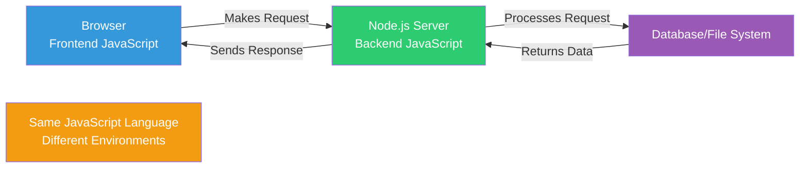

---

## Node.js vs Browser JavaScript

### Similarities

* Same JavaScript language
* Same syntax and data types
* Similar programming patterns

### Differences

| Browser JavaScript | Node.js |
| ------------------ | ------- |
| Runs in browser | Runs on server |
| Has `window`, `document` objects | Has `global`, `process` objects |
| Can't access file system | Can access file system |
| Limited to browser APIs | Has Node.js APIs (fs, http, etc.) |
| User interactions | Server requests/responses |

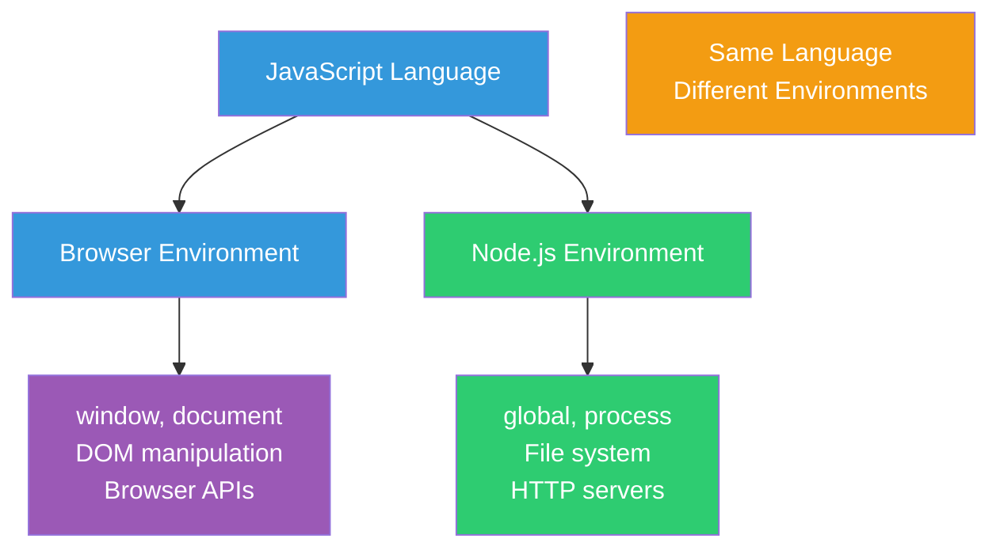

---

## Modules: Organizing Code

A **module** is a file containing JavaScript code. Modules help organize code into reusable pieces.

### How Modules Work

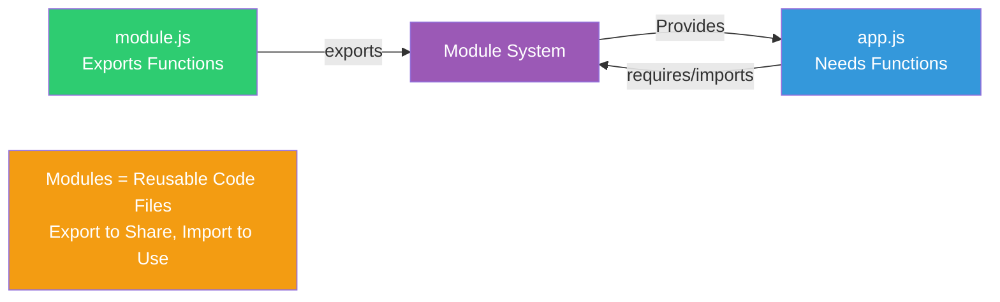

### Exporting from a Module

```javascript
// math.js
function add(a, b) {
  return a + b;
}

function subtract(a, b) {
  return a - b;
}

module.exports = { add, subtract };
```

### Importing a Module

```javascript
// app.js
const { add, subtract } = require('./math');

console.log(add(2, 3)); // 5
console.log(subtract(5, 2)); // 3
```

**Modern ES6 Syntax:**

```javascript
// math.js
export function add(a, b) {
  return a + b;
}

// app.js
import { add } from './math.js';
```

---

## npm: Node Package Manager

**npm** is a tool for installing and managing packages (code written by others).

### What npm Does

* **Install packages**: `npm install package-name`
* **Manage dependencies**: Tracks what your project needs
* **Run scripts**: Execute predefined commands
* **Publish packages**: Share your code with others

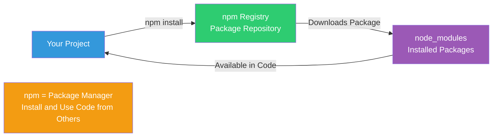

### Common npm Commands

| Command | What it does |
| ------- | ------------ |
| `npm install package-name` | Install a package |
| `npm install` | Install all dependencies from package.json |
| `npm init` | Create a new package.json file |
| `npm start` | Run the start script |
| `npm test` | Run tests |

### package.json

The `package.json` file describes your project and its dependencies:

```json
{
  "name": "my-app",
  "version": "1.0.0",
  "dependencies": {
    "express": "^4.18.0"
  },
  "scripts": {
    "start": "node server.js"
  }
}
```

---

## Event Loop: How Node.js Handles Async Operations

The **event loop** is Node.js's mechanism for handling asynchronous operations efficiently.

### How It Works

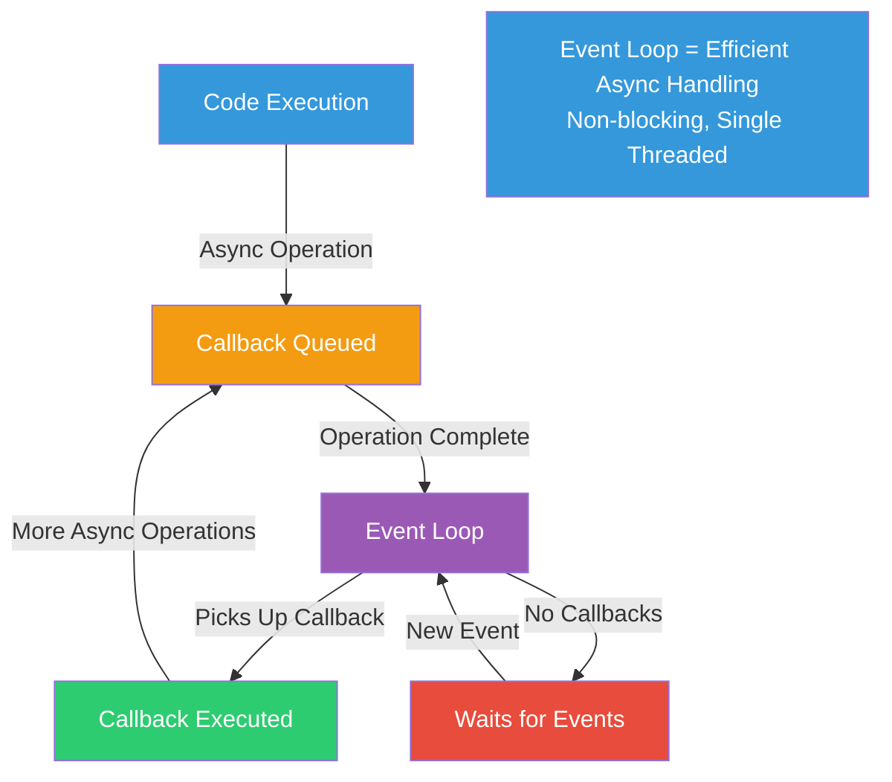

### Example: Non-Blocking Code

```javascript
console.log('Start');

setTimeout(() => {
  console.log('After 1 second');
}, 1000);

console.log('End');

// Output:
// Start
// End
// After 1 second (after 1 second delay)
```

**Key point:** Node.js doesn't wait for the timeout. It continues executing, then runs the callback when the timeout completes.

---

## Event Emitter: Event-Based Communication

**Event Emitter** is a pattern for handling events. Objects can emit events, and listeners can respond to those events.

### How Event Emitters Work

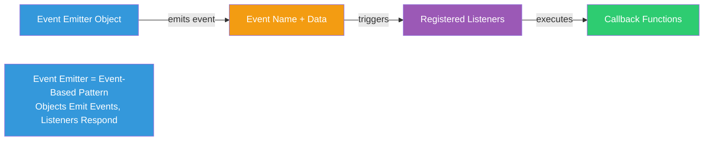

### Event Emitter Example

```javascript
const EventEmitter = require('events');

// Create an event emitter
const myEmitter = new EventEmitter();

// Register a listener
myEmitter.on('greet', (name) => {
  console.log(`Hello, ${name}!`);
});

// Emit an event
myEmitter.emit('greet', 'Alice'); // Output: Hello, Alice!
```

**Common pattern:** Many Node.js objects (like HTTP servers) are event emitters.

---

## HTTP Server: Building Web Servers

Node.js can create **HTTP servers** that respond to web requests.

### How HTTP Servers Work

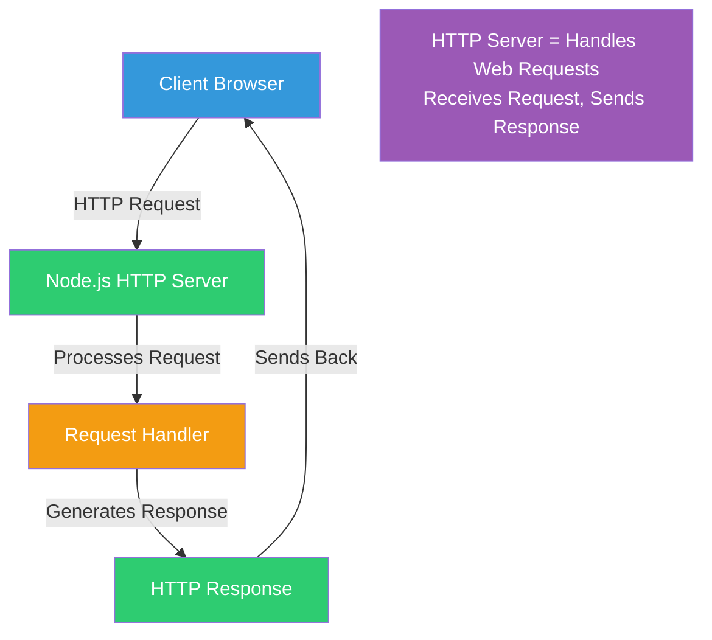

### Basic HTTP Server Example

```javascript
const http = require('http');

const server = http.createServer((req, res) => {
  res.writeHead(200, { 'Content-Type': 'text/plain' });
  res.end('Hello, World!');
});

server.listen(3000, () => {
  console.log('Server running on http://localhost:3000');
});
```

**What happens:**
1. Server listens on port 3000
2. When request arrives, callback function runs
3. Response is sent back to client
4. Server continues listening for more requests

---

## File System: Reading and Writing Files

Node.js provides the `fs` module to interact with the file system.

### File System Operations

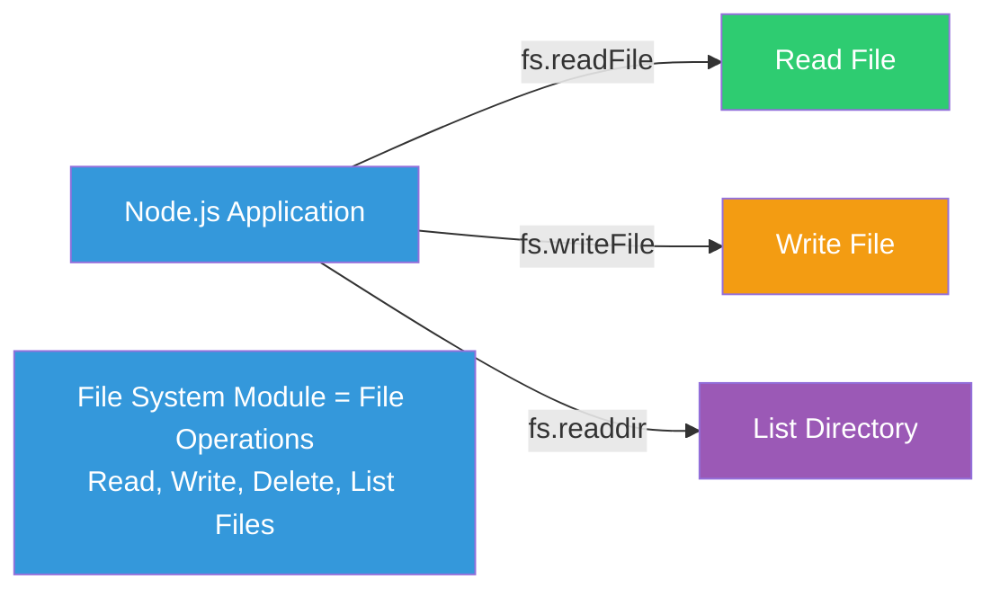

### Reading a File

```javascript
const fs = require('fs');

// Asynchronous (non-blocking)
fs.readFile('data.txt', 'utf8', (err, data) => {
  if (err) {
    console.error(err);
    return;
  }
  console.log(data);
});

// Synchronous (blocking)
const data = fs.readFileSync('data.txt', 'utf8');
console.log(data);
```

### Writing a File

```javascript
const fs = require('fs');

fs.writeFile('output.txt', 'Hello, World!', (err) => {
  if (err) {
    console.error(err);
    return;
  }
  console.log('File written successfully');
});
```

---

## APIs: Building REST APIs

An **API** (Application Programming Interface) defines how clients communicate with your server.

### API Request/Response Flow

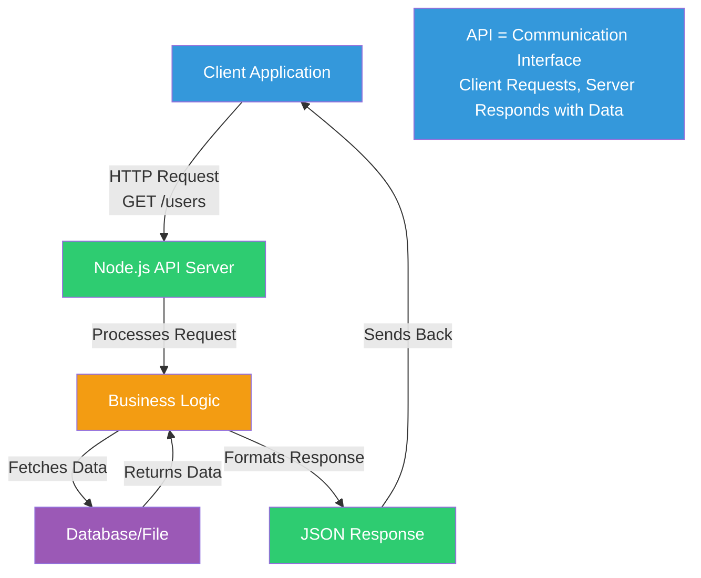

### Simple API Example

```javascript
const http = require('http');

const server = http.createServer((req, res) => {
  if (req.url === '/api/users' && req.method === 'GET') {
    res.writeHead(200, { 'Content-Type': 'application/json' });
    res.end(JSON.stringify({ users: ['Alice', 'Bob'] }));
  } else {
    res.writeHead(404, { 'Content-Type': 'text/plain' });
    res.end('Not Found');
  }
});

server.listen(3000);
```

---

## Express.js: Web Framework

**Express** is a popular Node.js framework that simplifies building web servers and APIs.

### Why Use Express

* **Simpler routing**: Easier to define URL routes
* **Middleware**: Functions that run before route handlers
* **Template engines**: Render HTML easily
* **Large ecosystem**: Many plugins available

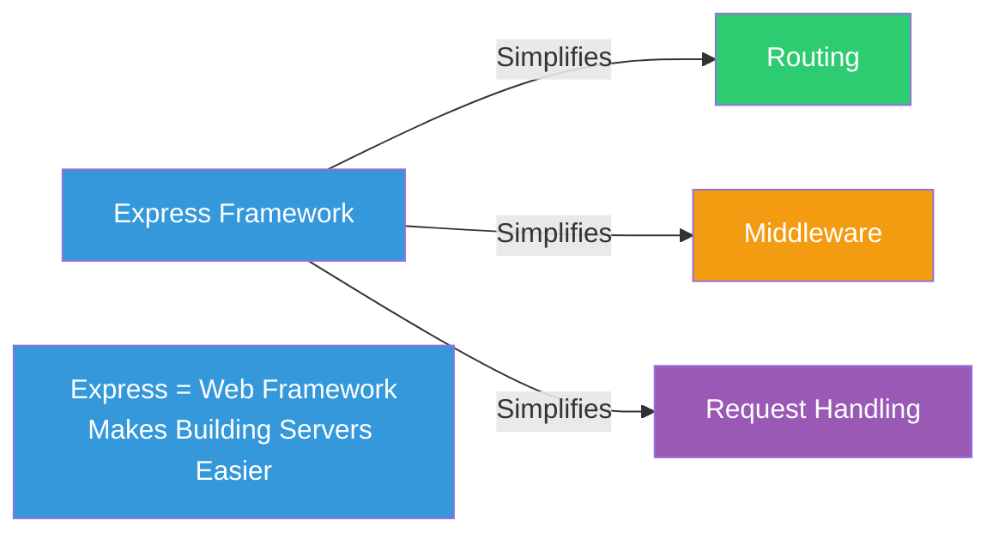

### Express Example

```javascript
const express = require('express');
const app = express();

app.get('/', (req, res) => {
  res.send('Hello, World!');
});

app.get('/api/users', (req, res) => {
  res.json({ users: ['Alice', 'Bob'] });
});

app.listen(3000, () => {
  console.log('Server running on port 3000');
});
```

---

## Asynchronous Patterns

Node.js uses several patterns for handling asynchronous operations.

### Callbacks

Functions passed as arguments that run when an operation completes.

```javascript
fs.readFile('file.txt', 'utf8', (err, data) => {
  if (err) {
    console.error(err);
    return;
  }
  console.log(data);
});
```

### Promises

Objects representing eventual completion (or failure) of an async operation.

```javascript
fs.promises.readFile('file.txt', 'utf8')
  .then(data => console.log(data))
  .catch(err => console.error(err));
```

### Async/Await

Syntactic sugar for Promises that makes async code look synchronous.

```javascript
async function readFile() {
  try {
    const data = await fs.promises.readFile('file.txt', 'utf8');
    console.log(data);
  } catch (err) {
    console.error(err);
  }
}
```

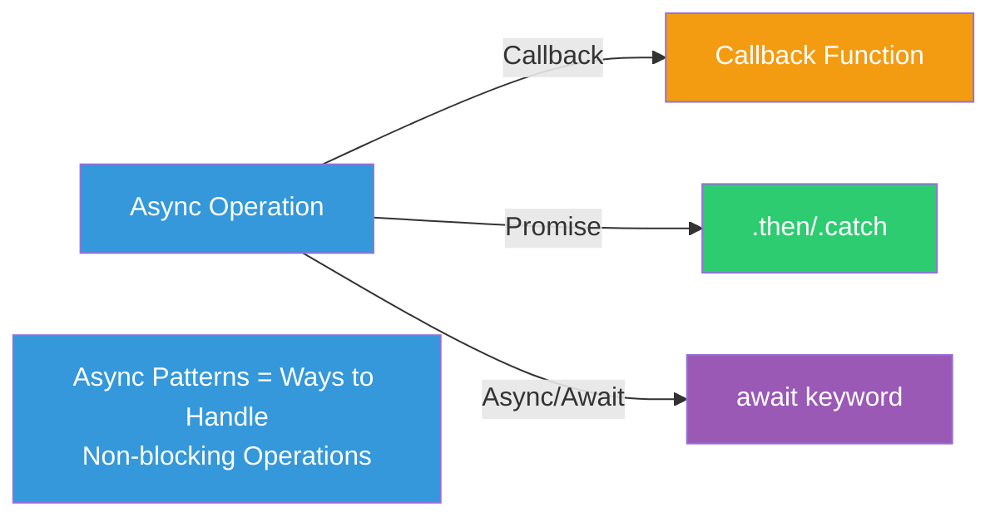

---

## Node.js Architecture: How It Works

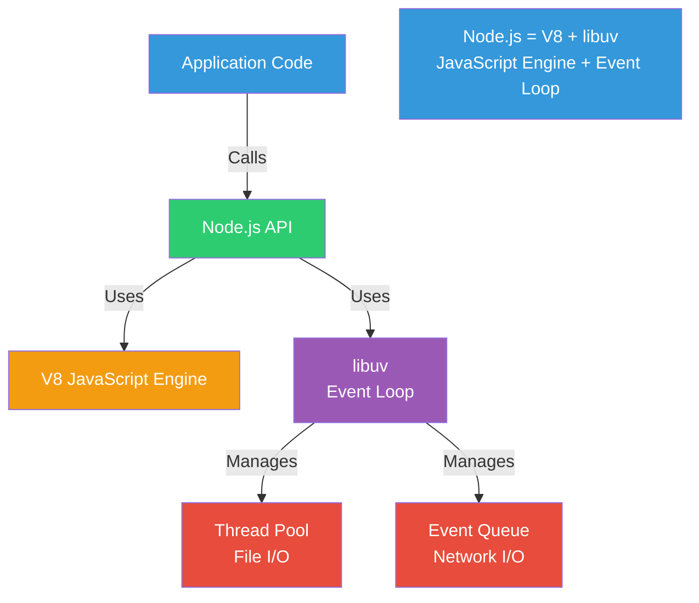

**Key components:**
* **V8 Engine**: Executes JavaScript code (fast)
* **libuv**: Handles event loop and async operations
* **Event Loop**: Manages async operations efficiently
* **Thread Pool**: Handles heavy operations (file I/O)

---

## Common Node.js Patterns

### Pattern 1: Request/Response Cycle

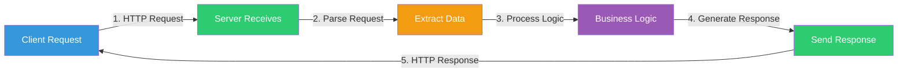

### Pattern 2: Middleware Chain

Functions that run in sequence, each modifying the request/response.

```javascript
app.use(express.json()); // Parse JSON
app.use(authMiddleware); // Check authentication
app.use(logger); // Log requests
```

### Pattern 3: Error Handling

Handle errors consistently across the application.

```javascript
app.use((err, req, res, next) => {
  console.error(err.stack);
  res.status(500).json({ error: 'Something went wrong!' });
});
```

---

## Node.js vs Other Server Technologies

| Technology | Language | Type | Use Case |
| ---------- | -------- | ---- | -------- |
| **Node.js** | JavaScript | Runtime | Real-time apps, APIs, microservices |
| **Python (Django/Flask)** | Python | Framework | Web apps, data processing |
| **Java (Spring)** | Java | Framework | Enterprise applications |
| **PHP** | PHP | Language | Traditional web apps |
| **Ruby (Rails)** | Ruby | Framework | Rapid web development |

**Node.js advantages:**
* Same language for frontend and backend
* Excellent for real-time applications
* Large ecosystem (npm)
* Fast execution

---

## Final Mental Model (Remember This)

```
Node.js        -> JavaScript runtime for servers
Module         -> Reusable code file (export/import)
npm            -> Package manager (install code from others)
Event Loop     -> Handles async operations efficiently
Event Emitter  -> Pattern for events (emit/listen)
HTTP Server    -> Responds to web requests
File System    -> Read/write files on server
API            -> Communication interface (client <-> server)
Callback       -> Function that runs after async operation
Promise        -> Object representing async operation result
Async/Await    -> Syntax for writing async code synchronously
```

If this makes sense, Node.js has officially **clicked**.

---

## Learning Path

1. **Start with basics**: Modules, npm, basic JavaScript in Node.js
2. **Learn file system**: Reading and writing files
3. **Understand async**: Callbacks, Promises, async/await
4. **Build HTTP server**: Basic server, routing, handling requests
5. **Explore frameworks**: Express.js for easier development
6. **Build APIs**: REST APIs, JSON responses, error handling
7. **Practice projects**: Build real applications

---

## Projects in This Repository

* **Event Emitter** - Learn about event-driven programming
* **Network Tools and Related Concepts** - Understand HTTP, URLs, network requests
* **Project** - Full-stack project with file handling and routing
* **Wild-Horizons-API** - REST API project with data handling

---

## Glossary (Fast Reference)

* **Node.js** – JavaScript runtime that executes JavaScript on servers
* **Runtime** – Environment that executes code
* **Module** – File containing reusable JavaScript code
* **npm** – Node Package Manager (tool for installing packages)
* **Package** – Collection of modules you can install and use
* **Event Loop** – Node.js mechanism that handles asynchronous operations
* **Event Emitter** – Pattern for emitting and listening to events
* **HTTP Server** – Server that responds to HTTP requests
* **API** – Application Programming Interface (how clients communicate with server)
* **Middleware** – Functions that run before route handlers in Express
* **Callback** – Function passed as argument, executed after operation completes
* **Promise** – Object representing eventual completion of async operation
* **Async/Await** – Syntax for handling Promises in synchronous-looking code
* **Route** – URL path that maps to a handler function
* **Request** – Incoming HTTP request from client
* **Response** – Outgoing HTTP response to client
* **JSON** – JavaScript Object Notation (data format for APIs)

---

Understanding these core Node.js concepts is the foundation for building server-side applications, APIs, and backend services. Start with the projects in this repository to see them all working together!

