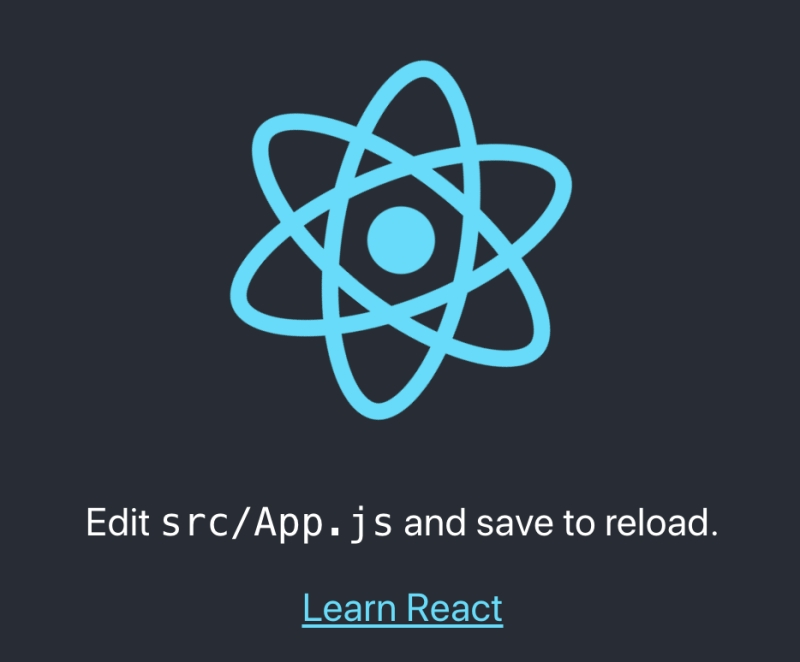
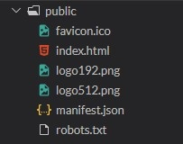
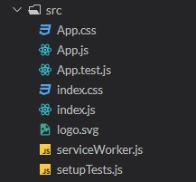

# React Getting Started Guide

## Front-End Development
- Front-end development refers to what the end user (also commonly referred to as the "client") can see. In the most basic forms, front-end development consists of HTML, CSS, and JavaScript.
- React is a library created to manage code better (Developed by Facebook)

React
- Speed
    - Interactive websites need to update the DOM (Document Object Model) each time a change happens. This process is generally resourceful and slow.
    - Compared to other libraries that manipulate the DOM, React uses a Virtual DOM, allowing to update only the parts of the website that have changed. This increases the speed of updates dramatically, as modern web applications may contain thousands of elements.
- Ease of Use
    - React has an amazingly large community and is open source. It is maintained by Facebook and the community.

## Adding React 

Adding React 
- We can add React to a website without special tools and installations 
        - react.development.js
        - react-dom.development.js
```html
<script src="https://unpkg.com/react@16/umd/react.development.js" crossorigin></script>
<script src="https://unpkg.com/react-dom@16/umd/react-dom.development.js" crossorigin></script>
```
    - add jsx script tags
- This approach is only suitable for creating small demos and not for production sites
```html
<script src="https://unpkg.com/babel-standalone@6/babel.min.js"></script>
```

Adding React - Sample React Code using the react header script
```html
<!DOCTYPE html>
<html>
    <head>
        <title>Test</title>
        <script src="https://unpkg.com/react@16/umd/react.development.js" crossorigin></script>
        <script src="https://unpkg.com/react-dom@16/umd/react-dom.development.js" crossorigin>
        </script>
        <script src="https://unpkg.com/babel-standalone@6/babel.min.js"></script> 
    </head>
    <body>
        
        <div id="container"></div>
        
        <script type="text/babel">
        ReactDOM.render(
          <h1>Hello, React!</h1>,
          document.getElementById('container')
        )
        </script>
    </body>
</html>
```

Create React App
- The command installs all the required dependencies, configures and starts the project on localhost:3000
```
npx create-react-app my-app
cd my-app
npm start


# Modern Minimal Official Way to Create React App (Vite)
- Create project
```
npm create vite@latest my-react-app -- --template react
```
- Install dependencies
```
cd my-react-app
npm install
```
- Run it
```
npm run dev
```

## Create React App - Project Structure
- The public folder contains files related to how the application will display on the client
    - most important file is index.html, which is the HTML template of our page

- src folder contains all the JavaScript, CSS, and image files that will be compiled into a bundle file and injected into index.html

- React is compiled into a bundle file via file loader. In the case of Create React App, Webpack is used
- Webpack creates a bundle file containing the content of multiple files that need to be "bundled" together and it is all added together into a single file.
    - Webpack only has to find one file rather than multiple which decrease load time
    - All CSS and JS files need to be added to the src folder, otherwise webpack won't see them.
    - Index.js is the entry point into the application
    - App.js: This file is the main component that will be rendered to the DOM

## Course Project
- Outcome: create a Contact Manager app using React and lessons learned


