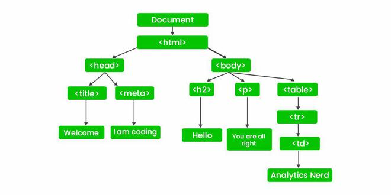
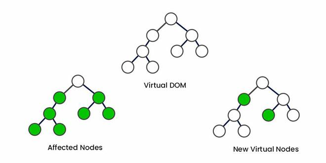
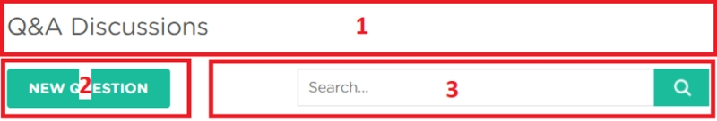
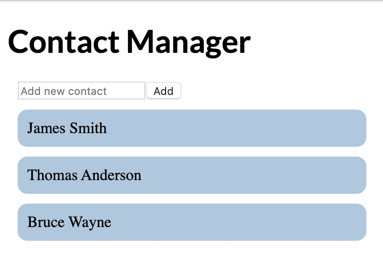

# JSX

- JSX stands for JavaScript XML. JSX allows us to write HTML in React. JSX makes it easier to write and add HTML in React.
  - Allows HTML in JS and places them in DOM without any createElement() or appendChild() methods
  - JSX converts HTML tags into React elements
  - Similar to Razor pages for frontend (writing frontend code using HTML and C# code)
- Sample Code:

```javascript
// index.js
ReactDOM.render(
  <h1>Hello, React!</h1>,
  document.getElementById('root')
); 
```

- render method displays the provided element in the container, which, in our case, is the HTML element with id="root"

```html
<!-- index.html -->
<div id="root"></div>
```

## JSX - Expression

- We can use any JavaScript expression inside JSX using curly braces.
- Similar to JS expression: you can assign JSX expression to a variable, return it from a function, etc.

```javascript
const name = "David";
const el = <p>Hello, {name}</p>;

ReactDOM.render(
  el,
  document.getElementById('root')
);
```

## JSX - Attributes

- We can specify attributes using quotes, just like in HTML:
- React DOM uses camelCase property naming convention instead of HTML attribute names. For example, class becomes className in JSX.

```javascript
// HTML attribute
<div id="name"></div>

// JSX attribute with expression
<div id={user.id}></div>
```

## DOM: Document Object Model

- DOM stands for Document Object Model and is a tree-like representation of the HTML page.
- Directly Manipulates On-Screen Elements: Any changes made to the Real DOM immediately reflect on the user interface.
- Slow Updates for Large Trees: When updating an element, the entire DOM tree needs to be re-rendered, which can be time-consuming, especially for complex applications.
- Full Tree Re-Renders: Even minor changes require traversing the entire DOM tree, which affects performance.



## Virtual DOM

- Virtual DOM object is the same as a real DOM object, except that it is a lightweight copy
  - Virtual DOM Creation: When the application state changes, the Virtual DOM creates a new virtual tree.
  - Diffing Algorithm: The new Virtual DOM tree is compared with the previous version, and the differences (known as "diffs") are calculated.
  - Batch Updates: Instead of updating the entire Real DOM, only the nodes that have changed are updated, leading to faster rendering.
- Reference: https://www.geeksforgeeks.org/reactjs/difference-between-virtual-dom-and-real-dom/



- JSX expressions are compiled, they are converted into JavaScript objects, representing React elements.

```javascript
let counter = 0;

function show() {
  counter++;
  const el = <p>{counter}</p>;
  ReactDOM.render(
  el, document.getElementById('root')
  );
}

setInterval(show, 1000);
```

- We use setInterval to call the show function every second and render the counter element on the page.
- React only updates the elements that need an update
- In practice, most React apps call ReactDOM.render() once.

## Components

- Components let you split the page into independent and reusable parts.



- Separation of concerns is a programming principle that states that each concern should be separated into individual pieces.
- For example, in the diagram above, the "new question" button (2) should be clicked if a user wanted to add a new question, whereas the search bar (3) would be used if the user wanted to search the existing questions.
- React has two types of components: functional and class components

### Components - Functional Components 

- A functional component is a simple JavaScript function
- The name of a functional component must begin with a capital letter or it's treated as an HTML element instead of a component

```javascript
function Hello() {
  return <h1>Hello world.</h1>;
}
```

- To display a component we need to create a corresponding JSX element

```javascript
function Hello() {
  return <h1>Hello world.</h1>;
}

const el = <Hello />; 
ReactDOM.render(
  el, 
  document.getElementById('root')
);
```

### Components - Class Components

- Class components are typically used when there are more advanced user interactions, like forms, and animations.
- All class components need to extend the React.Component class.

```javascript
class Hello extends React.Component {
  render() {
  return <h1>Hello world.</h1>;
  }
}
```

## Props

- Functional components can accept arguments, similar to JavaScript functions. These arguments are called props, and represent an object.
- Props are read-only

```javascript
function Hello(props) {
  return <p>Hello, {props.name}!</p>;
}
```

- We can add a name attribute to our element

```javascript
const el = <Hello name="David" />;
```

- An element can have multiple custom attributes, which will be passed to the component using the props object. 
- You can use any custom names for your attributes.

### Props - Components using Components

- Components can use other components to generate an output

```javascript
function App() {
  return <div>
  <Hello name="David" />
  <Hello name="James" />
  <Hello name="Amy" />
  </div>;
}
```

- It is a good practice to split complex components into multiple smaller components, that are reusable.
  - For example, a Post component can use an Avatar component, an Image component, a Date component, etc.

### Props - Props in Class Components

- Props can be accessed in class components using this.props
- Interactive apps generally need to change data and the page elements.

```javascript
class Hello extends React.Component {
  render() {
  return <p>Hello, {this.props.name}!</p>;
  }
}
```

- Shopping list example

```jsx
<Item name="Cheese" price="4.99" />
```

```javascript
function Item(props) {
  return <div className="item">
  <b>Name:</b> {props.name} <br />
  <b>Price:</b> {props.price}
  </div>;
}
```

```jsx
<Item name="Cheese" price="4.99" />
<Item name="Bread" price="1.5" />
<Item name="Ice cream" price="24" />
```

- We can use className to apply css styles to item elements

## State

- React provides a feature called state to allow components to manage and change their data
- Many web apps need their components to change their data, for example, after user interaction (clicking a button, submitting a form, etc.).
- Props cannot be changed.

```javascript
class Hello extends React.Component {
  state = {
  name: "James"
  }

  render() {
  return <h1>Hello {this.state.name}.</h1>;
  }
}
```

- The state object can contain multiple key:value pairs, separated by commas.
- State should not be modified directly, but instead through setter called setState()

```javascript
this.setState({ 
  name: "James",
  age: 25
});
```

- When setState is called, React automatically re-renders the affected component with the new state!
  - If we modify the value directly the object won't re-render automatically
- Counter App Example:

```javascript
class Counter extends React.Component {
  state = {
  counter: 0
  }
  increment = () => {
  this.setState({
   counter: this.state.counter+1});
  }
  render() {
  return <div>
  <p>{this.state.counter}</p>
  <button onClick={this.increment}>Increment</button>
  </div>;
  }
}
```

- Event handler uses camelCase syntax and that the handler function is passed in curly braces

### State - Props vs State

- We use props to pass data to components.
- Components use state to manage their data.
- Props are read-only and cannot be modified.
- State can be modified by its component using the setState() method.
- The setState() method results in re-rendering the component affected.
- Components that have state are called stateful, while components that do not use state are called stateless.

## Hooks

- Allows functions to be able to use state in function components
  - previous version of React only allowed state in class components
- To use hooks you must import useState 

```javascript
import React, { useState } from 'react';
```

- useState returns a pair, the current state value and a function, that lets you change the state.
- useState takes one argument, which is the initial value of the state.

```javascript
function Hello() {
  const [name, setName] = useState("David");

  return <h1>Hello {name}.</h1>;
}
```

  - The square brackets are called array destructuring, which assigns the following:
    - the first argument (name) is the state variable
    - the second argument (setName) is the setter function
- You can create multiple state variables with their corresponding set methods. Just use separate statements for each variable using the useState hook.

### Hooks - Counter App using Hooks

```javascript
function Counter() {
  const [counter, setCounter] = useState(0);

  function increment() {
  setCounter(counter+1);
  }

  return <div>
  <p>{counter}</p>
  <button onClick={increment}>
  Increment
  </button>
  </div>;
}
```

## Lifecycle Methods

- Lifecycle methods are special methods for class components regarding the stages of component rendering
  - Mounting is the process when a component is rendered on the page.
  - Unmounting is the process when a component is removed from the page.

```javascript
componentDidMount() {
  this.setState({counter: 42});
}
```

  - The componentDidMount method is called when a component is rendered on the page.
  - This will set an initial value of the counter when the component is rendered.
  - componentDidMount is typically used for populating the state inside of a component when it initially mounts to the DOM.
- componentWillUnmount() lifecycle method is called right before the component is removed from the DOM
  - It can be used to free up resources taken by the component.

**Example Question:**
Given the code below, what will be the value of x after `<div><Test /><Test /></div>` has been rendered on the page?

```javascript
let x = 0;
class Test extends React.Component {
  componentDidMount() {
  x+=3;
  }
  render() {
  return null;
  }
}
```

- The answer is 6 since Test gets rendered twice --> `<Test /><Test />` 
  - before rendering x is 0
  - after first rendering x is 3
  - 2nd rendering x is 6
- Another lifecycle method is componentDidUpdate(), which is called when a component is updated in the DOM.

```javascript
componentDidUpdate() {
  alert("Number of clicks: " + this.state.counter);
}
```

### Lifecycle Methods - The useEffect Hook

- The lifecycle methods we covered are only available for class components.
- React provides a special Hook called useEffect to make lifecycle methods available in functional components
  - It combines the componentDidMount, componentDidUpdate, and componentWillUnmount methods into one.

```javascript
function Counter() {
  const [counter, setCounter] = useState(0);

  useEffect(() => {
  alert("Number of clicks: " + counter);
  });

  function increment() {
  setCounter(counter+1);
  }
  return <div>
  <p>{counter}</p>
  <button onClick={increment}>Increment</button>
  </div>;
}
```

- To call the method only when something changes, we can provide it a second argument:

```javascript
useEffect(() => {
  //do something
}, [count]);
```

  - Now, the useEffect() method will run only if count changes.

- To mimic componentWillUnmount, useEffect may return a function that cleans up after it:

```javascript
useEffect(() => {
  // do something
  
  return () => {
  // cleanup
  }; 
});
```

- Just like with the useState hook, we need to import useEffect to be able to use it: `import React, { useState, useEffect } from 'react';`

## Handling Events

- Handling events in React is very similar to handling events in the DOM, instead event names use camelCase syntax
- Example:

```jsx
<button onClick={handleClick}>
  My Button
</button>
```

- Counter App Example using function component

```javascript
function Counter() {
  const [counter, setCounter] = useState(0);

  function increment() {
  setCounter(counter+1);
  }
  return <div>
  <p>{counter}</p>
  <button onClick={increment}>Increment</button>
  </div>;
}
```

- Counter App Example using class component

```javascript
import React from 'react';
import ReactDOM from 'react-dom';
import './style.css';

class Counter extends React.Component {
  state = {
  counter: 0
  }
  increment = () => {
  this.setState({counter: this.state.counter+1});
  }
  render() {
  return <div>
  <p>{this.state.counter}</p>
  <button onClick={this.increment}>Increment</button>
  </div>;
  }
}

const el = <Counter />; 
ReactDOM.render(
  el, 
  document.getElementById('root')
);
```

### Handling Events - Handling User Input

- One of the common ways that users interact with web pages is through text fields.
- We can handle user input in React using the onChange event of the text field.
- The value of the text field is accessed via the e object, which represents the React event. It is passed to the event handler function as an argument and can be used to access the event object.

```javascript
function Converter() {
  const [km, setKm] = useState(0);

  function handleChange(e) {
  setKm(e.target.value);
  }
  function convert(km) {
  return (km/1.609).toFixed(2);
  }

  return <div>
  <input type="text" value={km}
   onChange={handleChange} />
  <p> {km} km is {convert(km)} miles </p>
  </div>;
}
```

- The handleChange function updates the state with the current value of the textfield, causing the component to re-render and show the corresponding miles value, which is calculated using the convert function.

### Handling Events - Forms

- React form elements keep their state and update it based on user input.
- When the form is submitted using the submit button, the handleSubmit function gets called, which updates the value of sum in the state.
- An input form element whose value is controlled by React in this way is called a "controlled component".
- The `e.preventDefault();` statement prevents the default behavior of the form, which, by default, reloads the page when submitted
  - in JS we would use `return false;` for that

```javascript
function AddForm() {
  const [sum, setSum] = useState(0);
  const [num, setNum] = useState(0);

  function handleChange(e) {
  setNum(e.target.value);
  }

  function handleSubmit(e) {
  setSum(sum + Number(num));
  e.preventDefault();
  }

  return <form onSubmit={handleSubmit}>
  <input type="number" value={num} onChange={handleChange} />
  <input type="submit" value="Add" />
  <p> Sum is {sum} </p>
  </form>;
}
```

## Rendering A List - Lists

- Web apps commonly contain repeating elements, such as lists or sections, where the same DOM element is repeated with a different data set.

```javascript
function MyList(props) {
  const arr = props.data;
  const listItems = arr.map((val) =>
  <li>{val}</li>
  );
  return <ul>{listItems}</ul>;
}

const arr = ["A", "B", "C"];
const el = <MyList data={arr} />; 

ReactDOM.render(
  el, 
  document.getElementById('root')
);
```

- We take the input array from the incoming props, loop through the array using the JavaScript map function and return a `<li>` element for each item.
- The resulted array is stored in the listItems variable.
- Then, the component returns the listItems array inside a `<ul>` tag.
- This code results in a warning, saying that each element needs a unique key. We will look into keys in the next part.

### Rendering A List - Key

- Each element in a list must have a key attribute.
- Keys act as a unique identity, identifying each element.
- Usually, these are IDs from your data, or can be auto-generated indexes.

```javascript
const listItems = arr.map((val, index) =>
  <li key={index}>{val}</li>
);
```

## Contact Manager

- Based on the mockup, it makes sense to have two components
  - AddPersonForm: a form with the text field and Add button.
  - PeopleList: a list of contacts.
```
function AddPersonForm() {
  const [ person, setPerson ] = useState("");

  function handleChange(e) {
    setPerson(e.target.value);
  }

  function handleSubmit(e) {
    e.preventDefault();
  }
  return (
    <form onSubmit={handleSubmit}>
    <input type="text" 
    placeholder="Add new contact" 
    onChange={handleChange} 
    value={person} />
    <button type="submit">Add</button>
    </form>
    );
}
```
- PeopleList received an array representing the contacts and renders a list on the page:
```
function PeopleList(props) {
  const arr = props.data;
  const listItems = arr.map((val, index) =>
    <li key={index}>{val}</li>
  );
  return <ul>{listItems}</ul>;
}
```
- Now we can render our components on the page and include some initial data:
```
const contacts = ["James Smith", "Thomas Anderson", "Bruce Wayne"];

const el = (
  <div>
    <AddPersonForm />
    <PeopleList data={contacts} />
  </div>
);
```
- Adding a new contact does not work, as we have not built the logic in the handleSubmit function yet.

## Contact Manager - Sharing State
- AddPersonForm independently keeps its state, in order to add new contact to our PeopleList we need to share the state between the components
- We need a parent component that includes the child components and holds the contact list state
```
function ContactManager(props) {
  const [contacts, setContacts] = useState(props.data);

  return (
    <div>
      <AddPersonForm />
      <PeopleList data={contacts} />
    </div>
  );
}
```
- ContactManager component receives the initial contacts list using props, saves it in its state
- Data can be passed from the parent to the child, but not from the child to the parent. React uses what is called unidirectional data flow, in other words, data only flows downward, so to speak.


## Contact Manager - Adding a Contact
```
function ContactManager(props) {
  const [contacts, setContacts] = useState(props.data);

  function addPerson(name) {
    setContacts([...contacts, name]); // [...<variable>, name] is the way you can append to an array with the 2nd argument
  }
 ...
}
```
- We need to be able to call the addPerson() function from our parent component to add a new person to our contacts state array:
  - We pass the function as a prop 
```
function ContactManager(props) {
  const [contacts, setContacts] = useState(props.data);

  function addPerson(name) {
    setContacts([...contacts, name]);
  }

  return (
    <div>
      <AddPersonForm handleSubmit={addPerson} />
      <PeopleList data={contacts} />
    </div>
  );
}
```
```
function AddPersonForm(props) {
  const [ person, setPerson ] = useState('');
    
  function handleChange(e) {
    setPerson(e.target.value);
  }
    
  function handleSubmit(e) {
    props.handleSubmit(person);
    setPerson('');
    e.preventDefault();
  }
  return (
    <form onSubmit={handleSubmit}>
      <input type="text" 
        placeholder="Add new contact" 
        onChange={handleChange} 
        value={person} />
      <button type="submit">Add</button>
    </form>
  );
}
```
- We also clear the value of the text field using setPerson('') after adding a new person.

## Contact Manager - Summary
- Props can be used to pass down not only state, but also functions that may manipulate the state.
