# React: A Beginner-Friendly Guide

### A Practical Guide to Building Modern User Interfaces

This README explains **how React works**, why **components exist**, how **state and props** flow, what **hooks** are, and how React fits into modern web development — all in plain language.

The goal is to answer:

* What is React and why use it?
* What are components, props, and state?
* How does data flow in React?
* What are React Hooks?
* What is JSX?
* How do components interact?
* What are the core React patterns?

No prior React knowledge assumed.

---

## Big Picture (Start Here)

Modern React applications follow this pattern:

```
Component Structure -> Props Flow Down -> State Changes -> Re-render UI
```

Components are the building blocks. Props pass data down. State manages changes. React updates the UI automatically.

---

## Quick Glossary

* **Component** – Reusable piece of UI (like a function that returns HTML)
* **Props** – Data passed from parent to child component (read-only)
* **State** – Data that can change and trigger re-renders (component's memory)
* **JSX** – JavaScript syntax that looks like HTML (describes what UI looks like)
* **Hook** – Special function that lets components use state and other React features
* **Render** – React's process of converting components into DOM elements
* **Virtual DOM** – React's representation of the real DOM (used for efficient updates)

---

## React Core Concepts Overview

| Concept | What it is | Why it matters |
| ------- | ---------- | -------------- |
| **Components** | Reusable UI pieces | Write once, use many times |
| **Props** | Data passed to components | Makes components flexible and reusable |
| **State** | Changeable data in components | Enables interactive, dynamic UIs |
| **Hooks** | Functions to use React features | Modern way to add state and side effects |
| **JSX** | HTML-like syntax in JavaScript | Write UI code that's easy to read |
| **Event Handling** | Functions that respond to user actions | Makes apps interactive |

> This table belongs **near the top of the README** so beginners understand *where everything fits* before details.

---

## What is React?

React is a **JavaScript library** for building user interfaces, especially web applications.

### What React Does

* Lets you build UI using **components** (reusable pieces)
* Automatically updates the UI when data changes
* Makes it easier to build complex, interactive applications

### Why React Exists

* **Reusability**: Build once, use many times (components)
* **Efficiency**: Only updates what changed (Virtual DOM)
* **Maintainability**: Organize code into logical pieces
* **Ecosystem**: Huge community and tooling support

**Analogy:**

Traditional web development = writing each page from scratch  
React = building with LEGO blocks (components) that snap together

---

## Components: The Building Blocks

A **component** is a reusable piece of UI. Think of it as a function that returns what should appear on the screen.

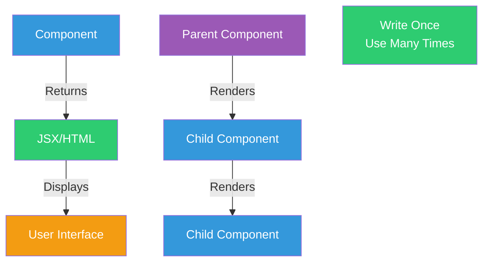

### Component Example

```jsx
function Welcome(props) {
  return <h1>Hello, {props.name}!</h1>;
}
```

**What happens:**
1. Component receives `props` (data)
2. Component returns JSX (what to display)
3. React renders it to the screen

---

## Props: Passing Data Down

**Props** (short for "properties") are how you pass data from parent components to child components.

### Key Properties of Props

* Props are **read-only** (can't be changed by child)
* Props flow **down** (parent -> child)
* Props can be any type (strings, numbers, objects, functions)

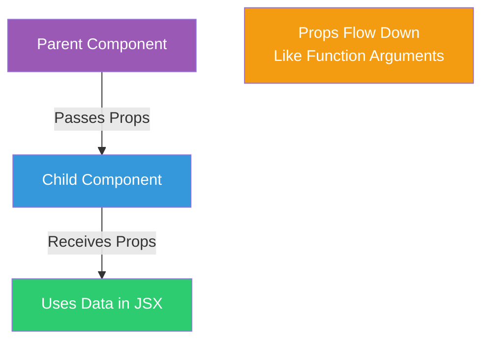

### Props Example

```jsx
// Parent Component
function App() {
  return <Welcome name="Alice" age={25} />;
}

// Child Component
function Welcome(props) {
  return (
    <div>
      <h1>Hello, {props.name}!</h1>
      <p>You are {props.age} years old.</p>
    </div>
  );
}
```

**Analogy:**

Props = function arguments. You pass data in, component uses it to render.

---

## State: Component Memory

**State** is data that can change and triggers the component to re-render when it does.

### State vs Props

| Props | State |
| ----- | ----- |
| Passed from parent | Managed inside component |
| Read-only | Can be changed |
| Can't trigger re-render | Changes trigger re-render |
| Like function parameters | Like component's memory |

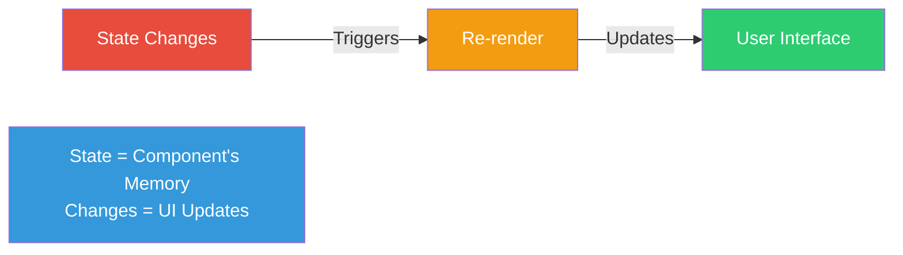

### State Example

```jsx
import { useState } from 'react';

function Counter() {
  const [count, setCount] = useState(0);
  
  return (
    <div>
      <p>Count: {count}</p>
      <button onClick={() => setCount(count + 1)}>
        Increment
      </button>
    </div>
  );
}
```

**What happens:**
1. `useState` hook creates state
2. `count` holds the current value
3. `setCount` updates the value
4. Clicking button updates state -> component re-renders -> UI updates

---

## JSX: JavaScript + HTML

**JSX** (JavaScript XML) lets you write HTML-like code in JavaScript.

### What JSX Looks Like

```jsx
const element = <h1>Hello, World!</h1>;
```

### JSX Rules

* Must return a single parent element (or use fragments `<>...</>`)
* Use `className` instead of `class` (JSX attribute name)
* Use `{}` to embed JavaScript expressions
* Self-closing tags need `/` (e.g., ``)

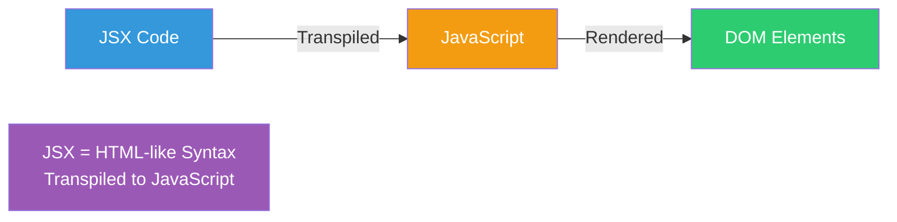

---

## React Hooks: Modern React Features

**Hooks** are functions that let you "hook into" React features like state and lifecycle from function components.

### Common Hooks

| Hook | Purpose | When to Use |
| ---- | ------- | ----------- |
| **useState** | Manage component state | Need changeable data |
| **useEffect** | Handle side effects | API calls, subscriptions, DOM manipulation |
| **useContext** | Access context values | Share data without prop drilling |
| **useRef** | Access DOM or store mutable values | Direct DOM access, values that don't trigger re-render |

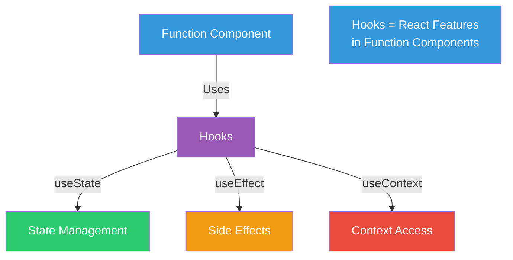

### useState Hook

```jsx
import { useState } from 'react';

function MyComponent() {
  const [value, setValue] = useState(initialValue);
  // value = current state
  // setValue = function to update state
}
```

### useEffect Hook

```jsx
import { useEffect } from 'react';

function MyComponent() {
  useEffect(() => {
    // Side effect code here
    // Runs after render
  }, [dependencies]);
}
```

---

## Data Flow in React

React follows a **unidirectional data flow** pattern.

### How Data Flows

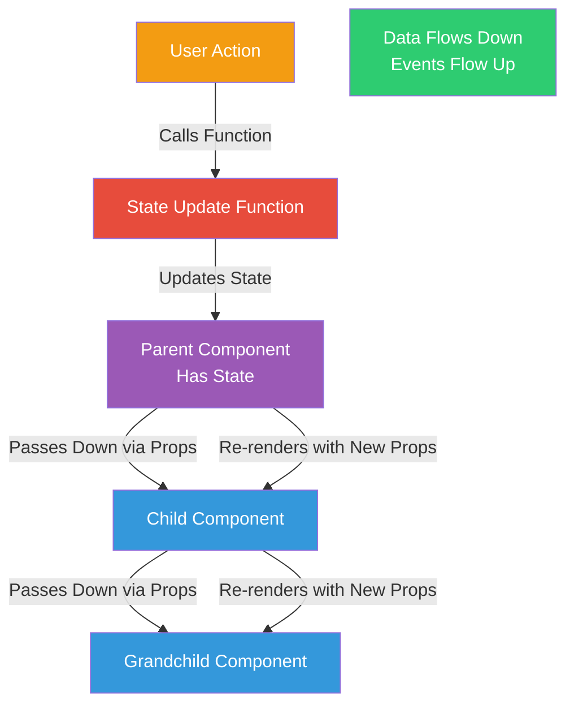

**Key principle:**

* **Data flows down**: Props pass from parent to child
* **Events flow up**: Callbacks pass from child to parent
* **State lives at the top**: Keep state as high as needed

---

## Component Lifecycle (Function Components)

In function components, hooks manage the component lifecycle:

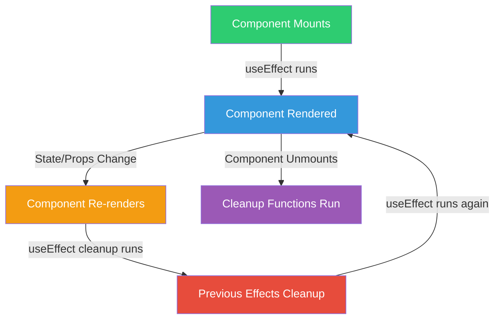

### useEffect Lifecycle

```jsx
useEffect(() => {
  // This runs after every render (by default)
  // Or after dependencies change (if dependencies array provided)
  
  return () => {
    // Cleanup function (runs before next effect or unmount)
  };
}, [dependencies]);
```

---

## Event Handling: Making Components Interactive

Events in React are handled with functions that you pass as props.

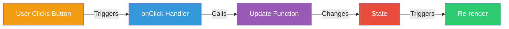

### Event Handling Example

```jsx
function Button() {
  const [clicked, setClicked] = useState(false);
  
  const handleClick = () => {
    setClicked(true);
  };
  
  return (
    <button onClick={handleClick}>
      {clicked ? 'Clicked!' : 'Click me'}
    </button>
  );
}
```

---

## Conditional Rendering

React components can render different things based on conditions.

```jsx
function Welcome({ isLoggedIn }) {
  if (isLoggedIn) {
    return <h1>Welcome back!</h1>;
  }
  return <h1>Please log in.</h1>;
}
```

Or using ternary operator:

```jsx
function Welcome({ isLoggedIn }) {
  return (
    <div>
      {isLoggedIn ? <h1>Welcome back!</h1> : <h1>Please log in.</h1>}
    </div>
  );
}
```

---

## Lists and Keys

When rendering lists, React needs a unique `key` prop for each item.

```jsx
function ItemList({ items }) {
  return (
    <ul>
      {items.map(item => (
        <li key={item.id}>{item.name}</li>
      ))}
    </ul>
  );
}
```

**Why keys matter:**

* Help React identify which items changed
* Improve performance during re-renders
* Must be unique among siblings

---

## Forms and Controlled Components

React components that control form inputs are called **controlled components**.

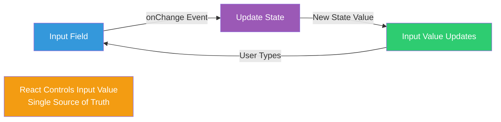

### Controlled Component Example

```jsx
function NameForm() {
  const [name, setName] = useState('');
  
  const handleChange = (event) => {
    setName(event.target.value);
  };
  
  return (
    <input
      type="text"
      value={name}
      onChange={handleChange}
    />
  );
}
```

---

## Component Composition

React components can be combined (composed) to build complex UIs.

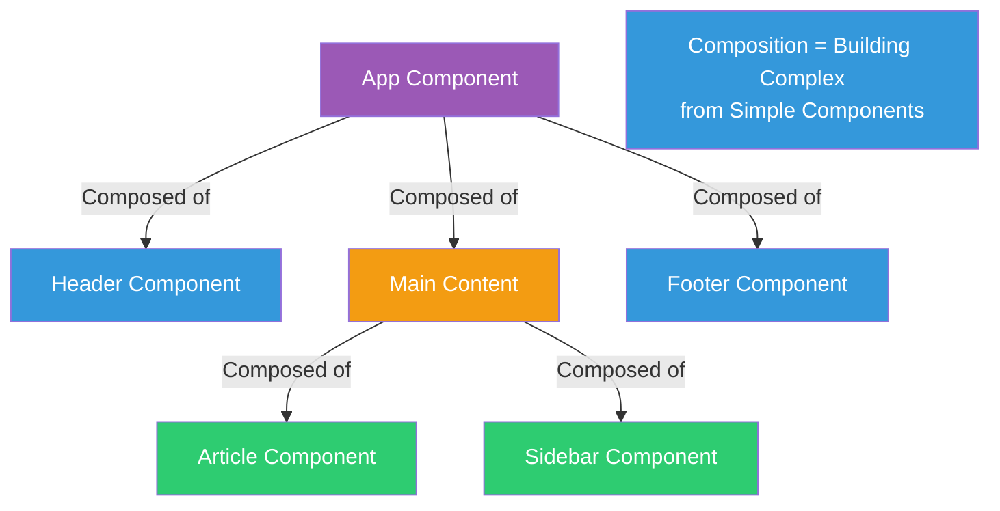

### Composition Example

```jsx
function App() {
  return (
    <div>
      <Header />
      <MainContent />
      <Footer />
    </div>
  );
}

function MainContent() {
  return (
    <div>
      <Article />
      <Sidebar />
    </div>
  );
}
```

---

## Common React Patterns

### Pattern 1: Lifting State Up

When multiple components need the same data, lift state to their common parent.

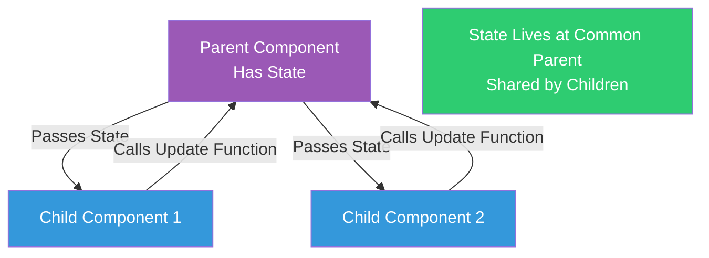

### Pattern 2: Container/Presentational Components

* **Container**: Manages state and logic
* **Presentational**: Just displays data via props

### Pattern 3: Higher-Order Components (HOC)

A function that takes a component and returns a new component with additional functionality.

---

## React vs Traditional JavaScript

| Traditional JS | React |
| -------------- | ----- |
| Direct DOM manipulation | Declarative UI (describe what you want) |
| Manual updates | Automatic re-renders |
| Hard to reuse code | Components are reusable |
| State scattered | State managed in components |
| Imperative (how to do) | Declarative (what you want) |

---

## Virtual DOM: How React Updates Efficiently

React uses a **Virtual DOM** to efficiently update the real DOM.

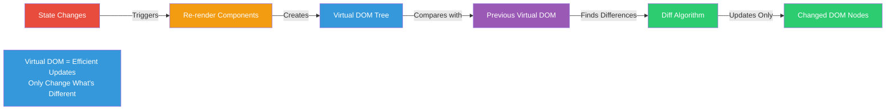

**Why it matters:**

* Direct DOM updates are slow
* Virtual DOM is fast (JavaScript objects)
* React calculates minimal changes
* Only updates what actually changed

---

## Final Mental Model (Remember This)

```
Component      -> reusable UI piece (like a function)
Props          -> data passed down (parent -> child)
State          -> changeable data that triggers re-renders
JSX            -> HTML-like syntax in JavaScript
Hooks          -> way to use React features in functions
Render         -> React converts components to DOM
Virtual DOM    -> efficient way React updates the UI
Data flows down -> props flow from parent to child
Events flow up  -> callbacks flow from child to parent
```

If this makes sense, React has officially **clicked**.

---

## Learning Path

1. **Start with basics**: Components, JSX, Props
2. **Learn state**: useState hook, controlled components
3. **Understand effects**: useEffect hook, side effects
4. **Practice patterns**: Component composition, lifting state
5. **Build projects**: Apply concepts in real applications

---

## Projects in This Repository

* **Getting Started** - React basics and setup
* **Intro To React** - Components, props, state, lifecycle
* **Contact Manager** - Practical project example
* **react-enterprise-guide** - Enterprise patterns and best practices

---

## Glossary (Fast Reference)

* **Component** – Reusable piece of UI that returns JSX
* **Props** – Data passed from parent to child component (read-only)
* **State** – Changeable data in a component that triggers re-renders
* **JSX** – JavaScript syntax extension that looks like HTML
* **Hook** – Function that lets you use React features (state, effects, etc.)
* **Render** – React's process of converting components into DOM elements
* **Virtual DOM** – React's in-memory representation of the real DOM
* **Re-render** – React updating the UI when state or props change
* **Controlled Component** – Form input controlled by React state
* **Uncontrolled Component** – Form input controlled by the DOM
* **Key** – Special prop used to identify list items efficiently
* **Fragment** – Way to group multiple elements without adding DOM nodes (`<>...</>`)
* **Side Effect** – Operation that affects something outside the component (API calls, DOM manipulation)

---

Understanding these core React concepts is the foundation for building modern, interactive web applications. Start with the projects in this repository to see them all working together!

